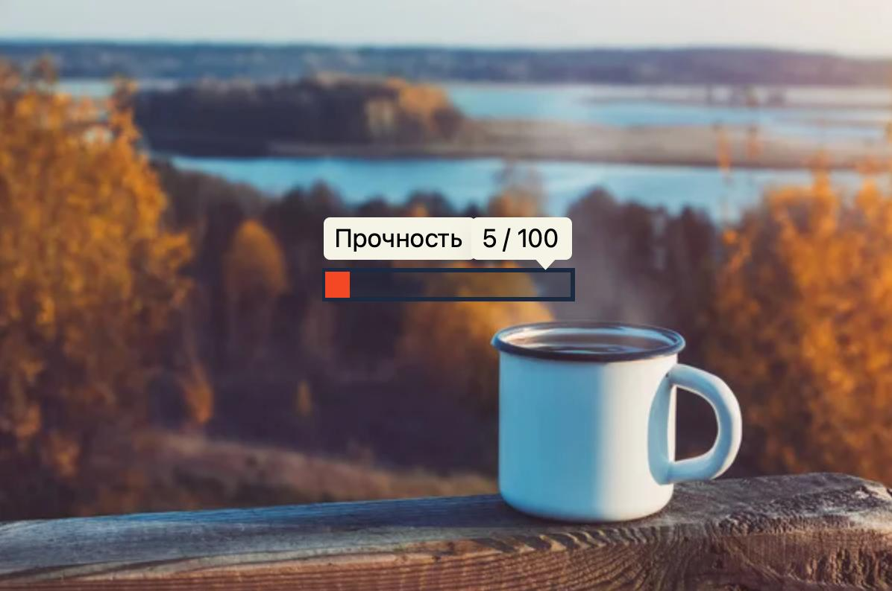

# Почему не каждая казуальная игра это Cozy (Уютная)?

> Оригинал статьи в блоге: [Дмитрий Зайцев | Геймдизайн](https://t.me/dima_zaitsev_gamedev/55)

Разбираем концепцию уютных игр и проводим черту между "просто" и "уютно".

Да, большинство cozy игр — казуальные. У таких игр общие корни с casual сегментом: простота, доступность.

НО, новички, которые пытаются сделать cozy игру, часто делают «токсичного родственника», который лишь издалека напоминает уютную игру.

Наша задача — понять, как сделать по-настоящему уютную игру, отделив одних от других.

---

### Механика против Ощущения

Казуальные игры по своей сути — это **«механический»** термин. Такие игры часто имеют простое управление, понятные правила, короткие игровые сессии.

Например, *Vampire Survivors* — казуален по своей сути, но для многих людей это не является уютной игрой.

Многие игры в Steam имеют пометку Casual, которая лишь говорит о том, что в игру просто и легко играть. Но в чем разница с Cozy, если там тоже просто и легко играть?

**Cozy (уютный)** — это новое направление, больше **философский и эмоциональный** термин, чем механический. Такие игры не про то, *как* ты играешь, а про то, *как ты себя чувствуешь* во время игры.

> **💡 OGD Контекст: Игра-Убежище и Органика**
>
> В терминологии Organic Game Design разница фундаментальна:
> *   **Casual** часто работает как **Стимулятор** или даже **Синтетика** (развеивает скуку, дает быстрый дофамин, иногда манипулирует).
> *   **Cozy** работает как **Стабилизатор** и **Органика** (снимает тревогу, возвращает равновесие, питает).
>
> Cozy — это классическая **[Игра-Убежище](../../OGD/OGD.md#ogd-game-shelter)**, задача которой — снизить уровень стресса (Кортизола) и вернуть игрока в зону комфорта. Если механика простая, но заставляет нервничать (таймер, риск проигрыша) — это уже не Убежище.

---

### 4 Маркера «Cozy-философии»

Давайте определим четкие маркеры, которые отличают уют от казуала:

#### 1. Отсутствие наказания
Вас не наказывают за перерыв, за медлительность и неоптимальные решения. Наказанием может быть медленный прогресс, и не более.

> **💡 OGD Контекст: Безопасное пространство**
>
> Любое наказание — это стресс-фактор (хаос). Для игрока, который ищет **Убежище**, любое наказание разрушает «Магический круг» безопасности. В OGD это принцип **"Soft Landing" (Мягкая Посадка)** — игра должна принимать игрока любым, даже уставшим и невнимательным.

#### 2. Внутренняя мотивация
Вы играете ради процесса, а не ради внешней награды (очков, репутации, денежек). Внешняя награда является вторичной, хоть и может усиливать интерес игрока. Основой является сам процесс игры.

> **💡 OGD Контекст: Автономия (SDT)**
>
> Здесь работает теория самодетерминации (SDT). Уютные игры опираются на потребность в **Автономии** (я делаю, потому что хочу), а не на внешние стимулы (бихевиористские "крючки"). Как только игра заставляет вас гриндить ради цифр — она превращается в работу.

#### 3. Созидание, а не разрушение
В основе всегда организация, коллекционирование, строительство, забота. НО не разрушение и хаос.

> **💡 OGD Контекст: Инструменты Структуры**
>
> Вспомним **[5 сфер жизни](../../OGD/OGD.md#ogd-spheres)**. Уютные игры часто работают со сферой **Познания** и **Среды** через инструменты **СОБРАТЬ** и **УПРОСТИТЬ**. Мы снижаем энтропию мира, упорядочиваем его. Разрушение же, наоборот, увеличивает хаос.

#### 4. Низкая когнитивная нагрузка
Игра не бомбардирует вас таймерами, срочными делами, не создает эффект упущенной награды (FOMO), не нагружает обилием информации.

> **💡 OGD Контекст: Когнитивный Бюджет**
>
> Игрок приходит в "Убежище" с истощенным ресурсом внимания (Сфера Познания перегружена). Любой таймер или сложный интерфейс требует ресурса, которого у игрока нет. Хороший Cozy-дизайн уважает усталость игрока.

---

### Ловушка «Синтетического Казуала»

Давайте проведем границу между чистейшими casual играми, в основе которых лежит тот самый мифический «казуал», и уютными играми.

Многие современные казуальные игры (и на ПК, и на мобильных) используют простые механики, чтобы замаскировать манипулятивные системы. Они созданы для удержания и монетизации: те самые дофаминовые петли, FOMO (эффект упущенной выгоды), искусственные барьеры.

> **💡 OGD Контекст: Синтетическая Игра**
>
> Это то, что OGD называет **[Синтетической Игрой](../../OGD/OGD.md#ogd-organic-vs-synthetic)**.
> Игра "держит" не потому, что игроку хорошо, а потому, что она эксплуатирует его уязвимости. Это антипод Органики.
>
> **OGD-тест:** Если после сессии игрок чувствует себя истощенным, но хочет еще ("еще один ход") — это Синтетика. Если восстановленным — это Органика.

> **⚠️ Важный нюанс: Парадокс мобильных пазлов**
>
> Часто мобильные пазлы (Match-3, Merge) механически являются идеальными **Стабилизаторами**. Игрок занимается простой сортировкой и упорядочиванием (глагол **СОБРАТЬ** из OGD), что снижает тревогу. Люди приходят в них именно за Убежищем.
>
> Но агрессивная монетизация (реклама, таймеры «жизней», FOMO-ивенты) превращает их в **Синтетику**.
>
> Получается трагедия дизайна: игра *обещает* Убежище (своим кор-геймплеем), но *доставляет* Стресс (своей обвязкой). Вместо восстановления ресурса игрок получает скрытое истощение.

Уютные игры используют простые механики для обратного — чтобы создать безопасное, предсказуемое и успокаивающее пространство для игрока. Зачастую в них используется премиум модель (Pay-to-Play). Бесплатная версия кози игры — это демо-версия, как бы мы ее ни называли.

**Вывод для дизайнера:**
*   **Казуальность** — это ваш *инструмент*.
*   **Уют (Cozy)** — это *цель*, которой вам надо достичь.

Казуальность можно использовать, чтобы создать стрессовую «ловушку внимания», а можно — чтобы построить настоящий «уютный дом» для игрока. Ваш выбор как разработчика Cozy игр — всегда использовать инструмент для второй цели.

---

### А что по арту?

Функция арта в cozy играх точно такая же — создавать правильную атмосферу.

Мы должны избегать сильно ярких (кислотных) цветов, резких пестрящих VFX эффектов, летящих во все стороны цифр. Арт должен быть с уклоном в теплые тона. Можно использовать приемы «милой», «кавайной» рисовки.

Конечно, это лишь рекомендации, эксперименты никто не отменял. Можно использовать ностальгию (пиксель-арт), даже нужно, если это подходит игре.

Получается, что даже арт cozy игр отличается от чистых casual игр.

---

### В заключение

Casual игры — прекрасны. Именно они часто являются «воротами» для людей, которые никогда не играли в игры и хотят погрузиться в этот мир. Но не путайте инструмент с целью.

Вспомните игру, которая вас разочаровала, маскируясь под «уютную». Какая одна механика или деталь разрушила для вас всю магию ощущения тихой гавани? 👀
