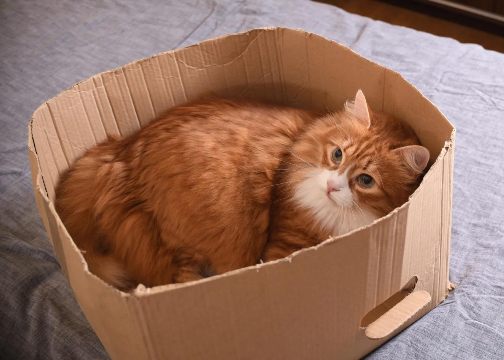

# Safe Space: Архитектура Уюта через призму OGD

> Основано на заметке из канала: [Дмитрий Зайцев | GameDev](https://t.me/dima_zaitsev_gamedev/71)

Одна механика делает любую игру теплее. Даже если это Dark Souls, где мир пытается вас уничтожить каждые три секунды.

Речь о **Safe Space** (Безопасное Пространство). Это комнаты с пишущей машинкой в Resident Evil, костры в Dark Souls или квартира в Cyberpunk 2077. Места, где игровые правила агрессии временно отключаются.

Парадоксально, но эти точки покоя часто становятся самыми эмоционально насыщенными моментами игры. Давайте разберем, почему это работает, через оптику моей методологии **Organic Game Design**.

> [!NOTE]
> **Organic Game Design (OGD)** — это инженерный подход к геймдизайну, который рассматривает игру не как замкнутую систему, а как органичную часть жизни человека, помогающую ему регулировать своё внутреннее состояние.
>
> [👉 Читать подробное описание методологии](../../OGD/OGD.md)

## Стабилизация внутри Шторма

С точки зрения OGD, игрок — это система, стремящаяся к **Гомеостазу** (равновесию).

Когда человек играет в сложную игру (например, Elden Ring), он находится в режиме **Игры-Тренажёра**. Игра бомбардирует его вызовами, повышая уровень стресса и когнитивной нагрузки.

> [!NOTE]
> **Игра-Тренажёр** — тип игры в OGD, предназначенный для "встряски" игрока. Она работает с состоянием скуки (Избыточный Порядок), предлагая вызов, риск и напряжение.

Если напряжение длится слишком долго, оно превращается в **Избыточный Хаос**. Игрок устает, начинает совершать ошибки и выгорает.

> [!NOTE]
> **Токсичный Поток** — состояние, когда когнитивная нагрузка игры превышает текущий ресурс игрока. Вместо удовольствия ("фана") игрок начинает испытывать тревогу и раздражение, что ведет к оттоку (rage quit).

**Safe Space — это встроенный Стабилизатор.**

Это локальная зона, где игра временно меняет свой тип. Из агрессивного Тренажёра она превращается в **Игру-Убежище**. Здесь:
1.  Отключается угроза жизни (снижение тревоги).
2.  Снижается темп (восстановление ресурса внимания).
3.  Появляется предсказуемость.

> [!NOTE]
> **Игра-Убежище** — тип игры в OGD, предназначенный для успокоения. Она работает с состоянием стресса (Избыточный Хаос), предлагая предсказуемость, безопасность и комфорт.

Это позволяет игроку "выдохнуть", сбросить накопленный стресс и восстановить баланс, чтобы снова вернуться в бой.

## Контраст как Инструмент

Безопасное место не работает в вакууме. Ему нужен контраст.

В *Galaxy Burger* мы случайно создали такой эффект. Игрок находится внутри теплой, освещенной бургерной. А за окном — холодный, синий, безвоздушный космос.

Именно наличие "враждебного" или холодного внешнего мира делает внутреннее пространство уютным.
В OGD это работает на разнице потенциалов: чем выше уровень **Стимуляции** (опасности) снаружи, тем сильнее эффект **Стабилизации** (уюта) внутри.

> [!NOTE]
> **Стимуляция и Стабилизация** — два главных рычага влияния в OGD.
> *   **Стимуляция** повышает сложность и неопределенность (лекарство от скуки).
> *   **Стабилизация** снижает сложность и дает предсказуемость (лекарство от стресса).

Костер в Dark Souls ощущается почти сакральным местом именно потому, что в метре от него вас может убить любой скелет. Без опасности снаружи костер был бы просто декорацией.

## Аудиовизуальный Якорь

Как дать игроку понять, что он в безопасности, без текста? Через сенсорные каналы:

*   **Звук:** Смена тревожной боевой музыки на спокойную, обволакивающую мелодию (save room theme).
*   **Свет:** Переход от холодных/темных тонов к теплым (оранжевый свет костра или лампы).
*   **Границы:** Четкое визуальное разделение "внутри" и "снаружи".

Это сигналы для подсознания: "Здесь действуют другие правила. Здесь можно расслабиться".

## Компенсация Дефицита

Почему эта механика так сильно резонирует с людьми сейчас?

OGD гласит: **мы играем, чтобы восполнить дефициты реальной жизни.**

В современном мире многие испытывают дефицит базовой безопасности. Проблемы с жильем, ипотечные кризисы, общая мировая нестабильность создают фон **Избыточного Хаоса**. Людям буквально не хватает места, которое они могут назвать своим.

Safe Space в игре удовлетворяет эту базовую потребность (в пирамиде Маслоу — потребность в безопасности, в SDT — потребность в Автономии/своей территории).

Игрок получает то, чего ему не хватает в реальности: уголок, где его никто не тронет, где тепло, светло и безопасно. Даже если этот уголок — всего лишь цифровая комната с сундуком.

---

### Практический совет

Если вы делаете игру, проверьте её на наличие ритма "Стресс — Покой".

Есть ли у игрока легальное место, где он может остановиться и просто *быть*? Не решать задачи, не бежать, не сражаться.

Иногда достаточно просто поставить скамейку с видом на закат, как в *Hollow Knight*, чтобы превратить механический геймплей в глубокий эмоциональный опыт.
