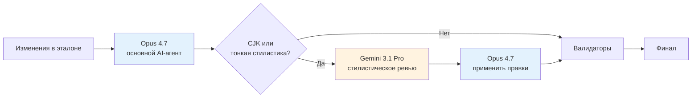
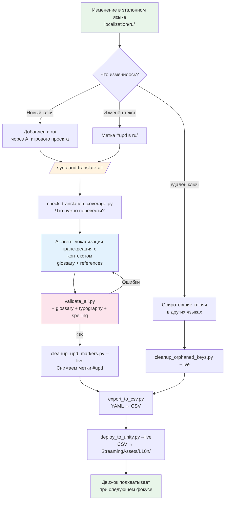

# Как делать качественную локализацию инди-игр через AI агентов

> **TL;DR.** Локализация — это не «отдадим в агентство за две недели до релиза», а непрерывный процесс рядом с кодом, под гитом, с валидаторами и AI-агентом в роли технического локализатора. Гайд про конкретный пайплайн, который я гоняю на своём проекте. Структура YAML, скрипты, AI-скиллы, выбор моделей. Можно перетащить к себе почти 1-в-1, поменяв список языков и формат экспорта под свой движок. Экспортные скрипты под любой формат (CSV, `.po`, JSON, native) тебе напишет тот же AI-агент за один разговор.
>
> **Что использую:** Claude Code + Claude Opus 4.6/4.7 как основной агент и модель. Gemini 3.1 Pro как второе мнение, особенно для CJK. Альтернативные агенты: Cursor IDE, opencode, Codex CLI, Gemini CLI, все совместимы через общий `AGENTS.md`. GPT для локализации крайне не рекомендую, разбор в Части 2.7.
>
> **Когда пайплайн не подходит:** adult / NSFW / 18+ контент. Все frontier-модели (Claude, Gemini, GPT) тихо искажают перевод сексуальных сцен из-за safety-фильтров. Без отказа, без предупреждения, просто «смягчают». Для adult-игр это не работает. Детали в Части 2.8.

---

## Часть 1. Подход и философия

### 1.1 Continuous Localization

Классический подход «сначала весь текст, потом в конце переводим» создаёт предсказуемый набор проблем: потеря контекста, сломанный UI (немецкий +30-40% к длине, в японском другая высота строки), забытые хардкодные строки в коде, плывущая терминология без глоссария, срыв сроков на bulk-переводе за две недели до релиза.

Альтернатива — **translate-as-you-go**. Каждое изменение строки на эталонном языке в тот же день уходит на все целевые. Один эталонный язык (обычно тот, на котором пишет геймдизайнер) выступает источником правды, остальные — производные. Все файлы лежат под гитом, изменения трекаются метками. Вся рутина (поиск, статистика, валидация, экспорт) крутится на скриптах. Транскреацию берёт на себя AI-агент с хорошо настроенным контекстом. Человек на финал-чеке (human-in-the-loop) не пишет с нуля, а валидирует.

### 1.2 Транскреация, а не дословный перевод

Главный принцип — транскреация (культурная адаптация), а не дословный перевод. «Как дела?» в начале записки от персонажа в японской версии станет `お疲れさま` (стандартное приветствие коллег), а не дословным `元気ですか?`. Контекст требует тёплого повседневного тона, а не вопроса о здоровье. То же с идиомами, шутками и культурными отсылками: они адаптируются, а не калькируются.

### 1.3 Человек не редактирует YAML руками

Тут фрейминг всего пайплайна меняется, поэтому скажу прямо. **Инди-разработчик не открывает `localization/ru/ui/main_menu.yaml` и не пишет туда ключи руками.** Он говорит AI-агенту своего игрового проекта (Claude Code в Unity/Godot-репозитории): «добавь на эту кнопку текст "Готово"» или «придумай дружелюбную фразу для тултипа сохранения». AI-агент **сам** выбирает категорию и файл (`ui/`, `items/`, `notes/` по контексту экрана), придумывает осмысленный namespace-ключ (`save_tooltip.label`), ставит нужные флаги (`@maxlen` если кнопка узкая), форматирует YAML и сразу обвязывает использование в коде. Вместо `button.text = "Готово"` пишет `button.text = L10n.Get("save_tooltip.label")` или эквивалент для твоего стека.

Дальше локализационный AI-агент (в отдельном проекте локализации, см. Часть 2.1) подхватывает новый ключ при следующем `/sync-and-translate-all` и допереводит на все остальные языки. Человек ревьюит результат через `git diff`. В нормальном workflow YAML руками вообще не трогают. Я уже в страшном сне не могу представить, что буду писать YAML руками, и тебе того же желаю.

### 1.4 Режим работы: диалог, а не «запустил и забыл»

У людей часто складывается ошибочное впечатление, что AI-локализация — это «нажал кнопку, получил готовое». Нет. **Работа с AI-агентом локализации устроена ровно так же, как работа с AI-агентом-программистом в Claude Code** — через конкретные просьбы, как живому коллеге:

- «Проверь корейские переводы в последних трёх файлах, что-то звучит формально»
- «Добавь поддержку вьетнамского, посмотри какой тон обращения у инди-игр на vi и зафиксируй в `AGENTS.md`»
- «Допереведи фразы, которые мы не перевели в прошлый раз»
- «Проверь пунктуацию в CJK языках, особенно после латинских вставок»
- «Это место в немецком звучит криво, переформулируй ближе к разговорному»
- «Найди все упоминания "клиент" в разных языках и сверь с глоссарием»
- «Подумай, как лучше адаптировать эту шутку на польский, у меня сомнения»

Slash-команды вроде `/sync-and-translate-all` — это **ярлыки для самых частых операций**, а не единственный способ работать. В основном качественная локализация строится в открытом диалоге между конкретными просьбами.

### 1.5 Творческий контроль на человеке

AI-агент талантливый, эрудированный, прилежный, но **без вкуса**. Вкус, чувство тона игры, понимание, звучит это как наша игра или как чужая — это ты. Что это значит на практике:

- **Ревьюй каждый `git diff`** после `/sync-and-translate-all`. Не каждую строку, но хотя бы скользящим взглядом по всем языкам, цепляясь за подозрительное.
- **Задавай вопросы.** «Почему ты выбрал именно этот вариант?», «Какие альтернативы рассматривал?», «Что в этой фразе сложного для перевода?». AI отвечает развёрнуто и часто подсвечивает решения, которые иначе прошли бы мимо.
- **Перепроверяй подозрительное.** Если фраза в `de` кажется слишком корпоративной, попроси Gemini дать второе мнение через `gemini-loc-reviewer`.
- **Помечай утверждённое `#locked`.** Это твой способ сказать «финальный голос игры, больше не трогать». Иначе AI на следующей итерации может «улучшить» уже выверенную фразу.
- **Спрашивай AI как эксперта в культурах.** «Будет ли эта фраза звучать снисходительно для бразильских игроков?», «Какие у японцев ожидания от этого типа диалога в cozy-играх?». Это часть творческого решения.

**Антипаттерн.** Настроить пайплайн, запустить, отгрузить в Steam, не открыв ни один YAML. AI без живого режиссёра выдаёт корректный, но усреднённый результат.

Думай о себе как о **режиссёре локализации**. Не пишешь субтитры построчно, но принимаешь каждое креативное решение. AI — это команда из 13 native-переводчиков-стажёров, которые быстро делают черновики, но ждут от тебя финальной редакции.

---

## Часть 2. AI-инфраструктура

Выбор агента и модели влияет на качество локализации больше, чем структура файлов или валидаторы. Хорошие правила + плохая модель = плохой перевод. Только связка «правильный агент + правильная модель + полный контекст» даёт результат, сопоставимый с агентством.

### 2.1 Two-agent setup: два репозитория, два агента

На практике пайплайн живёт в **двух репозиториях с двумя AI-агентами**, у каждого свой контекст и зона ответственности:

```
~/gamedev/
├── MyGame/                          # репозиторий игры
│   ├── AGENTS.md                    # роль: технический разработчик (Unity / Godot / etc.)
│   ├── .claude/                     # скиллы под игровой стек
│   ├── Assets/                      # код, ассеты
│   └── localization/                # → symlink на ../MyGame-Localization/localization/
│
└── MyGame-Localization/             # репозиторий локализации
    ├── AGENTS.md                    # роль: технический локализатор
    ├── .claude/                     # скиллы под L10N (sync-and-translate-all, …)
    ├── localization/                # YAML по языкам
    ├── glossary.yaml
    ├── references/                  # character_voices, icu_format, культурные нюансы
    └── scripts/                     # config.py, валидаторы, экспортёры
```

**AI-агент игрового проекта** знает Unity/Godot API, твои кастомные хелперы (`L10n.Get(key)`), структуру UI-префабов, какие экраны существуют. Когда ты говоришь «добавь фразу на эту кнопку», он понимает контекст: какой это экран, какой `@maxlen` подойдёт по ширине, в какой файл её логичнее положить. Сразу добавляет ключ в `localization/ru/ui/<screen>.yaml` (через симлинк это пишется в репозиторий локализации) и обвязывает использование в C#.

**AI-агент локализационного проекта** знает транскреацию, культурные нюансы, голоса персонажей, глоссарий, типографику по языкам. Игровой стек его не интересует, только YAML и культурный контекст.

**Симлинк** связывает их незаметно. Изменения через game-side агента видны l10n-side агенту в реальном времени, никаких ручных синков. Git-коммиты идут в репозиторий локализации, игровой репозиторий остаётся чистым от локализационных правок.

**Зачем разбивать** вместо одного агента на всё:

- **Экономия контекста.** Game-side агенту не нужны правила корейской типографики. L10n-side не нужно знать Unity API.
- **Чище промпты.** `AGENTS.md` каждого проекта говорит только про свою область.
- **Перенос локализации между играми.** `MyGame-Localization/` можно склонировать как boilerplate, оставив свой `glossary.yaml` и `references/`.
- **Контейнеризация L10N от движка.** Меняешь Unity на Godot — игровой репозиторий переписывается, локализация остаётся.

### 2.2 Какие агенты поддерживают пайплайн

Пайплайну не важен конкретный CLI/IDE, он работает с любым агентом, который умеет читать markdown-инструкции, запускать shell и редактировать файлы.

| Агент | Поставщик | Конфиг | Императивные скиллы | Реактивные скиллы | Модели |
|---|---|---|---|---|---|
| **Claude Code** | Anthropic | `CLAUDE.md` + `@AGENTS.md` | `.claude/commands/<name>.md` или `.claude/skills/<name>/` | `.claude/skills/<name>/SKILL.md`, `.claude/agents/<name>.md` | Opus 4.6/4.7, Sonnet 4.6, Haiku 4.5 |
| **Codex CLI** | OpenAI | `AGENTS.md` | `.codex/prompts/<name>.md` | через делегацию субагентам | GPT-5.x |
| **Gemini CLI** | Google | `GEMINI.md` | `.gemini/commands/<name>.toml` | через бэкенд | Gemini 3.x |
| **Cursor IDE** | Cursor | `.cursor/rules/*.mdc` (или legacy `.cursorrules`) | через UI | `.cursor/rules/*.mdc` | любые через API-ключ |
| **opencode** | open-source | `AGENTS.md` | `.opencode/commands/<name>.md` | `.opencode/agents/<name>.md` | любые через провайдеров |

**Унификация через `AGENTS.md`.** В новых версиях Claude Code, Codex CLI и opencode действует общий стандарт — один файл инструкций, который читают все три. Держи **единый источник правды**:

```
В корне проекта:
├── AGENTS.md          # Основной файл — единый для всех
├── CLAUDE.md          # Импорт + Claude-специфика (см. ниже)
├── GEMINI.md          # Аналогично для Gemini CLI
└── .cursorrules       # Скопированная/импортированная версия для Cursor
```

Содержимое `CLAUDE.md` — это лаконичный импорт:

```markdown
@AGENTS.md

# Claude Code — специфика

## Императивные скиллы (slash-команды)
- `/sync-and-translate-all` — главный пайплайн перевода
- `/translate-to-lang` — новый язык
- `/check-and-fix-l18n-for-lang` — точечная проверка

## Реактивные скиллы
- `gamedesign-reference` — навигация по геймдизайну
- `engine-source-audit` — аудит кода на L10N-проблемы
- `gemini-cjk-cultural-check` — авто-ревью CJK через Gemini 3.1 Pro
- `gemini-loc-reviewer` — независимое ревью любого языка через Gemini
```

### 2.3 Выбор модели

Раздел из опыта «через боль». Модели тестировались на реальном пайплайне с 13+ языками, нарративом и character voices.

| Модель | Роль в пайплайне | Сильные стороны | Слабые |
|---|---|---|---|
| **Claude Opus 4.7** | основная модель | следование инструкциям, консистентность глоссария, character voices, технические директивы (`@maxlen`, ICU) | дорого, медленнее |
| **Claude Opus 4.6** | альтернатива 4.7 | те же качества, дешевле | меньше контекстное окно, чуть слабее на редких языках |
| **Claude Sonnet 4.6** | рутина | в 5× дешевле Opus, быстрее | может пропускать тонкости тона |
| **Claude Haiku 4.5** | технические задачи | дешевле всех | не годится для творческой транскреации |
| **Gemini 3.1 Pro** | стилистическое ревью CJK и nuance-критичных мест | лингвистическое чутьё, идиомы, художественный регистр, native CJK | плохо держит `@maxlen`/ICU/`#locked`, склонен к отсебятине |
| **GPT-5.x** | не использовать | - | см. 2.7 |

**Почему Opus — основная.** Держит три вещи, на которых другие сыпятся. Глоссарий: помнит, что `Keeper` в файле 3 переведён как `守人`, и в файле 47 не подставит синоним. Character voices: если в `AGENTS.md` прописан «Строгий Заказчик», не сваливает всё в средне-вежливый ньюс-тон. Технические директивы: `@maxlen:12` соблюдает или явно говорит, что не лезет, а не молча превышает. ICU-плюрали, переменные `{count}` и теги `<b>` не ломает.

**Почему Gemini 3.1 Pro критически полезен как «второе мнение».** Лучше Опуса замечает, когда фраза в немецком/японском/корейском «пахнет переводом». Художественные тексты от лица персонажей у Гемини выходят колоритнее. CJK-специфику (славянские `))`, full-width vs ASCII пунктуация, разница между 文言 и повседневной лексикой) ловит нативно, без подробных инструкций.

**Доступ.** Opus — через Claude Code (auto через подписку Max) или Anthropic API. Gemini 3.1 Pro — через AI Studio (бесплатный tier + платный) или Vertex AI. Sonnet/Haiku лежат там же где Opus.

### 2.4 Гибридный подход Opus + Gemini



Opus — основной агент, запускается через Claude Code и `/sync-and-translate-all`. Gemini 3.1 Pro вызывается как subagent на CJK и эмоциональных голосах после Opus-перевода. Subagent отдаёт структурированный отчёт о проблемах, а Opus решает, что применять.

Opus сводит к минимуму технические дефекты (глоссарий, директивы, структура), Gemini правит лингвистику (идиомы, регистр, художественный тон). Пересечение даёт качество, недостижимое одной моделью.

### 2.5 Подключение Gemini как субагента через Gemini CLI

**Установка.** Gemini CLI — это `npm i -g @google/gemini-cli`, бинарь `gemini`. Авторизация: `gemini auth` (Google-аккаунт) или `export GEMINI_API_KEY=...`. Проверка: `echo "hello" | gemini -m pro`.

**Реальный субагент в Claude Code** живёт в `.claude/agents/<name>.md`, это markdown с frontmatter и инструкцией:

```markdown
---
name: gemini-cjk-cultural-check
description: Independent second-opinion review of CJK localization (ja/zh/zt/ko)
  via Google Gemini 3.1 Pro. Use PROACTIVELY after translating, modifying, or
  backfilling strings in localization/ja/, localization/zh/, localization/zt/,
  localization/ko/ — Gemini catches full-width punctuation, slavic smiley calques,
  literary-vs-everyday register drift, honorifics misuse, Russian idiom calques,
  and character-voice inconsistencies. Caller MUST provide target language code
  AND list of changed file paths to review.
tools: Read, Bash, Grep, Glob
model: haiku
---

Ты — обёртка над Google Gemini 3.1 Pro для независимого ревью CJK-локализации.
Не анализируешь язык сам — собираешь контекст, вызываешь `gemini`, возвращаешь его вывод.

## Шаги

1. **Извлеки имя персонажа из путей.** Если путь матчит `notes/<char>_*.yaml`
   или `mail/<char>_*.yaml` — извлеки `<char>` и определи тип голоса из
   `references/character_voices.md`. Передай тип голоса в промпт явно.

2. **Собери `@-paths` для Gemini:**
   - `@localization/<lang>/<path>` (перевод)
   - `@localization/ru/<path>` (эталон)
   - `@localization/glossary.yaml` (всегда)
   - `@references/character_voices.md` (если персонаж определён)

3. **Сохрани промпт в `/tmp/gemini_cjk_prompt.txt`** через `Write` —
   надёжнее heredoc для длинных промптов с YAML внутри.

4. **Вызови:**
   ```bash
   cat /tmp/gemini_cjk_prompt.txt | gemini -m pro 2>&1
   ```

5. **Верни stdout как есть, без редактуры.**

## Шаблон промпта для Gemini

Ты — независимый ревьюер локализации игры <название и краткое описание>.
Эстетика — <тональный камертон>.

Тон обращения на {lang}:
- ja: вежливая (です/ます形)
- zh, zt: неформальное (你)
- ko: вежливо-неформальная (해요체)

# Материалы
- Переводы на {lang}: {lang_paths}
- Русские эталоны: {ru_paths}
- Глоссарий: @localization/glossary.yaml
- Голоса персонажей: @references/character_voices.md

Сопоставляй ключи между ru- и {lang}-файлами. Комментарии в ru/ —
часть контекста (могут отмечать намеренные стилистические выборы).

# Контекст голоса
{voice_type}

# Что проверять (приоритеты сверху вниз)
1. Типографика — full-width пунктуация после CJK-символов; кавычки
   「…」 для ja/zh/zt, "…" для ko; отсутствие славянских смайликов
   `))` `((`; правильное многоточие `…` вместо `..`.
2. Регистр (ja/zh/zt) — повседневная лексика для тихих/плавных голосов
   и UI. Литературный регистр / 文言 — маркер Старомодного Джентльмена,
   не «мудрости» наставника.
3. Обращения (ja) — `-さん`/`-くん`/`-ちゃん`/`-さま`/`-先生`
   применены корректно.
4. Естественность — нет калек с русского.
5. Голос персонажа — соответствует архетипу.
6. Глоссарий — ключевые термины совпадают с утверждёнными переводами.

# Формат вывода
Для каждой проблемы — блок:

### {{key}} — {{ось}}
**Проблема:** одна-две фразы.
**Предложение:** конкретный вариант исправления.

Если проблем нет: «Проблем не найдено.»
Не выдумывай проблемы ради полноты. Лучше пустой вывод, чем шум.
```

**Как Claude Code триггерит субагент.** По полю `description` (там сказано «Use PROACTIVELY after translating CJK strings»). Когда сессия касается правок в `localization/{ja,zh,zt,ko}/**/*.yaml`, Claude автоматически решает вызвать `gemini-cjk-cultural-check`. Caller (Opus в основной сессии) передаёт целевой язык и список путей, субагент возвращает структурированный отчёт, а Opus применяет точечные правки. **Файлы Gemini не редактирует**, только даёт второе мнение.

**Синтаксис `@<path>`** в промпте Gemini нативно грузит файлы в контекст. Полезно для больших YAML, не нужно копипастить содержимое руками. Ограничение: `@<path>:line-range` не работает, файл читается целиком (для файлов локализации это норма).

**Второй похожий субагент — `gemini-loc-reviewer`**, использует тот же паттерн, но для **любого языка** (не только CJK). Активируется on-demand, когда caller просит «дай второе мнение по немецкому/польскому/итальянскому». Отлично подходит, чтобы ловить калькированные идиомы, корпоративный тон или drift характера персонажа в не-CJK.

### 2.6 Стоимость и оптимизация

Ориентировочные расчёты для проекта ~10 000 строк на 13 целевых языков:

| Сценарий | Модель | Bulk-прогон | Регулярные апдейты (10% строк/мес) |
|---|---|---|---|
| Premium | Opus 4.7 (всё) | ~$80–150 | ~$10–20/мес |
| Hybrid (рекомендуется) | Opus 4.7 + Gemini 3.1 Pro ревью | ~$100–180 | ~$15–25/мес |
| Budget | Sonnet 4.6 + точечный Opus на нарратив | ~$25–50 | ~$5–10/мес |

Цифры зависят от длины строк, доли нарратива относительно UI и числа итераций ревью.

**Как оптимизировать:**

- **Prompt caching** включается автоматически в Claude Code. Статичный контекст из `AGENTS.md`, `glossary.yaml`, `references/` кэшируется, что экономит до 90% на повторных запросах.
- **Sonnet 4.6 для рутины** — cleanup, статистика, простой UI. Opus береги для творческой транскреации и нарратива.
- **Локальные валидаторы первыми** — `validate_glossary.py`, `validate_typography.py`, `validate_spelling.py` отлавливают 60–70% типовых ошибок **без обращения к LLM**.
- **Batch API** Anthropic/OpenAI — скидка 50% для асинхронного режима. Идеально для bulk-перевода нового языка (несколько часов задержки против синхронного режима за минуты).

**Лимиты Claude Code Max.** Bulk-перевод 10k строк × 13 языков занимает 4–6 часов работы агента и легко сжирает 5-часовое окно подписки Max за один присест. Лучше делить по языку или гонять через API напрямую.

### 2.7 Почему GPT не подходит

GPT любого поколения для game-localization я не рекомендую. Опыт прогона реальных файлов через GPT-4/5/5.5 и сравнения с Opus/Gemini показал устойчивые паттерны:

- **Глоссарий разъезжается между файлами.** `Container` в файле 1, `Storage` в файле 15, `Box` в файле 23, даже с явно переданным глоссарием в системном промпте.
- **Character voices схлопываются в один нейтральный тон.** «Строгий Заказчик» и «Эмоциональный Хаос» начинают звучать одинаково.
- **Кастомные правила из `AGENTS.md` модель регулярно перевешивает** привычными переводами из своих данных.
- **На редких языках идёт скрытый pivot через английский** вместо прямого перевода с эталона, из-за чего качество падает.
- **Технические директивы ломает.** Добавляет лишние комментарии в YAML, меняет порядок ключей, ломает ICU.
- **Склонна к «инициативе».** Может молча «улучшить» утверждённый перевод, помеченный `#locked`.

GPT в целом не так уж плох. С кодом, рефакторингом и дебагом он мне регулярно помогает. Но локализация — задача с длинным контекстом, кастомными правилами и художественной чувствительностью. Приоритеты OpenAI («полезный универсальный ассистент») не совпадают с приоритетами проекта («следуй именно этому глоссарию и именно этому тону»). Если у тебя уже проект на GPT, на следующей итерации попробуй Opus, разницу увидишь на первой неделе.

### 2.8 Ограничение: adult / NSFW / 18+ контент

Жёсткое и важное ограничение пайплайна, о котором редко предупреждают в гайдах по AI-локализации. **Если в твоей игре есть сексуальные сцены, откровенный adult-контент, NSFW-нарратив, hentai-style сцены, эротические VN-эпизоды, этот пайплайн не работает.**

Все frontier-модели (Claude, Gemini, GPT) обучены с RLHF-уклоном в «безопасного нейтрального ассистента» и проходят safety-тренировку. На adult-контенте это даёт **тихие искажения перевода**, которые крайне сложно отловить:

- **Смягчение лексики.** Конкретные физиологические или сексуальные термины переводятся эвфемизмами. «Hard fuck» → «passionate intimate moment». «Cum» → «finished». **Модель не предупреждает**, она выдаёт «как бы перевод», который технически отвечает запросу, но теряет хирургическую точность оригинала.
- **Опускание целых фраз и образов.** Особенно в длинных эротических сценах модель может «забыть» перевести одно-два предложения, или объединить несколько откровенных предложений в одно нейтральное.
- **Изменение тональности персонажа.** Доминирующий/агрессивный персонаж становится «вежливо-нежным». Голос сабмиссивного персонажа — «уверенно-нейтральным». Character voice разъезжается тихо, под видом «более естественного перевода».
- **Смещение акцентов.** Сцену, где автор делал акцент на конкретной детали, модель может перевести со смещённым фокусом, поставив в центр «безопасную» часть.
- **Отказы вместо переводов.** В худшем случае модель явно отказывается («I can't help with this»). И это **лучший** исход среди проблем, потому что хотя бы заметно.

**Почему это критично.** Валидаторы (`validate_glossary.py`, `validate_typography.py`) такие искажения **не ловят**. Структурно перевод корректен, ICU не сломан, кавычки правильные. `git diff` показывает строку как успешно переведённую. Единственный способ это найти — отдать носителю, чтобы он прочитал конкретную сцену в контексте оригинала. На 14 языках для длинного adult-контента это нереалистично.

**Степень строгости разная.** Claude Opus самый зажатый по safety, особенно через Claude Code (где fine-tuning под код накладывается на базовую безопасность). Gemini 3.1 Pro заметно мягче на художественном контенте, но всё равно не нейтрален. GPT где-то посередине. Все три **не подходят** для качественной adult-локализации.

**Что делать, если твой проект — adult-игра:**

- **Не используй этот пайплайн.** Структуру YAML, скрипты-валидаторы и two-agent setup оставить можно, но AI-агента в роли переводчика вычёркиваем.
- **Профессиональные локализаторы из adult-индустрии.** Студии типа Henlightenment или индивидуальные фрилансеры с портфолио на DLsite/Fakku/JAST — они переводят руками, без safety-фильтров.
- **Open-source uncensored модели** (Mistral, Llama в uncensored fine-tunes) в теории вариант, но качество транскреации у них в разы хуже frontier-моделей, character voices разваливаются. Для серьёзного adult-проекта на практике не годится.
- **Использовать API напрямую с system prompt'ом «художественный перевод эротики».** Это частично отключает safety-фильтры на Gemini и Claude API (не Claude Code), но сильно зависит от провайдера и может сломаться после обновления модели. Ненадёжная база для пайплайна.

**Если игра mainstream, но содержит несколько suggestive / mature сцен** (типичный romance-сюжет в RPG, эпизодический поцелуй, упоминание секса без graphic-описания), пайплайн **работает**, но эти конкретные сцены **обязательно** прогоняй через нативное human-ревью. AI допереведёт всё остальное чисто, а спорные 5–10 строк ты проверишь руками.

**Главное правило.** Если ты открыл локализационный диалог с агентом и в первой же реплике он осторожничает или подбирает эвфемизмы — пайплайн не для этого проекта, ищи другие инструменты.

---

## Часть 3. Структура данных

### 3.1 Иерархия файлов

```
localization/
├── ru/                      # Эталонный язык (с комментариями)
│   ├── ui/                  # интерфейс, меню, общие элементы
│   │   ├── main_menu.yaml
│   │   ├── settings.yaml
│   │   ├── hub.yaml
│   │   └── pause_menu.yaml
│   ├── items/               # игровые предметы, описания
│   │   ├── containers.yaml
│   │   ├── item_types.yaml
│   │   └── clients.yaml
│   ├── notes/               # записки от персонажей (нарратив)
│   │   ├── mei_first.yaml
│   │   └── elias_archive.yaml
│   ├── mail/                # письма-задания от клиентов
│   ├── feedback/            # реакции игры на действия
│   ├── order/               # тексты процесса выполнения заказов
│   └── demo/                # обучение, onboarding, демо-контент
│       └── onboarding.yaml
├── en/                      # Английский (комментарии можно переводить или нет)
│   └── ...                  # Та же структура, что в ru/
├── ja/                      # Японский (только ключи и переводы)
│   └── ...
├── glossary.yaml            # Утверждённая терминология на все языки
└── ...
```

**Правила:**

- **Структура зеркалит эталон.** Если в `ru/` есть `ui/main_menu.yaml`, он должен лежать и в `en/ui/main_menu.yaml`, и в `ja/ui/main_menu.yaml`. Валидатор за этим следит.
- **Делай категории смысловыми, а не техническими.** Геймдизайнер думает о текстах категориями игры, а не тем, как они хранятся в движке. Реальный набор в моём проекте: `ui/`, `items/`, `notes/`, `mail/`, `feedback/`, `order/`, `demo/`.
- **Один экран — один файл.** Не сваливай всё в `strings.yaml`. Когда правок накопится много, Git-конфликты убьют итерацию.
- **Записки персонажей держи в отдельных файлах.** Конвенция: `notes/<character>_<context>.yaml` (например, `mei_first.yaml`, `elias_archive.yaml`). Имя персонажа в пути помогает AI-агентам и субагентам (как `gemini-cjk-cultural-check`) автоматически определять голос через `references/character_voices.md`.

### 3.2 Namespace-ключи через имя файла

Внутри YAML ключи лежат плоским списком, без вложенных wrapper-ключей:

```yaml
# localization/ru/ui/main_menu.yaml
title: "Главное меню"
new_game: "Новая игра"
continue: "Продолжить"
settings: "Настройки"
```

Полный ID ключа строится как `имя_файла_без_yaml.ключ`. То есть `main_menu.title`, `main_menu.new_game`. Уникальность гарантирована (`title` в `main_menu.yaml` и `title` в `settings.yaml` не конфликтуют), плюс это **самодокументируемость**: по ключу `main_menu.title` сразу ясно, где он используется.

**Универсальные суффиксы ключей:** `label` (кнопка/подпись), `title` (заголовок), `description`/`tooltip` (пояснение), `placeholder` (пустое поле), `message`, `error`, `_plural`, `_gender`.

**Файлы уникальны в пределах языка**, не делай `ui/buttons.yaml` + `items/buttons.yaml`. Пути `ui/` и `items/` уже разносят их по категориям, но само имя файла должно быть глобально уникальным, потому что namespace ключей строится только по нему.

### 3.3 Директивы в комментариях

В эталонном языке (`ru/`) комментарии — это **контракт с AI-агентом**. Три директивы:

```yaml
# Кнопка на главном меню, должна влезать в узкий контейнер
# @maxlen:12
new_game: "Новая игра"

# Финальная фраза в катсцене, утверждена режиссёром, не трогать
ending_quote: "И тогда наступила тишина." #locked

# Текст изменился — нужно перевести заново на всех языках
welcome: "Добро пожаловать в мастерскую!" #upd
```

| Директива | Где ставить | Назначение |
|---|---|---|
| `@maxlen:N` | в комментарии перед ключом | Лимит на длину перевода в символах |
| `@maxlen:N words` | в комментарии перед ключом | Лимит в словах (для CJK char-лимит бессмыслен) |
| `#locked` | **в конце строки с переводом** | «Не трогать автоматически», для художественно выверенных фраз |
| `#upd` | **в конце строки в эталоне** | «Оригинал поменялся, переводы устарели, нужно перезалить» |

{: .important }
> `#locked` ставится **в строке перевода** (в `en/`, `ja/` и т.д.), а `#upd` — **в строке эталона** (в `ru/`). Это разные сигналы: первый говорит «эту строку выверили руками», второй «оригинал поменялся, бегите обновлять».

### 3.4 Workflow `#upd`

Самая частая операция в живом проекте — изменение уже существующей строки. Как это выглядит:

1. **Геймдизайнер просит AI-агента игрового проекта** поменять фразу: «эта реплика звучит холодно, перепиши теплее».
2. **AI-агент игрового проекта** меняет строку в `localization/ru/<file>.yaml` и **ставит метку `#upd`** в конце строки. Также он метит `#upd` все переводы этого ключа в других языках (потому что они устарели).
3. **`scripts/check_translation_coverage.py`** в следующем прогоне показывает в секции `🔄 STRINGS MARKED FOR UPDATE` сколько строк нуждаются в перезаливе, по каким файлам и в каких языках.
4. **`/sync-and-translate-all`** при следующем запуске видит `#upd`-строки и приоритезирует их выше «просто отсутствующих», потому что это уже видимый контент, который игрок рискует встретить с устаревшим переводом.
5. **AI-агент локализации** допереводит их на все языки, человек ревьюит.
6. **`scripts/cleanup_upd_markers.py --live`** снимает метки `#upd` с эталона, задача закрыта.

### 3.5 Конфигурация: `config.py`

Единая точка правды для всех скриптов: список языков, пути, человекочитаемые названия.

```python
# scripts/config.py
from pathlib import Path

SOURCE_LANGUAGE = "ru"
TARGET_LANGUAGES = ["en", "es", "fr", "de", "it", "br", "pl", "cs",
                   "tr", "uk", "ja", "ko", "zh", "zt"]
SUPPORTED_LANGUAGES = [SOURCE_LANGUAGE] + TARGET_LANGUAGES

LOCALIZATION_ROOT = Path(__file__).parent.parent / "localization"
EXPORTS_DIR = Path(__file__).parent.parent / "exports"
UNITY_L10N_DIR = Path("/path/to/Unity/Assets/StreamingAssets/L10n")

LANGUAGE_NAMES = {
    "ru": "Russian", "en": "English", "ja": "Japanese",
    "zh": "Chinese (Simplified)", "zt": "Chinese (Traditional)",
    "ko": "Korean", "de": "German", "fr": "French", "es": "Spanish",
    "it": "Italian", "br": "Brazilian Portuguese", "tr": "Turkish",
    "pl": "Polish", "cs": "Czech", "uk": "Ukrainian",
}

def get_localization_dir(lang: str) -> Path:
    return LOCALIZATION_ROOT / lang
```

Все скрипты импортируют отсюда. Добавил новый язык в одном месте — все скрипты его подхватили.

### 3.6 `AGENTS.md` / `CLAUDE.md` / `GEMINI.md`

Главный файл, который держит всю систему вместе. Агент подгружает его **при каждом запуске**. Без него агент будет переводить «нормально», но **мимо правильного тона игры**.

Минимальная структура:

```markdown
# Роль
Ты — технический специалист по локализации игр. Работаешь через
транскреацию, с сохранением голосов персонажей и тона игры.

# Проект
Краткое описание игры, жанра, целевой аудитории.
Ссылки на референсы (Unpacking, Stardew Valley, etc.).

# Атмосфера
Главный тональный принцип (cozy / dark / satirical / etc.).
Красные флаги по языкам (что НЕ использовать) + 3-5 пар
«ru → en/ja/de» хороших коротких фраз из игры для few-shot.

# Система "Голосов" персонажей
Архетипы голосов и правила их адаптации.
Ссылка на references/character_voices.md.

# Тон обращения к игроку по языкам
Таблица: какая форма обращения для какого языка.

# Типографика по языкам
Правила кавычек, тире, full-width знаков, эллипсиса.

# Правила работы с текстом
Источник правды, автоперевод, #locked, #upd, глоссарий, контекст,
обработка двусмысленностей, осиротевшие ключи, верификация.

# Форматы и структура
YAML, директивы, структура папок, namespace ключей.

# Плюрализация и гендер
ICU MessageFormat, суффиксы ключей, ссылка на references/icu_format.md.

# Скрипты и автоматизация
Перечисление скриптов с одной строкой описания +
ссылка на scripts/AGENTS.md.
```

**`scripts/AGENTS.md`** — это отдельная навигация для AI по всем скриптам: с примерами вызова, опциями, типичным выводом. Опытный AI-агент сначала читает его, а потом решает, какой скрипт запускать. Это сильно лучше, чем заставлять агента угадывать аргументы.

---

## Часть 4. Контекст для качества перевода

Хороший перевод — это 80% контекста и 20% мастерства. Чем больше AI-агент знает о фразе, тем меньше выдаёт дословных нелепостей.

### 4.1 Глоссарий

`localization/glossary.yaml` — это утверждённые переводы ключевых терминов на все языки:

```yaml
- term: "Мастерская"
  description: "Главное игровое пространство, где игрок работает."
  translations:
    en: "Workshop"
    ja: "工房"
    zh: "工坊"
    de: "Atelier"
    fr: "Atelier"

- term: "Keeper"
  description: "Роль игрока. Хранитель, наставница, не 'manager' и не 'boss'."
  case_sensitive: false
  translations:
    en: "Keeper"
    ja: "守人"
    de: "Hüterin"

- term: "TSB"
  description: "Аббревиатура The Sorting Bureau. Только в маркетинговых материалах."
  case_sensitive: true
  translations:
    en: "TSB"
    ja: "TSB"
```

**Правила глоссария:**

- **Без артиклей.** Храни `Keeper`, а не `The Keeper`. Валидатор ищет термин в любом контексте, артикли подставляются по грамматике языка.
- **`case_sensitive: true`** используй только для аббревиатур и имён собственных. Для остальных дефолт — `false`.
- **Глоссарий — живой документ.** Каждый раз, когда вводишь новое игровое понятие, добавляй его сюда **до** того, как оно расползётся по 50 файлам в разных вариантах.
- **`validate_glossary.py`** проверяет, что термины из глоссария используются именно в утверждённых формах. Опции: `--detailed` (конкретные локации нарушений), `--stats` (статистика использования терминов), `--case-sensitive` (строгий регистр).

**Кросс-файловая консистентность имён.** Глоссарий не всегда выделяет каждое имя отдельной записью. Например, пара «Хана и Моти» может лежать в глоссарии единой строкой, где явно прописан только перевод для «Ханы», а «Моти» подразумевается. Когда переводишь файл, где упомянут только Моти отдельно, проверь, как его перевели в других файлах того же языка: `python scripts/search_strings.py --text "Моти" --language ja`. Это правило стоит явно прописать в `AGENTS.md`.

### 4.2 Тональный камертон

У проекта должен быть **тональный камертон** — короткое описание того, какой тон допустим. В cozy-игре это «мастерская ремесленника, а не корпоративный офис»: даже когда речь идёт о «работе» и «клиентах», характер остаётся камерным, как в Stardew Valley, а не как в бизнес-центре.

**Красные флаги по языкам** — слова и интонации, которые AI должен активно обходить:

| Язык | Избегать | Использовать |
|---|---|---|
| ja | `オフィス`, `クライアント`, `業務`, `お客様` | `工房`, `お客さん`, `頼みごと` |
| en | office, workplace, professional, corporate | workshop, study, requests, cozy, craft |
| zh | `办公室`, `工作/任务` | `工坊`, `委托/请求` |
| de | Büro, Arbeitsplatz, Angestellter | Atelier, Zimmer, Mitglied |

Для другого жанра (тактика, хоррор, сатира) камертон будет другим, но он **обязан существовать как явный документ**. Без него AI-агент скатывается в нейтрально-новостной тон, который убивает уникальность голоса игры.

### 4.3 Голоса персонажей

Если в игре много нарратива от лица разных персонажей (записки, диалоги, письма), полезно завести таблицу архетипов в `references/character_voices.md`.

Универсальные архетипы:

| Архетип | Признаки | Адаптация при переводе |
|---|---|---|
| **Строгий Заказчик** | Сухие телеграфные фразы, КАПС для выделения, без приветствий | КАПС работает в латинице и кириллице; в CJK передаётся через сухие формы и отсутствие вежливых частиц |
| **Эмоциональный Хаос** | Поток сознания, восклицания, скобки, смайлики, нарочные опечатки | Сохранять эмодзи, но с поправкой на культурную норму (в JP/KR допустимо, в DE/CS умереннее) |
| **Старомодный Джентльмен** | Архаичный слог, витиеватые обороты, «милостивый государь» | В английском — «My good fellow», «Dear Sir», а не нейтральный «Sir» |
| **Тревожный Перфекционист** | Многоточия, извинения без причины, самокритика | Сохранять нерешительные интонации средствами целевого языка |

**Прогрессия тона.** Голос одного персонажа меняется в зависимости от того, на какой стадии отношений он с игроком:

1. **Знакомый**: первые заказы, сдержанный тон.
2. **Друг**: клиент раскрывается, записки становятся теплее.
3. **Близкий друг**: максимально личный и доверительный тон.
4. **Мастерство**: клиент дарит уникальные подарки для мастерской, тон высшей степени доверительный.

Голос (строгий/хаотичный и т.д.) при этом **остаётся тем же**, меняется только дистанция. Ранние заказы переводим сдержаннее, поздние — теплее.

#### Примеры сильнее объяснений (few-shot prompting)

Это главное методологическое открытие за весь проект, держи его в голове. **LLM держат стиль персонажа из примеров фраз в десятки раз лучше, чем из описания признаков.** Описание «сухие телеграфные фразы, КАПС» агенту вроде бы понятно, но при переводе он всё равно скатывается в «среднестатистическую» интерпретацию. А вот если дать несколько реальных фраз персонажа + утверждённые переводы, модель сразу копирует ритм, лексику, пунктуацию и эмодзи-паттерны.

Так работает few-shot prompting. В локализации эффект ещё сильнее, потому что характер строится из мелочей (восклицательных знаков, точек в конце, оборотов), которые в описании архетипа теряются, а в примерах сохраняются буквально.

Поэтому в `references/character_voices.md` к каждому архетипу полезно приложить блок:

```markdown
## Эмоциональный Хаос (Микко)

### Признаки
Поток сознания, скобки, восклицания, смайлики, нарочные опечатки.

### Эталонные фразы (для few-shot)

- ru: "ОЙ!! я опять забыл!! (ну как так-то...) короч это для мамы, она поймёт ❤️"
  - en: "OH no!! i forgot AGAIN!! (how is this even possible omg) anyway it's for mom, she'll get it ❤️"
  - ja: "あっ!!また忘れた!!(どうしてこうなる…)とにかく母さんに、伝わるよ ❤️"
  - de: "OH nein!! schon wieder vergessen!! (wie geht das nur...) egal, das ist für mama, sie versteht ❤️"

- ru: "стоп стоп стоп этот контейнер... он же розовый????!! РОЗОВЫЙ!!!"
  - en: "wait wait WAIT this container... it's PINK????!! PINK!!!"
  - ja: "まってまってまって このコンテナ…ピンク????!!ピンクだよ!!!"
```

Дальше при переводе новой записки от Микко у AI появляются конкретные референсы. Он больше не выдумывает «обобщённого эмоционального персонажа», а **продолжает существующий голос**. То же самое работает и для атмосферы проекта в целом: вместо «cozy, не корпоративный» в `AGENTS.md` лучше дать 3–5 пар «ru → en/ja/de» хороших коротких фраз из игры.

**Откуда брать эталонные фразы.** Возьми ключевые реплики персонажа, которые ты уже выверил на основных языках и пометил `#locked`. Лучших 3–5 штук на персонажа вполне достаточно. Расширять каталог имеет смысл, только если замечаешь, что AI на новых строках начал терять голос — тогда дополни список примерами из тех фраз, на которых он сбивается.

### 4.4 Тон обращения к игроку по языкам

В каждом языке нужно один раз решить, как игра обращается к игроку, и держать единый тон во всём UI:

| Язык | Обращение | Форма |
|---|---|---|
| ru, uk, pl, cs | неформальное | ты / ти / ty |
| es, fr, it, tr | неформальное | tú / tu / sen |
| de | неформальное | du |
| en | casual | (неформальный стиль) |
| zh, zt | неформальное | 你 |
| br | стандартное | Você |
| ja | вежливая | です/ます形 |
| ko | вежливо-неформальная | 해요체 |

Это **культурная норма игровой аудитории**, а не универсальная инклюзивность. Формальное `Sie` в немецкой инди-игре прозвучит как обращение из банка, а в японском без `です/ます` покажется нарочитой фамильярностью.

### 4.5 Типографика по языкам

Именно пунктуация мгновенно выдаёт качество перевода носителю.

**Кавычки:**

| Языки | Кавычки |
|---|---|
| zh, zt, ja | 「…」 |
| ru, uk, es, fr, it | «…» |
| cs, de, pl | „…" |
| en, br, tr, ko | "…" |

**CJK (zh, zt, ja, ko):** после иероглифа всегда ставь full-width знаки — `！？，；（）：`, а не `!?,;():`. Латинские вставки (бренды, аббревиатуры) сохраняют внутри ASCII-пунктуацию.

**Русские интернет-идиомы не переносятся.** Смайлики `))`, `((`, `=)` — это славянский интернет-фольклор. В CJK и en/de они выглядят как опечатка. Для эмоциональных голосов используй эмодзи или междометия (`哈哈`, `~`).

**Тире-перечисление «А — Б»** в CJK создаёт литературный эффект, лучше переформулируй через порядок слов.

**Регистр в CJK:** тихий, плавный голос — это повседневная лексика, без 文言. «Теперь чуть сложнее» → `现在稍微难一点`, а не `今日略难一些`. Литературный регистр — это маркер «Старомодного Джентльмена», а не «мудрости».

### 4.6 ICU MessageFormat: плюрализация и гендер

Для строк, которые зависят от числа или грамматического рода, используй **ICU MessageFormat** — индустриальный стандарт.

**Плюрализация:**

```yaml
# Ключ должен иметь суффикс _plural, переменная всегда называется count
items_found_plural: "{count, plural, one{Найден {count} предмет} few{Найдено {count} предмета} many{Найдено {count} предметов} other{Найдено {count} предметов}}"
```

Категории по языкам (CLDR):

| Язык | Категории |
|---|---|
| ru, uk, cs, pl | one, few, many, other |
| en, de, it, es, fr, br, tr | one, other |
| ja, ko, zh, zt | other |

**Гендер:**

```yaml
# Суффикс _gender, переменная всегда называется gender
player_finished_gender: "{gender, select, male{Игрок завершил} female{Игрок завершила} other{Игрок завершил(а)}}"
```

**Ветка `other` обязательна** во всех формах — это фолбэк на случай, если язык не знает других категорий.

### 4.7 Визуальный контекст

Папка `localization_screenshots/` со скриншотами интерфейсов — самый простой способ дать AI понять, **где** появляется текст. На финальной кнопке «Готово» — это `Done`, а в чек-листе — `Complete`. Без скриншота AI может ошибиться.

Современные модели (Opus 4.7, Gemini 3.1 Pro) видят изображения нативно. Кладёшь PNG рядом с YAML-файлом, и агент сам его подхватывает.

---

## Часть 5. Скрипты и валидация

Вся автоматизация крутится на Python в папке `scripts/`. Конвенция простая: безопасный превью запускается без `--live`, деструктивные действия — только с `--live`.

### 5.1 Полный реестр скриптов

| Скрипт | Категория | Что делает |
|---|---|---|
| `search_strings.py` | поиск | Ищет строки по ключам / тексту / путям / терминам с фильтрами (пустые, `#locked`, `@maxlen`, regex). |
| `check_translation_coverage.py` | поиск | Отдаёт отчёт о полноте: недостающие файлы, ключи, пустые, `#upd`. С ключом `-l <lang> -d` выдаёт детальную сводку. |
| `language_stats.py` | поиск | Собирает статистику: ключи, плюрали, гендеры, `#locked`, длины, категории. Экспортирует в JSON/CSV. |
| `add_language.py <code>` | структура | Создаёт папку нового языка, копирует структуру из эталона. |
| `cleanup_orphaned_keys.py` | структура | Удаляет ключи, которых больше нет в эталоне. `--live` для применения, `--remove-files` снесёт и пустые файлы. |
| `cleanup_upd_markers.py` | структура | Снимает метки `#upd` после обновления переводов. Превью, `--live`, `--backup`. |
| `validate_structure.py` | валидация | Проверяет, все ли ключи и файлы из эталона есть в других языках, и нет ли дублей. |
| `validate_syntax.py` | валидация | Проверяет YAML-синтаксис + ICU MessageFormat (плюрали, переменные, обязательная ветка `other`). |
| `validate_content.py` | валидация | Ищет пустые значения, непереведённые строки, подозрительные длины, двойные пробелы. |
| `validate_length_limits.py` | валидация | Проверяет соблюдение `@maxlen` из комментариев. |
| `validate_glossary.py` | валидация | Сверяет переводы с `glossary.yaml`. Флаги: `--detailed`, `--stats`, `--case-sensitive`. |
| `validate_typography.py` | валидация | Проверяет кавычки по языкам, тире vs дефис, эллипсис, двойные пробелы, точки в конце кнопок. |
| `validate_spelling.py` | валидация | Гоняет орфографию и грамматику через LanguageTool. Игнорирует термины из глоссария. Флаг `--files` для выборочной проверки. |
| `validate_all.py` | валидация | Запускает все валидаторы разом, сводит в единый отчёт. Exit code `0`/`1`, отлично подходит для CI. |
| `export_to_csv.py` | экспорт | Перегоняет YAML в CSV по языкам. Автоматически отфильтровывает осиротевшие ключи. |
| `export_to_csv_with_context.py` | экспорт | Делает то же самое, но добавляет колонку комментариев для внешних сервисов или агентства. |
| `deploy_to_unity.py` | деплой | Копирует CSV в Unity `StreamingAssets/L10n/`. Сравнивает побайтово, переносит только изменённое. Без `--live` работает как превью. |

### 5.2 Детально: ключевые валидаторы

**`validate_glossary.py`** — самый важный валидатор. Проверяет, что термины из `glossary.yaml` используются в утверждённых формах:

```bash
python scripts/validate_glossary.py                  # все языки, краткая сводка
python scripts/validate_glossary.py --detailed       # детальный отчёт с локациями
python scripts/validate_glossary.py --language ja    # конкретный язык
python scripts/validate_glossary.py --stats          # статистика использования
python scripts/validate_glossary.py --case-sensitive # строгая проверка регистра
```

Особенности:
- **По умолчанию нечувствителен к регистру (case-insensitive)**, «Archive» = «archive» (убирает ложные срабатывания).
- **Варианты через слэш**: запись «Term1 / Term2» в глоссарии позволяет валидатору найти любой из этих вариантов в переводе.
- **Работает без артиклей**: храни «Keeper», «Guardiã», и валидатор найдёт их в любом контексте.
- **Группирует предупреждения**: вместо сотен дублей выдаёт структурированную сводку — список языков для каждого термина, статистику, а с ключом `--detailed` покажет конкретные файлы и ключи.

**`validate_typography.py`** — проверяет типографику по языкам:

```bash
python scripts/validate_typography.py                # все языки
python scripts/validate_typography.py --language ru  # конкретный
python scripts/validate_typography.py --detailed     # детально
```

Что ищет:
- 🔤 Кавычки: « » для русского, „ " для немецкого, 「 」 для японского, " " для английского.
- ➖ Тире vs дефис: ` - ` → ` — ` (em-dash).
- … Эллипсис: `...` → `…`.
- 🔘 Точки в конце кнопок (их там быть не должно).
- ␣␣ Двойные пробелы и trailing whitespace.

**`validate_spelling.py`** — проверяет орфографию и грамматику через LanguageTool (open-source, 25+ языков):

```bash
# УСТАНОВКА (одноразово):
pip install language-tool-python
# Первый запуск сам скачает ~300MB данных

# Полная проверка (очень долго, 5+ мин на язык):
python scripts/validate_spelling.py
python scripts/validate_spelling.py --language ru
python scripts/validate_spelling.py --detailed

# Быстрая выборочная проверка (рекомендуется):
python scripts/validate_spelling.py --files ui/hub.yaml demo/onboarding.yaml
python scripts/validate_spelling.py -l en --files items/*.yaml --detailed
```

Особенности:
- Полностью игнорирует термины из `glossary.yaml`.
- Поддерживает 25+ языков (LanguageTool покрывает большинство европейских + CJK).
- На bulk-прогоне отрабатывает долго, поэтому лучше используй `--files` для проверки только изменённых файлов.

**`validate_all.py`** — комплексная проверка, которая запускает всё подряд:

```bash
python scripts/validate_all.py                # полная проверка
python scripts/validate_all.py --errors-only  # только ошибки
python scripts/validate_all.py --export report.json  # JSON-отчёт
```

Exit code: `0` = успех, `1` = ошибки. Отличный вариант для pre-commit hook или CI.

### 5.3 Пример вывода `check_translation_coverage.py`

```
Language     Coverage     Files           Keys                 Empty      #upd
--------------------------------------------------------------------------------
en           100.0%       0/12 missing    0/398 missing        0          3
ja           100.0%       0/12 missing    0/398 missing        0          3
uk             6.8%       11/12 missing   371/398 missing      0          3
================================================================================
⚠️  Total strings marked #upd in source (ru/): 3
```

С флагом `-l ja -d` скрипт отдаёт детальную сводку по конкретному языку: списки недостающих файлов с количеством ключей, недостающие ключи в существующих файлах, пустые строки и `#upd`-строки с полными путями.

---

## Часть 6. AI-скиллы

Поверх скриптов и YAML-файлов живёт AI-агент со своими **скиллами** — markdown-файлами с инструкциями. Эти инструкции расширяют его поведение под конкретные задачи проекта. Скиллы делятся на два типа в зависимости от того, как активируются.

### 6.1 Императивные vs реактивные

**Императивные скиллы** (явный вызов, исторически это slash-команды). Дёргаешь `/<name>`, и агент идёт по пошаговой инструкции из файла. Это рабочие процессы: что делать, в каком порядке, какие скрипты запускать, по каким критериям проверять качество и как формировать финальный отчёт.

**Реактивные скиллы** (включаются автоматически по триггерам: по упоминанию в речи, типу задачи или наличию конкретного файла в диффе). Это «мини-роли» со своим контекстом, которые включаются по ситуации.

| Категория | Скиллы в моём проекте |
|---|---|
| Императивные | `/sync-and-translate-all`, `/translate-to-lang <code>`, `/check-and-fix-l18n-for-lang <code>` |
| Реактивные | `gamedesign-reference`, `unity-source-audit`, `gemini-cjk-cultural-check`, `gemini-loc-reviewer` |

### 6.2 `/sync-and-translate-all`, главный пайплайн

Это самая востребованная команда. 9-шаговый workflow:

1. **Обнаружение.** Запускает `check_translation_coverage.py` и смотрит, чего не хватает, а что помечено `#upd`. Флаг `-l <lang> -d` использует для детального анализа языков с неполным покрытием.
2. **Контекст.** Для каждого недостающего ключа AI вычитывает `localization/ru/...`, собирает все комментарии, директивы и сверяется с `glossary.yaml`. Для `#upd`-строк сравнивает старый перевод с новым оригиналом, чтобы понять суть изменений.
3. **Перевод.** Приоритеты расставляет так:
   - `#upd` (изменённый видимый контент)
   - критичный UI (кнопки, меню, ошибки)
   - onboarding (первое впечатление)
   - игровой процесс (демо, заказы)
   - контент (предметы, описания)
4. **Самопроверка после каждого файла.** AI сам себя спрашивает: Терминология из глоссария? Правильный тон для языка? Нет «офисных» красных флагов? Сохранены `{count}`, теги, `@maxlen`? Фраза понятна носителю без оригинала?
5. **Автовалидация.**
   ```bash
   python scripts/check_translation_coverage.py
   python scripts/validate_all.py
   python scripts/validate_glossary.py --detailed
   python scripts/validate_typography.py --detailed
   python scripts/validate_spelling.py --detailed --files <изменённые>
   ```
6. **Ручная проверка.** Человек ревьюит изменения критичных языков параллельно с эталоном.
7. **Финальная сверка.** Снова `check_translation_coverage.py` — больше нет `#upd`? Запускает `cleanup_upd_markers.py --live`, чтобы снять метки. Смотрит `git diff`, чтобы проверить все изменения. Вызывает `language_stats.py --all` — статистика по языкам должна быть примерно равной.
8. **Экспорт и деплой.**
   ```bash
   python scripts/export_to_csv.py            # YAML → CSV
   python scripts/deploy_to_unity.py          # превью
   python scripts/deploy_to_unity.py --live   # копирование в Unity
   ```
9. **Итоговый отчёт.** AI пишет, сколько обнаружено изменений, сколько переведено по языкам, подсвечивает ключевые решения по адаптации, результаты проверок, изменённые файлы и спорные моменты для ручного ревью.

### 6.3 `/translate-to-lang <code>`, новый язык

Добавление нового языка с нуля. Стратегия по этапам:

**0. Подготовка.** AI вычитывает `glossary.yaml`, `references/gamedesign/` и скриншоты. Определяет культурные особенности нового языка: форму обращения, специфику адаптации «офисных» терминов под «хобби», правила плюрализации и гендера. **Это момент для мета-разработки (см. Часть 7):** AI собирает культурный checklist через WebSearch, перепроверяет его у Gemini и фиксирует в `AGENTS.md` для этого языка.

**1. Создание структуры.** Вызывает `python scripts/add_language.py <code>`.

**2. Перевод по этапам:**

- **Этап 1: Базовая терминология** (30–40 мин): файлы `items/item_types.yaml`, `items/item_attributes.yaml`, `items/containers.yaml`, `items/clients.yaml` (имена клиентов: решает, нужна ли транслитерация или адаптация).
- **Этап 2: UI и навигация** (20–30 мин): `ui/common.yaml`, `ui/hub.yaml`, `ui/settings_menu.yaml`, `ui/pause_menu.yaml`, `ui/save_load_menu.yaml`.
- **Этап 3: Игровой процесс** (30–40 мин): `demo/onboarding.yaml` (критичный UX!), `demo/demo_flow.yaml`, `ui/order_complete.yaml`.
- **Этап 4: Нарратив**: папки `notes/`, `mail/` — самое творческое, требует погружения в контекст character_voices.

**3. Принципы качественного перевода:**
- Использует транскреацию, а не дословный перевод.
- Держит консистентность терминологии через глоссарий.
- Сохраняет `{count}`, теги и `@maxlen`.
- В UI лаконичность ставит выше точности, но смысл должен оставаться ясным.
- Onboarding требует особого внимания, так как это первый контакт игрока с игрой.

**4. Финальная проверка.** Гоняет `validate_all.py` + `check_translation_coverage.py` (ожидаем 100%).

**5. Отчёт.** Выдаёт язык, количество переведённых строк, ключевые решения по адаптации (формы обращения, специфические термины, культурные сдвиги), спорные моменты и результаты проверок.

### 6.4 `/check-and-fix-l18n-for-lang <code>`, точечный фикс

Вызывай, когда нужно прокачать качество конкретного языка. AI прогоняет специализированные проверки и фиксит только то, что **точно требует исправления**, оставляя спорные моменты как есть.

**Что исправляет обязательно:**
- Неверную терминологию (если есть расхождения с `glossary.yaml`).
- Нарушения тона (неправильная форма обращения).
- «Красные флаги» (всё, что звучит слишком по-офисному или формально).
- Потерю смысла.
- Технические ошибки (сломанные теги, слетевшая плюрализация, превышение `@maxlen`).
- Культурную неадаптированность (дословный перевод идиом).
- Орфографические и типографические ошибки.

**К чему не прикасается:**
- К строкам с пометкой `#locked` — никогда.
- К альтернативным вариантам, если они допустимы по смыслу и тону.
- К стилистическим предпочтениям, если в них нет явных ошибок.
- К незначительным различиям в формулировках.

**Главный принцип:** исправлять только то, в чём уверен на 100%. Сомневаешься — не трогай.

### 6.5 Реактивные скиллы

**`gamedesign-reference`** — навигация по геймдизайн-документации. Активируется, когда агенту нужно перевести термин, реплику персонажа или текст, ссылающийся на механику игры. Знает структуру `references/gamedesign/` и умеет быстро вытаскивать релевантные куски.

**`engine-source-audit`** (например, `unity-source-audit`) — аудит кода движка на проблемы локализации. Ищет хардкодные строки вроде `button.text = "Start"`, отсутствующую L10N-обвязку, несоответствия языковых кодов между движком и `config.py`, а также неправильное использование плюралей.

**`gemini-cjk-cultural-check`** — авто-ревью CJK-локализации через Gemini 3.1 Pro. Срабатывает после правок в `localization/{ja,zh,zt,ko}/**/*.yaml`. Отлично ловит калькированные идиомы, славянские смайлики, неправильные регистры. Подробности реализации — в Части 2.5.

**`gemini-loc-reviewer`** — независимое ревью **любого** языка через Gemini. Активируется on-demand: просто скажи «дай второе мнение по немецкому переводу за последний коммит». Очень выручает с не-CJK языками.

---

## Часть 7. Мета-разработка: AI строит AI

Это самая недооценённая часть пайплайна. **Не пиши `AGENTS.md`, `glossary.yaml`, `references/character_voices.md` и таблицы типографики из головы.** Используй для этого того же AI-агента — он справляется с этим в десятки раз лучше, чем ты пытаешься вытащить факты из памяти или нагуглить в куче вкладок.

### 7.1 Принцип

**AI-агент — не только переводчик, но и ресёрчер.** С доступом к WebSearch / WebFetch он за час собирает по конкретному языку то, на что человеку пришлось бы убить неделю: правила полноширинной пунктуации в японском после латинских вставок, категории плюрализации в чешском по CLDR, примеры идиоматического калькирования с английского в немецких инди-играх, как именно Stardew Valley локализовали на корейский, или какой тон обращения принят в бразильском португальском.

### 7.2 Что просить у агента

Примеры реальных запросов:

- «Собери из открытых источников правила типографики для японского: full-width vs half-width, кавычки, обращения с латинскими вставками. Дай 3–5 ссылок на первоисточники (Unicode CLDR, японские style guides, документация Adobe/Apple).»
- «Какие категории плюрализации используются в чешском по CLDR? Приведи 5 примеров фраз с числами 1, 2, 5, 22, 100, чтобы я видел разницу между one/few/many/other.»
- «Какие славянские интернет-идиомы (смайлики, многоточия, эмоциональные знаки) не переносятся в немецкий, японский, корейский? Найди примеры провальной локализации, которые это иллюстрируют.»
- «Как Coffee Talk, A Little to the Left, Unpacking адаптировали тон обращения к игроку в японской и немецкой версиях? Найди скриншоты или цитаты.»

### 7.3 Перепроверка критична

На фактологии LLM галлюцинирует куда чаще, чем на переводе. Поэтому:

1. **Запроси то же самое ещё раз, переформулировав вопрос.** Сошлось — больше доверия. Разошлось — копаем глубже.
2. **Перекрёстно запроси у другой модели.** Опус → Гемини. Если совпали — факт твёрдый. Если разошлись — либо оба могут быть правы (в разных контекстах), либо оба ошибаются.
3. **Проси ссылки на первоисточники** и проверяй пару штук руками. Если ссылки выдуманные — ответ смело выбрасывай.
4. **Спроси напрямую у Gemini CLI** через `gemini -p` без твоего пайплайна. Независимая среда без системного промпта помогает отловить предвзятость модели.
5. **Сверься с носителем, если вопрос критичный** — сходи в Discord-комьюнити локализаторов, на /r/translator или спроси у знакомых из других студий.

### 7.4 Результат правильной мета-разработки

`AGENTS.md` и документы в `references/` перестают быть «эссе по интуиции автора» и становятся **компендиумом проверенных фактов** с понятным происхождением. Когда через полгода ты вернёшься в проект и подумаешь «а откуда я вообще взял это правило про `お疲れさま` в кэжуал-контексте?», комментарий рядом с правилом ответит тебе: «source: Tofugu honorifics guide + Coffee Talk JP-локализация, перепроверено через Gemini 2026-03».

### 7.5 Новый язык: обязательная сессия исследования

Прежде чем запускать `/translate-to-lang <new-lang>`, устрой **сессию с research-агентом**:

> «Собери для меня культурные нюансы локализации игр для <язык>: тон, обращение к игроку, типографика, идиомы, которых нужно избегать, известные кейсы локализации инди-игр. Перепроверь у Gemini. Дай checklist того, что я должен зафиксировать в `AGENTS.md` для этого языка.»

Только после этого добавляй язык в `config.py` и пускай пайплайн в работу.

---

## Часть 8. Пайплайн в работе

### 8.1 Диаграмма



### 8.2 Шаг за шагом

1. **Геймдизайнер просит AI-агента игрового проекта добавить/изменить текст.** При этом он не открывает YAML, а формулирует задачу словами: «придумай тёплую фразу для пустого инвентаря», «поменяй эту кнопку на что-то более камерное». AI игрового проекта сам выбирает нужный файл, придумывает ключ, ставит флаги, форматирует YAML и обвязывает использование прямо в коде (`L10n.Get(...)`).
2. **Локализационный AI-агент запускается командой `/sync-and-translate-all`** (он работает в проекте локализации, рядом с игровым репозиторием через симлинк). Читает coverage, подтягивает контекст, делает транскреацию, гоняет валидаторы и сам же исправляет свои ошибки.
3. **Human-in-the-loop.** Геймдизайнер ревьюит изменения через `git diff` и помечает выверенные строки как `#locked`.
4. **Снимаются метки `#upd`** через `cleanup_upd_markers.py --live`.
5. **Экспорт**, скрипт `export_to_csv.py` собирает файлы.
6. **Деплой**, `deploy_to_unity.py --live` (или его аналог для другого движка) копирует CSV в `StreamingAssets/`.
7. **Движок подхватывает** обновлённые тексты при следующем фокусе на окно редактора.

Всё это занимает минуты, а не недели. Человек не пишет ни строчки YAML, а только описывает задачи агенту и ревьюит финальный результат.

### 8.3 Как это выглядит в терминале

```
$ claude
> /sync-and-translate-all

Coverage check...
  en: 100% (1247/1247)
  ja: 98.2% (1224/1247) — 23 missing, 5 marked #upd
  zh: 97.4% (1215/1247) — 32 missing, 5 marked #upd
  de: 99.8% (1244/1247) — 3 missing
  ...

Translating missing keys for ja, zh, de, fr, es, it, br, tr, pl, cs, uk, ko, zt
  Loaded context: AGENTS.md, glossary.yaml, references/character_voices.md
  ja: 23 keys translated
  zh: 32 keys translated
  ...

Running validators:
  validate_glossary.py: 3 violations in zh → fixing
  validate_typography.py: clean
  validate_spelling.py: 2 LanguageTool warnings in de → ignored (proper nouns)

Triggering gemini-cjk-cultural-check for ja, zh, zt, ko changes...
  ja: 2 typography issues, 1 register drift → fixing
  zh: clean
  zt: clean
  ko: 1 honorifics issue → fixing

Done in 6m 41s.
Removing #upd markers from ru/.
export_to_csv.py → exports/*.csv
deploy_to_unity.py --live → 14 files copied to StreamingAssets/L10n/.
```

---

## Часть 9. Интеграция с движком

Пайплайн умышленно отделяет «исходники локализации» от «движка». Это даёт две важные вещи:

1. **Локализация безболезненно переживает смену движка.** YAML-файлы и скрипты вообще не зависят от Unity, Unreal, Godot или Web-стека.
2. **Скрипты экспорта работают как адаптер.** Если меняешь технологию, переписывается только финальный шаг: вместо `deploy_to_unity.py` пишешь `deploy_to_unreal.py` или `deploy_to_godot.py`, а вся остальная база остаётся неизменной.

### 9.1 AI-агент сам напишет тебе экспорт под любой формат

Это важнее, чем кажется, и сразу снимает главное возражение «у нас другой стек, мне это не подойдёт». Если в проекте **специфический формат файлов локализации** — нативный для движка, кастомный JSON со своей схемой, многоязычная Excel-табличка от издателя, `.po` для GetText или `.resx` для Unity Localization Package, — **писать скрипт экспорта руками тебе не придётся**. AI-агент через `claude` / `cursor` / `codex` напишет его за один короткий разговор.

Как это выглядит: ты говоришь агенту «у нас Unreal с GetText, экспортируй переводы из `localization/<lang>/*.yaml` в файл `Game/Content/Localization/<lang>/Game.po` со структурой `msgid`/`msgstr`/`msgctxt`, а контекстные комментарии из YAML пихай в `#.` extracted comments». Агент пишет `export_to_po.py` за 5–10 минут, добавляет CLI-флаги по аналогии с другими скриптами, прогоняет тестовый прогон на одном языке, показывает diff и при необходимости вносит правки. Дальше этот скрипт просто становится частью твоего пайплайна.

Главное в том, что **исходники лежат в YAML по описанной структуре**. Вся рутина живёт в Python-скриптах, которые **пишет тот же AI-агент** под твои требования. Тебе не нужно вникать в синтаксис `.po` / `.resx` или native-форматов — достаточно описать агенту правила и попросить написать адаптер.

### 9.2 Готовые примеры по движкам

- **Unity:** YAML → CSV → `Assets/StreamingAssets/L10n/`. Runtime читает CSV и берёт нужные строки по ключу. Для работы с ICU нужна библиотека-парсер (например, [`Jeffijoe.MessageFormat`](https://github.com/jeffijoe/messageformat.net)).
- **Godot:** CSV или `.po`, нативная поддержка идёт из коробки через `TranslationServer`.
- **Unreal:** `.po` через классический GetText workflow или JSON через Unreal Localization Package.
- **Web (i18next, react-i18next, vue-i18n):** JSON по языкам — это самый простой случай из возможных.
- **Steam Store Page / маркетинговые ассеты:** Markdown или plain-text, разложенные по папкам языков.

### 9.3 Хардкод-аудит

Регулярно прогоняй по коду движка скрипт-аудит, который ищет string-литералы, обёрнутые в UI-функции без локализации. Это критично для Unity-подобных движков, где `myButton.text = "Start"` молча компилируется и работает, но никогда не локализуется. AI-скилл `engine-source-audit` (например `unity-source-audit`) делает это полностью автоматически: он сканирует `.cs` файлы, фильтрует ложные срабатывания и выдаёт список реально захардкоженных строк с готовыми предложениями замены через `L10n.Get(...)`.

---

## Дополнительные материалы

- **ICU MessageFormat spec:** [unicode-org/icu](https://unicode-org.github.io/icu/userguide/format_parse/messages/)
- **LanguageTool:** [languagetool.org](https://languagetool.org/) — open-source грамматика для 25+ языков
- **CLDR plural rules:** [cldr.unicode.org](https://cldr.unicode.org/index/cldr-spec/plural-rules) — официальные категории плюрализации
- **just-the-docs** (тема этого сайта): [just-the-docs.github.io](https://just-the-docs.github.io/just-the-docs/)
- **Gemini CLI:** [github.com/google-gemini/gemini-cli](https://github.com/google-gemini/gemini-cli) — официальный репозиторий
- **Claude Code Subagents:** [docs.anthropic.com/claude-code/sub-agents](https://docs.anthropic.com/claude-code/sub-agents)
