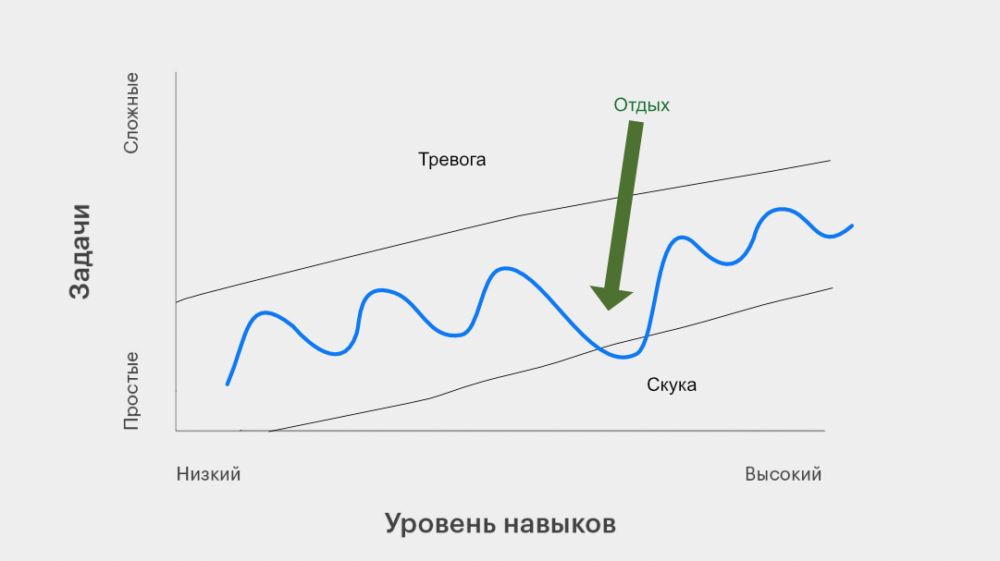
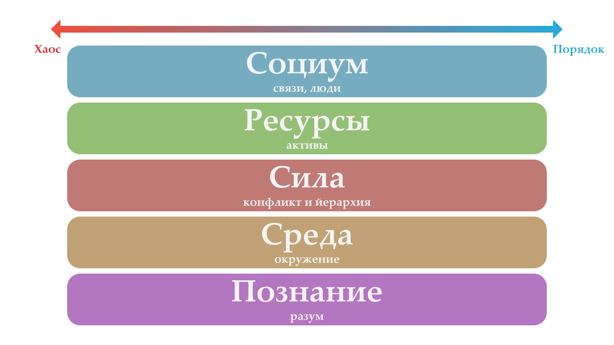
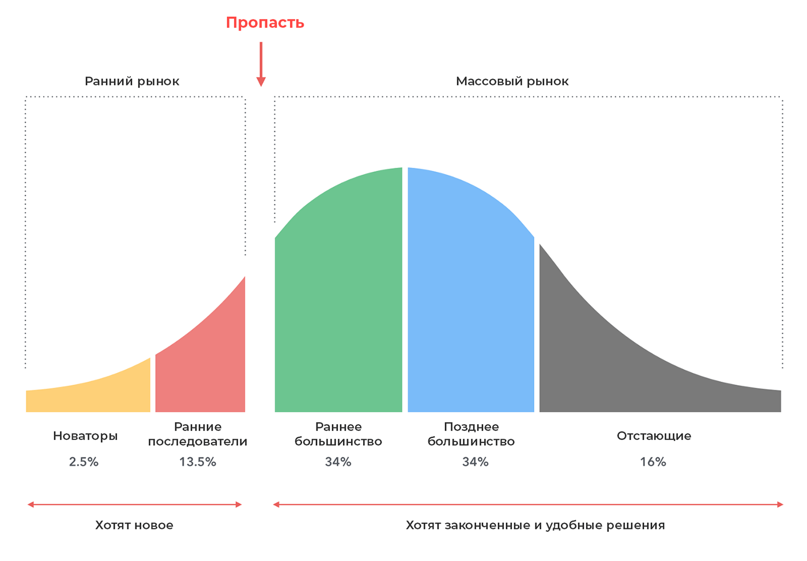

# Organic Game Design (OGD) `v0.9.3-beta`

*Методология создания игр, которые становятся естественной потребностью игрока и создают мощный органический "хвост" продаж.*

**Organic Game Design (OGD)** — это инженерный подход к геймдизайну, который рассматривает игру не как замкнутую систему, а как **органичную часть жизни** человека.

Мы не спрашиваем: «Насколько эта механика веселая?».
Мы спрашиваем: «Какой дефицит в жизни игрока она восполняет?». Это не отменяет маркетинг, но делает его честным: вы продаете не воздух, а решение проблемы.

Игрок — это живой организм, стремящийся к равновесию. OGD дает инструменты, чтобы спроектировать игру, которая станет для игрока либо **Убежищем** (снизит стресс), либо **Тренажёром** (даст энергию), идеально попадая в его текущий жизненный контекст.

Это позволяет создавать проекты с высоким удержанием и виральностью, потому что мозг воспринимает их как естественную потребность.

## Оглавление

- [FAQ (быстрые ответы)](FAQ.md)
- [Органичный Геймдизайн (OGD)](#ogd-top)
  - [Оглавление](#ogd-toc)
  - [На какие вопросы отвечает OGD?](#ogd-questions)
- [TL:DR (В двух словах о методе)](#ogd-tldr)
    - [OGD - определение метода](#ogd-definition)
- [Теоретический фундамент](#ogd-theory)
- [Философский контекст](#ogd-philosophy)
- [Базовая Аксиома](#ogd-axiom)
  - [Человеческий Фактор](#ogd-human-factor)
  - [Органические vs. Синтетические игры](#ogd-organic-vs-synthetic)
  - [Базовые типы игр](#ogd-game-types)
    - [Содержимое, которое определяет тип игры](#ogd-game-types-contents)
    - [Игра-Убежище](#ogd-game-shelter)
    - [Игра-Тренажёр](#ogd-game-simulator)
    - [Игра-Маятник](#ogd-game-pendulum)
    - [Игра-Буфет](#ogd-game-buffet)
    - [Иллюзия редкости Игр-Убежищ](#ogd-shelter-rarity)
- [Пять сфер жизни игрока](#ogd-spheres)
    - [1. Познание (разум) 🧠](#ogd-sphere-cognition)
    - [2. Среда (окружение) 🏙️](#ogd-sphere-environment)
    - [3. Сила (конфликт и иерархия) 😡](#ogd-sphere-power)
    - [4. Ресурсы (активы) 💰](#ogd-sphere-resources)
    - [5. Социум (связи и люди) 👫](#ogd-sphere-society)
- [Агентность и инструменты OGD](#ogd-agency-tools)
    - [1. Инструменты Границ 🗺️](#ogd-tools-boundaries)
    - [2. Инструменты Структуры 📦](#ogd-tools-structure)
    - [3. Инструменты Эффективности 🏭](#ogd-tools-efficiency)
    - [4. Инструменты Силы 💪](#ogd-tools-power)
    - [5. Инструменты Социума 🗣️](#ogd-tools-society)
    - [6. Инструменты Шанса (Джокер) 🎲](#ogd-tools-chance)
  - [Как подбирать верный инструмент для игрока](#ogd-tools-pick)
  - [Где рождаются инновации](#ogd-innovation)
  - [Справочник игровых механик → глаголы OGD](#ogd-mechanics-glossary)
    - [Как выбирать глагол, если механика “двусмысленная”](#ogd-mechanics-ambiguous)
    - [Таблица соответствий](#ogd-mechanics-table)
  - [Сенсорный слой и Game Feel](#ogd-sensory-layer)
    - [Валидация Агентности (Сочность / Juice)](#ogd-sensory-validation)
    - [Ритм Обратной Связи](#ogd-sensory-rhythm)
    - [Сенсорный Шум (Скрытый Хаос)](#ogd-sensory-noise)
  - [Справочник аудиторий по эпохам жизни](#ogd-audiences)
    - [Дошкольники (3–6 лет) 🧸](#ogd-audience-preschool)
    - [Ранняя школа (примерно 6–10/11 лет) 🎒](#ogd-audience-early-school)
    - [Поздняя школа / пубертат (примерно 12–17 лет) 🧑‍🎤](#ogd-audience-puberty)
    - [Студенчество / колледж (примерно 18–24/25 лет) 🎓](#ogd-audience-students)
    - [Работа (примерно 25–44 лет) 💼](#ogd-audience-work-25-44)
    - [Работа (примерно 45–60 лет) 👔](#ogd-audience-work-45-60)
    - [Пенсия (примерно 60+) 🌅](#ogd-audience-retirement)
- [Нарратив и Сюжет](#ogd-narrative)
    - [Два контура Агентности](#ogd-narrative-agency-loops)
    - [Когнитивная Физика Нарратива (Цена Входа)](#ogd-narrative-cognitive-physics)
    - [Спектр Идентификации (Как работает эмпатия)](#ogd-narrative-identification)
      - [1. Идентификация Желания ("Я хочу быть им")](#ogd-narrative-id-desire)
      - [2. Идентификация Сходства ("Он такой же, как я")](#ogd-narrative-id-similarity)
      - [3. Эмпатическое Наблюдение ("Я понимаю его")](#ogd-narrative-id-empathy)
    - [Нарративные Инструменты OGD (Справочник)](#ogd-narrative-tools)
    - [Синхронизация Контуров (Ludonarrative Harmony)](#ogd-narrative-harmony)
      - [Типология Синхронизации (Матрица Геймплей + Нарратив)](#ogd-narrative-harmony-typology)
    - [Кейс: Феномен Disco Elysium](#ogd-case-disco-elysium)
    - [Роль Нарратива в Типах Игр (Связка)](#ogd-narrative-role)
    - [Гипотеза применимости OGD вне игр](#ogd-outside-games)
- [Удержание игрока (LTV — пожизненная ценность игрока)](#ogd-retention-ltv)
    - [Феномен Токсичного Потока](#ogd-toxic-flow)
    - [Парадокс LTV: Отпускать, чтобы удерживать](#ogd-ltv-paradox)
  - [Протокол «Мягкой Посадки»](#ogd-soft-landing)
  - [Разбор Кейсов](#ogd-cases)
  - [Тест Последнего Экрана](#ogd-last-screen-test)
- [Игровая инерция и Цена входа](#ogd-inertia-entry)
  - [Барьер входа и инерция](#ogd-entry-barrier)
    - [Два типа отказа](#ogd-two-refusal-types)
  - [Игроки-новаторы и массовая аудитория](#ogd-innovators-mass)
    - [Новаторы и ранние последователи (высокий когнитивный ресурс)](#ogd-innovators)
    - [Раннее и позднее большинство (высокий барьер входа)](#ogd-majority)
  - [Ограничение “раннего рынка” для инди](#ogd-indie-early-market)
  - [Как провести игрока через барьер входа?](#ogd-through-barrier)
    - [Фаза 1: Маркетинговый транзит (обещание)](#ogd-transit-marketing)
      - [Два слоя обещания](#ogd-two-promise-layers)
      - [Разрыв дистанции (почему интерес не конвертируется в покупку)](#ogd-distance-gap)
      - [Якоря осуществимости](#ogd-feasibility-anchors)
      - [Переключение страницы на релизе](#ogd-launch-switch)
      - [Эффект чужого выбора](#ogd-social-distance)
    - [Фаза 2: Геймплейный транзит (доказательство)](#ogd-transit-gameplay)
  - [Две бизнес-стратегии](#ogd-business-strategies)
  - [Эффект социального доказательства](#ogd-social-proof)
  - [Удержание игрока массовой аудитории](#ogd-retention-mass)
- [Маркетинг Регуляции](#ogd-marketing-regulation)
  - [Формула обещания](#ogd-marketing-formula)
  - [Алгоритм выбора инструмента для продажи](#ogd-marketing-tool-choice)
  - [Стратегии продажи](#ogd-marketing-strategies)
  - [Правило Знакомого Кода](#ogd-familiar-code)
    - [Три уровня Знакомого Кода](#ogd-familiar-code-levels)
  - [Визуальная подача](#ogd-visual-design)
- [Жанр и сеттинг](#ogd-genre-setting)
  - [Карта ожиданий сеттинга](#ogd-setting-expectations)
  - [Карта жанровых ожиданий](#ogd-genre-expectations)
  - [Алгоритм проверки на диссонанс жанра и сеттинга](#ogd-dissonance-algorithm)
  - [Ловушка диссонанса](#ogd-dissonance-trap)
  - [Как это влияет на геймдизайн](#ogd-dissonance-impact)
- [Протокол применения OGD (практическая процедура)](#ogd-protocol-application)
  - [Режим A: От игры к аудитории (кто в это играет?)](#ogd-mode-a)
  - [Режим B: От аудитории к игре (когда вы ищете концепт)](#ogd-mode-b)
  - [Режим C: Диагностика (почему не работает?)](#ogd-mode-c)
  - [Режим D: Маркетинг без доступа к геймплею (что мы обещаем рынку?)](#ogd-mode-d)
  - [Мини-проверки](#ogd-mini-checks)
- [Где OGD не работает](#ogd-where-not-work)
    - [Где OGD даёт сильный сбой и не работает:](#ogd-where-fails)
    - [Как маркетинг помогает преодолевать ограничения и сбои OGD](#ogd-marketing-helps)
- [Эпилог: Конкуренция за Агентность](#ogd-epilogue)
  - [Долгосрочная лояльность](#ogd-loyalty)
- [Послесловие](#ogd-afterword)
- [Приложение: Ограничения и контр-аргументы](#ogd-appendix)
    - [Карта уверенности метода](#ogd-confidence-map)
    - [Ключевые контр-аргументы](#ogd-counter-args)

## На какие вопросы отвечает OGD?

Модель позволяет найти ответы на 4 главных вопроса разработки игры: 

- Для геймдизайнера: **ЧТО** мы делаем?
    - *Почему игроки бросают игру, хотя механики работают идеально? Что является ядром игры, а что можно вырезать?*
- Для продюсера: **ДЛЯ КОГО** мы делаем?
    - *Решаем ли мы реальные потребности людей или делаем “игру в вакууме”? Кто наш игрок на самом деле, чего ему не хватает в жизни? Почему этот жанр сейчас умирает, а другой взлетает?*
- Для маркетолога: **КАК** мы это продаем?
    - *Как объяснить ценность игры за 3 секунды? Как избежать обмана ожиданий? Где найти лояльную аудиторию для сложного проекта?*
- Для нарративного дизайнера: **О ЧЕМ** мы рассказываем?
    - *Почему игроки не верят в драму? Почему они скипают диалоги? Почему протагонист раздражает?*

# TL:DR (В двух словах о методе)

Суть метода: мы проектируем игру не как абстрактный «фан», а как инструмент *аллостатической регуляции* (восстановления баланса).

Наша задача — создать игровой опыт, который компенсирует давление реальности игрока. Мы строим игру так, чтобы вернуть игроку ресурс, потраченный на стресс или рутину, давая мозгу именно ту нагрузку, которой ему не хватает. Всё, чтобы создавать игры, которые нравятся игрокам и приносят прибыль.

1. Если игрок устал, это **избыточный хаос** (стресс) → он ищет покоя и контроля: ему нужна игра-убежище, похожая на “горячую ванную”.
2. Если игрок скучает, это **избыточный порядок** (рутина) → он ищет вызова и риска: ему нужна игра-тренажёр, похожая на спаринг.

Задача — понять, в каком состоянии находится игрок, и дать ему правильный инструмент (игру) для восстановления.

### OGD - определение метода

*Organic Game Design (**OGD**)* — прикладная методология с предсказательной целью: заранее оценить, понравится ли игра конкретной аудитории, и какая аудитория вероятнее всего выберет конкретную игру. Это инструмент, который помогает дизайнеру выйти за пределы собственных вкусов и смотреть на игру глазами аудитории.

> [!NOTE]
> Уточнение: OGD не пытается предсказать поведение *индивида* с точностью «купит/не купит». Она работает на уровне *аудитории* и *направления рисков*: где случится Диссонанс Ожиданий, где в ранней сессии возникнет Избыточный Хаос (стресс), где игра провалится в Избыточный Порядок (скука) и как это связано со Сферами и Инструментами.
>
> Это делает OGD ближе к инженерному фреймворку: она помогает быстрее поставить правдоподобную гипотезу и проверить её на игроках, чем пытаться «угадать рынок».

> [!IMPORTANT]
> **ВАЖНО**: Наш метод основывается на геймдизайне без принудительных практик удержания. Здесь вы не найдете приемов, которые удерживают игрока через давление, угрозы потерь или искусственные обязательства, но вы найдете описание того, как наш подход может конкурировать с играми, которые активно используют такие механики.
>
> См. раздел: [Где OGD не работает](#ogd-where-not-work)

У OGD есть полезное свойство: им можно пользоваться в обе стороны.

- **От игры к аудитории**: это когда мы придумали или нашли игру и пытаемся понять, *кто* аудитория этой игры.
- **От аудитории к игре**: это когда мы нашли аудиторию с явным запросом и пытаемся *придумать или найти* игру, которая с высокой вероятностью закроет их потребности.

> [!NOTE]
> Метафоры «регуляции состояния», используемые в тексте, описывают *восполнение дефицита* — того, чего человеку не хватает в реальности. OGD — это язык геймдизайна и маркетинга, а не клиническая рамка.

---

<b>Теоретический фундамент (научная база метода)</b>

- [**Теория самодетерминации**](https://ru.wikipedia.org/wiki/Теория_самодетерминации) (Self-determination theory — SDT): определяет базовые психологические потребности (автономия, компетентность, связность), которые игровой опыт тоже может удовлетворять.
    - *OGD берет из теории сильную потребность в Автономии + Компетентности (Агентности), сильную потребность в связности (социум и люди). Это база OGD.*
- [**Теория потока**](https://ru.wikipedia.org/wiki/Поток_(психология)) (Flow Theory): описывает динамику между скукой и тревогой, в которой активность удерживает вовлечённость.
    - *OGD берет теорию для подтверждения наличия разных полюсов интереса - скука (избыточный порядок) и тревога (избыточный хаос), и желание игрока уйти от того и другого в стремлении к балансу.*
- [**Принцип свободной энергии**](https://en.wikipedia.org/wiki/Free_energy_principle) (Free Energy Principle): описывает организм как предсказывающую систему, которая стремится снижать “сюрприз” (неожиданность сенсорных входов) за счёт уточнения внутренних моделей и действий.
    - *OGD использует это как интерпретативную рамку: у человека есть устойчивое стремление снижать неопределённость и возвращаться к рабочему равновесию, а игры могут быть одним из инструментов такой саморегуляции.*
- [**Теория когнитивной нагрузки**](https://ru.wikipedia.org/wiki/Теория_когнитивной_нагрузки) (**Cognitive load theory**) и *когнитивная психология:* помогают понять, почему человек играет в игры, как люди получают знания и опыт, а также почему мозг перегружается и «ленится» что-либо менять и пробовать новое.
    - *OGD использует эту теорию, чтобы объяснить барьер входа: когда новая игра требует много “оперативного внимания” (новые правила, интерфейс, действия), часть аудитории будет избегать такого старта и тянуться к более знакомым паттернам опыта.*
- [Пирамида Маслоу](https://ru.wikipedia.org/wiki/Пирамида_потребностей_по_Маслоу) (в маркетинге) и **[теория ERG](https://ru.wikipedia.org/wiki/Теория_ERG_Альдерфера)** (Клейтона Альдерфера) в психологии: это популярные “языки” классификации человеческих потребностей. Пирамида Маслоу считается устаревшей в научном смысле, а ERG часто рассматривают как её более гибкую альтернативу (без жёсткой лестницы).
    - *OGD использует ERG как таксономию (удобную группировку “что болит”). Ядро объяснительной силы метода в другом: SDT (Агентность/связность) + когнитивная нагрузка (барьер входа) + практические предсказания про диссонанс и трение.*
    - *Маслоу здесь упоминается только как популярный “маркетинговый язык”. OGD не строится на иерархии «снизу вверх»: она описывает динамический дисбаланс (хаос ↔ порядок) и то, как игры возвращают Агентность через инструменты.*
- [**Mood Management Theory**](https://en.wikipedia.org/wiki/Mood_management_theory) (Zillmann, Bryant): экспериментально доказанная теория медиапсихологии. Люди, находясь в стрессе, бессознательно тянутся к успокаивающему контенту, а скучающие — к возбуждающему. Психика автоматически ищет «контент-лекарство» для возврата к равновесию.
    - *Это прямая экспериментальная база для Базовой Аксиомы OGD (ось Хаос ↔ Порядок). MMT доказывает, что выбор контента для саморегуляции — не метафора, а воспроизводимый поведенческий паттерн.*
- **[Processing Fluency](https://en.wikipedia.org/wiki/Processing_fluency)** (беглость обработки): чем легче мозгу распознать и обработать информацию, тем более «безопасной», приятной и правдивой она кажется. Работает автоматически, на уровне Системы 1.
    - *OGD использует это как фундамент маркетинговой части метода: Правило Знакомого Кода, визуальная подача, барьер входа. Если игра или её маркетинг создают когнитивное трение при первом контакте (непривычный жанр, нечитаемый UI, чужеродный визуал), мозг автоматически оценивает продукт как «рискованный» — ещё до того, как игрок осознал почему.*
- [**Теория уровней конструирования**](https://en.wikipedia.org/wiki/Construal_level_theory) (Construal Level Theory — CLT, Trope & Liberman): чем дальше от нас событие (во времени, пространстве, социально), тем абстрактнее мы о нём думаем — «зачем?». Чем ближе — тем конкретнее: «как именно?». Эффект стабильно воспроизводится в сотнях исследований.
    - *OGD адаптирует CLT в прикладной язык: **мышление на дистанции** (абстрактное, «зачем мне это?» — привлекательность, desirability) и **мышление вблизи** (конкретное, «как именно начать?» — осуществимость, feasibility). В маркетинге: на дистанции (трейлер, соцсети) игрок оценивает привлекательность обещания, а вблизи (страница магазина, момент покупки) переключается на осуществимость — цена, время, размер. В транзите: в первые минуты мышление игрока максимально конкретное, и абстрактная информация (лор, стратегия) просто не обрабатывается — она не того типа. При выходе из сессии мягкая посадка переключает мышление обратно на абстрактный уровень, где формируется позитивная оценка опыта.*
    - *Примечание: в научной литературе используются термины «уровень конструирования» (construal level) и «рассогласование уровня абстракции» (construal mismatch). В тексте OGD мы заменяем их на «мышление на дистанции / вблизи» и «информация не того типа» для скорости восприятия.*

> [!TIP]
> Если специалисту нужен не пересказ, а первоисточник (чтобы видеть, на чем стоит логика OGD), вот “короткая полка” классики:
>
> - SDT: Deci & Ryan (2000); Ryan & Deci (2017). В играх: Ryan, Rigby & Przybylski (2006) про мотивацию и потребности.
> - Flow: Csikszentmihalyi (1990).
> - Predictive processing / Free Energy Principle: Friston (2010); Clark (2013).
> - Cognitive Load Theory: Sweller (1988); Paas & van Merriënboer (1994/1998).
> - ERG (как альтернатива пирамиде): Alderfer (1969). Критика “пирамиды”: Wahba & Bridwell (1976).
> - Mood Management Theory: Zillmann (1988); Bryant & Zillmann (1984).
> - Processing Fluency: Reber, Schwarz & Winkielman (2004); Alter & Oppenheimer (2009).
> - Construal Level Theory: Trope & Liberman (2010); Liberman & Trope (1998).

> OGD объединяет их так: игру можно рассматривать как один из инструментов саморегуляции, который помогает снижать субъективную неопределённость (в рамках predictive processing / Free Energy Principle), возвращает Агентность и связность (SDT) и удерживает в состоянии оптимального вызова (поток, Flow теория). ERG здесь выступает как язык группировки “о чём дефицит”. Mood Management Theory подтверждает саму ось Хаос ↔ Порядок экспериментально, Processing Fluency объясняет, почему первый контакт с игрой так критичен, а Теория уровней конструирования показывает, как мышление игрока переключается между «зачем мне эта игра» и «как именно начать» — и почему маркетинг и транзит должны работать на обоих уровнях.
> 

> [!NOTE]
> Важно для качества метода: OGD стоит на теориях разного “веса”, и это нормально. Проблемы начинаются, когда мы говорим о гипотезах и эвристиках так, будто это доказанные законы.
>
> - **Сильная опора (высокая прикладная надежность):** SDT, Cognitive Load Theory, Mood Management Theory, эффект “лёгкости восприятия” (processing fluency), Peak-End Rule, Теория уровней конструирования (CLT).
> - **Хорошая, но контекстная опора (зависит от формализации и измерения):** Flow.
> - **Интерпретативная рамка (влиятельно, но не “единственно верно”):** predictive processing / FEP.
> - **Классификатор потребностей (полезно как таксономия, но не ядро доказательности):** ERG.
>
> В дальнейшем в тексте мы будем держать этот принцип: чем слабее “фундамент”, тем осторожнее формулировка (тенденция/эвристика/гипотеза), и тем важнее примеры, кейсы и проверяемые предсказания.
>
> Контр-ракурс нужен не для “разоблачений”, а для честных границ.
>
> Flow как переживание устойчиво описывается в культуре и практике, но в науке упирается в проблемы операционализации и измерения. Классическая гипотеза “баланс вызова и навыка” работает не всегда и объясняет лишь часть вариативности (Abuhamdeh, 2020; Løvoll & Vittersø, 2014).
>
> Predictive processing / FEP — мощный язык моделирования, но его часто критикуют за размытые переходы от математики к онтологическим заявлениям (“что такое агент и где граница”) и за риск нефальсифицируемости без дополнительных конкретных моделей (Andrews, 2021; Bruineberg, Dołęga, Dewhurst, & Baltieri, 2022).

# Философский контекст

OGD опирается на нейробиологию и поведенческую психологию, но внутренняя динамика метода хорошо рифмуется с философскими традициями, которые описывают ту же механику на протяжении тысячелетий.

Хаос и Порядок в модели — не «добро и зло». Это взаимозависимые силы, где избыток одной компенсируется усилением другой. Даосская логика баланса (Инь-Ян) описывает ровно это — без мистики, просто как наблюдение о том, как ведут себя системы.

Отсюда следует важный тезис: статичное равновесие невозможно. Любая попытка «заморозить» систему в одной точке — это её смерть. Жизнь — постоянное движение маятника. Игра в этой картине — искусственный инструмент, который возвращает маятник ближе к центру.

С западного фланга к той же мысли приходит стоицизм. В его основе лежит «дихотомия контроля» — разделение мира на то, что зависит от тебя, и то, что нет. OGD использует ту же логику: мы разделяем то, на что игрок может повлиять (Инструменты, Агентность, Игра), и то, что ему неподвластно (Хаос Среды, Случайность).

---

# Базовая Аксиома

Человек стремится к **оптимальной регуляции** (аллостазу), а не к статичному покою. В реальной жизни это равновесие постоянно нарушается в одну из сторон:

- **Избыточный Хаос** (стресс или тревога) - слишком много вызовов, перегрузка информацией, дефицит ресурсов, непредсказуемость.
- **Избыточный Порядок** (скука или стагнация) - слишком мало вызовов, рутина, предсказуемость, стерильность, избыток безопасности.

Игрок подсознательно тянется к опыту, который компенсирует его текущее состояние — через прямые действия (игровые механики) или через сопереживание (нарратив и сюжет) — и возвращает его в поток.

> [!NOTE]
> **Важно**: желание играть в определённые игры запускает любой дисбаланс — и избыток хаоса (тревога), и избыток порядка (скука).
>
> OGD — стратегический подход. Он помогает понять аудиторию и выстроить концепцию игры в целом, но НЕ является инструкцией по настройке микро-циклов геймплея.

## Человеческий Фактор

OGD — это философия «здорового эгоизма». Метод описывает поведение человека, который подсознательно *хочет* вернуть себе баланс и чувствовать себя хорошо.

Однако мы признаем, что игрок не всегда рационален.

## Органические vs. Синтетические игры

Помимо жанра, игры различаются способом взаимодействия с дофаминовой системой игрока.

**Синтетические игры**

Они опираются на *уязвимости* мозга.
Такие игры используют FOMO, манипулятивные лутбоксы, искусственный дефицит и таймеры, чтобы вызвать быстрый дофаминовый всплеск.

После сессии игрок часто чувствует себя истощенным, но хочет «добавки». Это пустые калории, которые не питают, а лишь глушат голод.
Цель такой игры — удержание и завлечение любой ценой (Retention).

> [!TIP]
> **Важно: Не путайте декорации с механикой.**
> Игра может выглядеть как казино (например, *Balatro*), но работать как честная математическая задача.
> 
> В OGD мы смотрим «под капот»: если игра не использует тёмные паттерны и манипуляции, она остается Органической, даже если на экране карты, фишки и джокеры. 

**Органические игры**

Они опираются на *потребности* психики.
Такие игры используют прозрачные правила и честный вызов, чтобы восполнить реальный дефицит в покое, в компетентности или в живом общении.

После сессии игрок чувствует себя восстановленным, «сытым» и довольным.
Цель такой игры — завлечение и возвращение в игру через доверие и приятный игровой опыт.

> [!NOTE]
> **Экономический эффект: Разница в Энергии**
>
> - **Синтетика** требует поддержания. Поскольку игроки выгорают и уходят, вам нужно постоянно закупать новый трафик, чтобы компенсировать отток. Как только вы выключаете рекламу, игра умирает.
> - **Органика** требует активации. Вам нужен мощный "Неорганический толчок" (маркетинг/хайп/реклама) на старте, чтобы преодолеть порог шума. Но затем игра живет сама за счет высокого удержания (Retention) и рекомендаций. Вы платите за "вход" игрока, а не за то, чтобы он не сбежал.

> [!TIP]
> **OGD-тест:**
> Если игрок выключает вашу игру с чувством вины («потратил время зря») — это синтетика.
> Если с чувством завершенности («хорошо посидел») — это органика.

## Базовые типы игр

Игра работает как инструмент одного из нескольких типов. Либо она воспроизводит реальность игрока, давая ему возможность справиться с тем, что не получается в жизни (**Игра-Тренажёр**). Либо даёт противоположное реальности — тихую гавань, где можно восстановиться (**Игра-Убежище**). Также существуют смешанные типы игр, которые сочетают в себе оба подхода (**Игра-Маятник** или **Игра-Буфет**).

Чтобы лучше понять как делать и продвигать игру и чтобы она приносила удовольствие игрокам, нужно определить её тип: Тренажёр/Убежище/Маятник/Буфет.

### Содержимое, которое определяет тип игры

Выше описаны несколько типов игр и их общая логика. Чтобы понять, к какому типу относится конкретная игра, достаточно посмотреть на её игровые механики и сюжет/нарратив. Каждая механика либо развеивает скуку (избыточный порядок), либо успокаивает тревогу (избыточный хаос). 

> Это не похоже на классические теории геймдизайна, т.к. они обычно определяют игру как инструмент, который должен развеивать только скуку и тоску.
> 

Развеивание скуки назовём **Стимуляцией**, а механики, которые этим занимаются — Стимуляторами. Снижение тревоги/стресса назовем **Стабилизацией**, а механики — Стабилизаторами. Эти термины OGD будут встречаться дальше постоянно.

> [!IMPORTANT]
> 💡 **Правило**: Если в игре основные игровые механики стабилизируют тревогу и стресс игрока из жизни — это игра-убежище. Если наоборот стимулируют скуку и застой в жизни — это игра-тренажёр.

**Важное уточнение**: Игра, состоящая на 100% только из механик-стабилизаторов (убежище) или механик-стимуляторов (тренажёр), превращает геймплей либо в тотальную скуку для убежища, либо в невероятный стресс для тренажёра.

> [!TIP]
> 💡 Парадокс: чтобы игра работала, её нужно разбавлять механиками, противоположными основным.
>
> Проценты ниже — эвристика для баланса (не “физическая константа”). Смысл в том, чтобы не уходить в крайности: чистая стабилизация проваливается в Избыточный Порядок, а чистая стимуляция разгоняет Избыточный Хаос.
>
> **Хорошая** игра-убежище часто состоит из **70-90%** механик стабилизаторов + **10-30%** механик для стимуляции (для развеивания скуки и тоски).
> То же самое с играми-тренажёрами: **70-90%** механик для стимуляции (вызова) + **10-30%** механики-стабилизаторы (для передышки, успокоения и отдыха).
>
> Эта “эвристика смешивания” не выводится из исследований как формула (проценты не “из науки”). Она скорее согласуется с логикой канала оптимального вызова (Flow) и ограничений внимания/нагрузки (Cognitive Load / Attention): Csikszentmihalyi (1990); Sweller (1988); Kahneman (1973).

> [!NOTE]
> **Стимуляцию и стабилизацию создают не только механики, но и нарратив.**
>
> Сюжет-Стимулятор (тайна, интрига, серая мораль) повышает когнитивную нагрузку и снижает Избыточный Порядок. Сюжет-Стабилизатор (архетипы, ясные роли, надежда) снижает нагрузку и снижает Избыточный Хаос. Это означает, что 10-30% «противоположного» в Убежище или Тренажёре могут приходить из нарративного контура (Викарная Агентность), а не только из геймплейных механик (Прямая Агентность).
>
> *Пример:* Убежище с медитативным геймплеем и тревожным сюжетом (*Dredge*, *Strange Horticulture*) получает стимулирующую добавку через нарратив, не нарушая стабилизирующее ядро механик. Тренажёр с жёстким геймплеем и тёплым юмором (*Uncharted*, *Spider-Man*) получает стабилизирующую паузу через нарратив, не ослабляя вызов.
>
> Подробнее: [Нарратив и Сюжет](#ogd-narrative), [Когнитивная Физика Нарратива (Цена Входа)](#ogd-narrative-cognitive-physics), [Синхронизация Контуров](#ogd-narrative-harmony).

### Игра-Убежище

Игра, которая снимает стресс и тревогу, а не развлекает и не развеивает скуку. 

**Кому нужна такая игра**: игрок в реальной жизни часто истощён, у него мало энергии, постоянная тревога. Ему не нужны новые вызовы — нужна передышка. Игра напрямую даёт то, чего не хватает в жизни. Примеры: Stardew Valley, Unpacking, Tetris (на небольшой скорости), LEGO, Minecraft (мирный режим), PowerWash Simulator, Animal Crossing, Dorfromantik, The Sims, Coffee Talk.

> [!NOTE]
> Мы раз за разом даем игроку то, чего не хватает ему в реальной жизни, восполняя его потребности.
>
> Мы строго не воспроизводим его проблемы из его жизни в игре - ни напрямую, ни через аналогии.

В геймдизайне принято использовать кривые напряжения Джесси Шелла, но для игр-убежищ они подходят плохо.

> [!TIP]
> **Научное обоснование рутины ([Active Inference](https://direct.mit.edu/books/oa-monograph/5299/Active-InferenceThe-Free-Energy-Principle-in-Mind))**
> Здесь вступает в силу принцип *Активного Вывода*. Мозг устал от непредсказуемости жизни (энтропии). Ему нужна зона, где правило "Нажал X — получил Y" работает со 100% вероятностью.
> 
> Это делает "гринд" (рутину) не затягиванием времени, а формой цифровой медитации. Мы создаем островок гипер-предсказуемости, который снижает тревогу.

Здесь нужна кривая, похожая на дыхание: медленный рост с периодическими «выдохами» — просадками интереса, уходящими в лёгкую скуку. См. рисунок ниже:

> [!NOTE]
> Задачи не растут быстро — приятная рутина для игр-убежищ нормальна. Просадки нужны, чтобы игрок мог отдохнуть, оглядеться на результаты и спокойно выйти из игры до завтра.

Классическая кривая работает на **истощение**. Герой (игрок) преодолевает всё более сложные препятствия, тратит ресурсы, чтобы в финале выдать катарсис на последнем издыхании.

Если применить это к *Stardew Valley* или *Minecraft*, мы получим катастрофу. Представьте только, что чем дольше вы играете в ферму, тем быстрее вянут растения, тем агрессивнее сорняки и тем выше налоги.

Это превращает "Уютную Игру" в "Работу на износ". Это создает **Избыточный Хаос (стресс)**, от которого игрок сбегает. Убежище вырождается в **Синтетическую игру** (см. выше).

### Игра-Тренажёр

Игра, которая развеивает скуку, встряхивает или даёт выпустить пар — а не предлагает покой.

**Кому нужна такая игра:** игрок полон сил, но чувствует бессилие перед обстоятельствами, или ему невыносимо скучно. Ему нужен не покой, а реванш, встряска, вызов. Игра воспроизводит проблемы из жизни, но даёт мощные инструменты для их решения. Примеры: DOOM, Resident Evil, CS:GO, Dota, Among Us, Fallout, Baba Is You, Subnautica, Frostpunk.

> [!TIP]
> **Научное обоснование (Eustress & Prediction Error)**
> Если Убежище минимизирует ошибки прогноза, то Тренажёр их намеренно *создает*. Мозг, застрявший в рутине (избыточный порядок), голодает по новизне.
>
> Тренажёр дает *Эустресс* (полезный стресс). Мы бросаем игрока в ситуацию контролируемого риска, заставляя мозг мобилизоваться. Победа над этим стрессом дает мощный дофаминовый выброс (Reward Prediction Error), который ощущается как триумф и прилив сил.

> [!NOTE]
> Мы раз за разом воспроизводим в игре боль игрока из реальной жизни, давая возможность её преодолеть.
>
> Мы даем игроку возможность исправить то, что он не может исправить в жизни.

### Игра-Маятник

Игра, которая пытается быть и тренажёром, и убежищем — примерно *50/50* стимуляторов и стабилизаторов.

Это рискованная комбинация: и для продвижения, и для баланса. Если смешать механики неправильно, можно привлечь несовместимые аудитории, которых будет раздражать «чужая» половина игры. 

Чтобы игра-маятник работала как игра, нужно соблюсти несколько строгих правил при совмещении стабилизаторов со стимуляторами:

1. Разделить игру на чёткие фазы или режимы — фаза успокоения и фаза вызова (день/ночь, рейды и т.п.).
2. Не смешивать стимуляцию со стабилизацией в один момент времени, если обе активности требуют высокой концентрации (вредно: “собирай пазл, пока стреляют”). Причина — интерференция двойной задачи (dual-task interference), переключение внимания и рост когнитивной нагрузки: Kahneman (1973); Pashler (1994).
3. Давать игроку свободу выбора: когда он хочет успокоиться, а когда — получить вызов.

> [!TIP]
> 💡 Игра-маятник похожа на «2 в 1»: две игры, завёрнутые в одну.

Примеры: *Dave the Diver* (днём уютный ресторан, ночью — гарпуны и акулы), *Cult of the Lamb* (на базе — милая ферма с заботой об обитателях, в данже — жёсткий рогалик), *Moonlighter* (ночь/день), *Persona 5* (иногда у тебя школьная жизнь, иногда у тебя бои и сложные боссы).

### Игра-Буфет

Игра с множеством стабилизаторов и стимуляторов — те самые «активности» и мини-игры на любой вкус. Буквально шведский стол: «выбирай что хочешь, плата только за вход».

**Примеры**: GTA, Skyrim, Yakuza, Horizon Zero Dawn, серия Zelda, Genshin Impact, Ведьмак, большинство игр Ubisoft.

Последние игры из серии Zelda (например Tears of the Kingdom) это эталонные игры-буфеты, которые работают невероятно хорошо. Если вам нужна идеальная игра-буфет как референс, смотрите в сторону этих игр.

Как и в игре-маятнике, здесь велик риск смешать несмешиваемое. Решение — дать игроку свободу выбора, чем заниматься. Но это часто создаёт когнитивную нагрузку: «что делать дальше, не знаю что выбрать».

> [!TIP]
> 💡 Крупные AAA-игры часто такие: пытаются охватить максимум аудиторий, чтобы окупить бюджет и снизить риски.

> Частая ошибка инди-разработчиков — пытаться сделать игру-буфет. Нет бюджетов, ресурсов и опыта, чтобы всё сбалансировать. Даже крупным студиям это даётся с трудом.
> 

Не все AAA-игры — буфеты. Игры Sony, работы Хидео Кодзимы, souls-like скорее ближе к убежищам или тренажёрам.

### Иллюзия редкости Игр-Убежищ

Может показаться, что игры-тренажёры — это «настоящие игры», а убежища — узкая ниша. Скорее всего, это ошибка восприятия.

Тренажёры доминируют в инфополе: новости, обзоры, киберспорт, стримеры — они «любят» шум. В публичных топах (Steam Charts, Top Sellers) их визуально больше, чем в реальном спросе.

Убежища — «тихое большинство». В цифрах (отзывы, выручка) они зачастую доминируют. Миллиарды людей играют, чтобы сохранить энергию: мобильные, казуальные, cozy-игры. Minecraft и Tetris — самые продаваемые игры в мире.

> [!TIP]
> **Возрастная тенденция (гипотеза)**: в среднем, с возрастом может расти доля запросов на Убежище — спокойные рутины, предсказуемость, низкий риск и “безопасную” вовлечённость. Это тенденция, зависящая от культуры, здоровья и бэкграунда, а не железное правило.
>
> Теоретическая опора: Socioemotional Selectivity Theory (Carstensen, 1999/2006) — с возрастом (и шире: при ощущении “ограниченного будущего времени”) мотивационные приоритеты смещаются к эмоционально значимым и регулирующим состояние целям. Это объясняет, почему ценность спокойных, эмоционально комфортных активностей может расти, не являясь при этом строгим доказательством для жанров.
>
> Эмпирический маркер (рынок/опросы): отчёты ESA “Essential Facts” дают демографию и причины, которые люди называют (например, “relaxation” у старших когорт). Это самоотчёты и американский рынок — использовать как ориентир, не как закон.

---

# Пять сфер жизни игрока

> **Где у игрока перекос в реальной жизни?**
> 
Мы уже разобрали базовую динамику: человек тянется к равновесию, а игра часто помогает вернуться ближе к центру.

Перекос почти никогда не бывает «в целом». Он про что‑то конкретное.

У кого-то перегружена голова и хочется тишины. Кого-то давит среда: шум, люди, правила, бюрократия. Кого-то выматывают конфликты. Кого-то подтачивает нехватка денег, времени, сил. А у кого-то, наоборот, пусто и одиноко.

Чтобы не говорить общими словами, OGD вводит Сферы — пять крупных областей жизни, где чаще всего возникает этот перекос. Для геймдизайнера это карта: какой запрос игрок приносит в игру и почему одна и та же механика одного «собирает», а другого оставляет равнодушным.

<b>Научный фундамент и исследования рынка: Откуда взялись эти 5 сфер?</b>

Важно понимать: в академической психологии нет единой классификации «ровно на пять таких сфер». Эта модель — **инженерный синтез** трех фундаментальных теорий мотивации, адаптированный специально для разработки игр.

Мы взяли классические потребности и сгруппировали их так, чтобы с ними было удобно работать геймдизайнеру и маркетологу:

1.  **Теория Самодетерминации (SDT):** Самая доказанная теория современной психологии (Deci & Ryan).
    *   Потребность в *Компетентности* → легла в основу сферы **Познания** (я понимаю, как это работает).
    *   Потребность в *Связности* → стала сферой **Социума**.
    *   Потребность в *Автономии* → стала фундаментом для сферы **Силы** (я могу влиять).

2.  **Пирамида Маслоу и ERG (Alderfer):**
    *   Базовые потребности в *Безопасности* (Safety) → выделены в сферу **Среды** (мой дом — моя крепость).
    *   Физиологические потребности и накопление → выделены в сферу **Ресурсов**.

3.  **Mood Management Theory (Zillmann):**
    *   Это «железобетонная» классика медиапсихологии, подтвержденная сотнями исследований с 1980-х годов.
    *   *Суть экспериментов (Bryant & Zillmann, 1984):* Людей специально вводили в состояние стресса или скуки, а затем давали выбрать телепрограмму. Результат был неизменным: люди в стрессе бессознательно выбирали успокаивающий контент, а скучающие — экшн. Это доказывает, что психика автоматически ищет контент-лекарство для возврата к равновесию.

4.  **Данные рынка (Quantic Foundry):**
    *   Модель *Gamer Motivation Profile* (опрос >1 млн игроков) подтверждает существование этих кластеров на практике.
    *   Сфера **Силы** пересекается с мотивациями *Destruction* (Разрушение/Хаос) и *Power* (Власть/Влияние).
    *   Сфера **Познания** — с *Strategy* (Стратегия/Планирование) и *Discovery* (Открытие/Любопытство).
    *   Сфера **Среды** — с кластером *Immersion* (Погружение: Фантазия и Сюжет).
    *   Сфера **Ресурсов** — с *Completion* (Завершение: собрать всё, закрыть все галочки).
    *   [Подробнее о модели QF](https://quanticfoundry.com/gamer-motivation-model/)

Почему не три?

Три группы подходят для общих разговоров, но для проектирования механик требуется точность. Ощущение «я могу» может рождаться от решения задач (Познание) и от победы в борьбе (Сила). Ощущение безопасности может быть про пространство (Среда) и про запасы (Ресурсы). Если склеить эти вещи, метод теряет предсказательность: разные игры начинают выглядеть одинаково, хотя на деле они закрывают разные запросы.

### 1. Познание (разум) 🧠

Сфера отвечает за обработку информации: обучение, понимание, принятие решений, логику.

- Избыточный хаос: информационный шум, вынужденная мультизадачность, непонимание происходящего, экзистенциальные кризисы (кризисы смыслов).
- Избыточный порядок: монотонная работа, отсутствие интеллектуальных задач, сенсорный голод, «всё предельно ясно и понятно».

### 2. Среда (окружение) 🏙️

Сфера отвечает за пространство вокруг игрока — физическое, информационное, системное. 

- Избыточный хаос: давление среды, опасность, отсутствие личного пространства, дискомфорт, хаотичная бюрократия.
- Избыточный порядок: золотая клетка, стерильный офис, маршрут дом-работа без отклонений, отсутствие новизны, избыточно строгие законы.

### 3. Сила (конфликт и иерархия) 😡

Сфера отвечает за конфликт, иерархию и безопасность. Взаимодействие с другими в координатах силы: бей или беги, самоутверждение, защита территории, статус в группе.

- Избыточный хаос: слишком много угроз направлено на тебя — прямая агрессия, активный буллинг, токсичная конкуренция, постоянные конфликты. Ощущение: «атакуют со всех сторон, не успеваю отбиваться».
- Избыточный порядок: твоя активность в застое — жизнь слишком безопасна (нет вызовов, не с кем бороться) или тебя систематически подавляют (гиперопека, запрет на агрессию, авторитарный контроль). Ощущение: «я в безопасности, но слабею» или «я заморожен, не могу действовать».

> [!NOTE]
> **Подавление лечится вызовом, не покоем.**
> Подавленные подростки часто выбирают CS и Valorant вместо уютных ферм. В PvP честные правила. Результат зависит от тебя. Это возвращает агентность, которую забрали в реальной жизни.

### 4. Ресурсы (активы) 💰

Сфера отвечает за владение ресурсами: деньги, материальные активы и физическая энергия (жизненный тонус).

> [!NOTE]
> Важно: здесь речь идет именно о физической энергии ("спина отваливается", "колени болят", физиологические неудобства и проблемы тела из-за деятельности днем, это физическая усталость или бодрость). Когнитивная энергия (внимание, ментальный ресурс) относится к Сфере Познания.

- Избыточный хаос: «не хватает на жизнь», «нет сил встать с дивана» (физическое истощение), ресурсы утекают сквозь пальцы, ощущение бедности, долги, страх будущего.
- Избыточный порядок: «у меня есть всё, но это ничего не значит», «энергия распирает, а деть некуда»(гиперактивность), перенасыщение, отсутствие желаний.

### 5. Социум (связи и люди) 👫

Сфера отвечает за принадлежность к группе, эмпатию, связи. Люди — социальные животные: изоляция для мозга подобна физической боли, но избыток связей тоже вызывает стресс.

- Избыточный хаос: «люди меня душат», социальное давление, требование соответствовать, нарушение границ, троллинг, буллинг.
- Избыточный порядок: «я никому не нужен», изоляция, отсутствие эмоционального отклика, социальный вакуум, формальное общение.

**Особый случай: Экзистенциальный Кризис и Нигилизм**

Иногда дисбаланс достигает пика сразу в нескольких сферах, создавая ощущение **тотальной незначимости** («я ни на что не влияю», «мир бессмысленен»). Это НЕ отдельная 6-я сфера, а состояние Нулевой Агентности (из SDT).

Игроки в этом состоянии ищут не фана, а влияния (смысла). Эта проблема описана дальше.

---

# Агентность и инструменты OGD

Выше описаны 5 сфер жизни с характерными проблемами, выраженными через дисбаланс хаоса и порядка.

Каждый человек хочет иметь **Агентность** (термин из SDT) — способность влиять на свою жизнь так, чтобы это работало и давало результат.

Агентность в игре — это способность игрока влиять на игровые системы через инструменты (условно «молотки»). Игрок берёт инструменты и решает проблемы в сферах («забивает гвозди»), которые отражают его жизнь. Главное — в игре эти инструменты РАБОТАЮТ лучше, чем в жизни.

Каждый инструментарий работает в двух режимах:

- **Стабилизатор** - снижает избыточный хаос, успокаивает, возвращает контроль (снижает стресс).
- **Стимулятор** - снижает избыточный порядок, т.е. разрушает застой, бодрит, создает вызов (снижает скуку).

Ниже — инструментарий (игровые механики) для стабилизации хаоса и стимуляции порядка.

### 1. Инструменты Границ 🗺️

> Это родные инструменты для балансировки состояний из сферы Среды (окружения) 🏙️.
> 

**Стабилизатор** хаоса — глагол ЗАКРЫТЬСЯ. Изоляция, стены, укрытия, барьеры. Примеры: Minecraft (строительство базы), жанр Tower Defense.

**Стимулятор** порядка — глагол ОТКРЫТЬСЯ. Исследование, выход за стены, открытие нового. Примеры: Skyrim, Subnautica.

### 2. Инструменты Структуры 📦

> Родной инструментарий для сферы Познания (разум) 🧠
> 

**Стабилизатор** — глагол СОБРАТЬ. Упорядочивание, сортировка, чистка, снижение энтропии. Примеры: Unpacking, Tetris.

**Стимулятор** — глагол РАЗОБРАТЬ. Разгадать, расследовать, найти связи и закономерности, решить загадки. Примеры: The Witness, детективные игры, сложные пазлы.

> [!NOTE]
> «Собрать» можно применить и к пазлам — противоречия нет. «Разобрать» относится к сложным загадкам, где нужно найти решение. «Собрать» — к простым пазлам, где игроку не нужно думать КАК, только монотонно находить и ставить части на место.

### 3. Инструменты Эффективности 🏭

> Родной инструментарий для сферы Ресурсов (активов) 💰
> 

**Стабилизатор** — УПРОСТИТЬ (Оптимизация). Превращение рутины в автоматику. Игрок хочет получать тот же (или больший) результат, делая меньше действий. Примеры: Дроны, авто-бой, idle-доход, "пылесос" для лута, апгрейд "авто-сортировка".

**Стимулятор** — УСЛОЖНИТЬ (Сверх-результат). Игрок осознанно строит сложную, громоздкую или рискованную схему, чтобы выжать из игры максимум, недоступный обычным путем (min-maxing). Примеры: Redstone-инженерия в Minecraft, сложные билды в PoE (Path of Exile), разгон процессора в симуляторах, настройка ж/д сигналов в Factorio ради +1% КПД. 

> [!TIP]
> **Как не путать Структуру и Эффективность?**
> Они похожи, потому что обе работают на упорядочивание, но мотивация разная.
> 
> *   **Структура (Познание)** — это про эстетику и логику. Игрок хочет понять систему и навести красоту (Тетрис в инвентаре, распутать спагетти из проводов, разгадать загадку). Эмоция: "Теперь всё правильно".
> *   **Эффективность (Ресурсы)** — это про выгоду и скорость. Игрок хочет сэкономить время/силы и получить больше (Авто-сортировка, конвейер, который работает сам, найти эффективный метод получения ресурсов). Эмоция: "Я хакнул систему / Я богат".
> 
> Если вы делаете это ради красоты схемы, то это инструмент Структуры. Если ради того, чтобы завод работал быстрее, то это инструмент Эффективности.

### 4. Инструменты Силы 💪

> Родной инструментарий для сферы Силы (конфликта и иерархии) 😡
> 

**Стабилизатор** — ПОДАВИТЬ. Доминирование, уничтожение угрозы в лоб, активная самооборона. Примеры: DOOM, экшены, военные стратегии.

**Стимулятор** — БРОСИТЬ ВЫЗОВ. Соревнование, вызов сопернику, борьба за статус. PvP, рейтинги, таблицы лидеров.

### 5. Инструменты Социума 🗣️

> Родной инструментарий для сферы Социума (связей и людей) 👫
> 

**Стабилизатор** — СБЛИЗИТЬСЯ. Поддержка, кооперация, забота, эмпатия. Примеры: Stardew Valley, NPC, которые всегда рады, роль поддержки («лекарь»).

**Стимулятор** — МАНИПУЛИРОВАТЬ. Обман, интриги, социальный стелс. Примеры: Among Us, мафия-подобные игры, политические симуляторы, механики переговоров.

### 6. Инструменты Шанса (Джокер) 🎲

**Стабилизатор** — ОБОЙТИ. Адаптироваться, минимизировать риски, выработать реакции на угрозы. Примеры: рогалики, survival-игры.

**Стимулятор** — РИСКНУТЬ. Азарт, добровольный риск, высокие ставки. Примеры: покер, лут, гача/лутбоксы.

> [!TIP]
> **Пример из жизни игрока**: У игрока проблема в сфере РЕСУРСОВ - он беден (избыточный хаос в ресурсах, значит нужны **стабилизаторы**, а не стимуляторы).
>
> Инструментарии можно применять очень гибко.
>
> - Он может ЗАКРЫТЬСЯ, границы (копить ресурсы в игре)
> - Он может ПОДАВИТЬ, сила (ограбить банк, забрать ресурсы силой в игре)
> - Он может УПРОСТИТЬ, эффективность (найти эффективный метод получения ресурсов в игре).

## Как подбирать верный инструмент для игрока

Многие инструменты применимы для компенсации разных сфер, но у каждой проблемы есть «родной» инструмент — он работает естественнее всего. Есть также компенсирующий (план Б) и «синтетический» (протез) — искусственный, но рабочий, особенно при сильном перекосе в хаос или порядок.

Таблица применимости инструментов для разных сфер:

| **Сфера** | **Родной инструмент** <em>(Честный опыт)</em> | **Компенсирующий инструмент** <em>(Обходной путь, план Б)</em> | **Синтетический инструмент** <em>(Безопасный протез)</em> |
| --- | --- | --- | --- |
| ПОЗНАНИЕ (разум) | **Структура** <em>Собрать или разобрать (разгадать)</em> | Эффективность (стабилизация) Шанс (стимуляция), Сила (стимуляция) | **Сила (стабилизация)** _Подавить_ <em>Отказ от логики, “меньше думай — больше стреляй”, разгрузка от чрезмерного обдумывания.</em> |
| СРЕДА (окружение) | **Границы** <em>Закрыться в доме или открыть карту</em> | Шанс (стабилизация) Эффективность (стабилизация) | **Структура (стабилизация)** _Собрать_ <em>Превращение природы в цех. Победа над хаосом окружения через чертежи и т.п.</em> |
| РЕСУРСЫ (активы) | **Эффективность** <em>Тайкуны, настройка потоков для получения ресурсов.</em> | Шанс (стимуляция) Социум (стабилизация) | **Шанс (стимуляция)** _Рискнуть_ <em>Гача, монетизация дружбы, покупка лояльности и любви.</em> |
| СИЛА (конфликт и иерархия) | **Сила** <em>Прямая агрессия, доминирование, бросание вызова.</em> | Границы (стабилизация) Структура (стабилизация) | **Структура (стимуляция)** _Разобрать_ <em>Война как шахматы, убийство без ярости и рефлексов, через логику и мышление.</em> |
| СОЦИУМ (связи и люди) | **Социум** <em>Кооп, серверы для отыгрыша роли (RP), эмпатия NPC, а также манипуляции, обман, мафия-подобные игры.</em> | Сила (стабилизация) Эффективность (стабилизация) | **Эффективность (стабилизация)** _Упростить_ <em>Геймификация отношений, дружбы, любви через прогресс. Дейтинг-симы, адалт-игры.</em> |

> [!WARNING]
> **Важно**: В столбце «Синтетический инструмент» указан самый частый вариант в дизайне. Но логически протезировать сферу можно и другими инструментами. Например, СИЛУ можно заменить не только Структурой (ум/стратегия), но и Ресурсами (гринд/перекачка героя — победа за счет превосходства в статах.). Суть синтетического инструмента это дать результат Сферы, избавив от честного усилия в ней.

**Главное правило для подбора инструментов (игровых механик)**

Для игр с отыгрышем роли (ролевые игры — RPG, 4X‑стратегии, мафия-подобные игры) - активно добавляйте стабилизатор и стимулятор из одной и той же сферы, т.к. роль это буйство красок и изменчивость характера персонажа, за которого игрок играет.

Для всех остальных игр - НЕ добавляйте одновременно стабилизатор и стимулятор из одной и той же категории.

> **Например**, не намешивайте механики дружбы и сближения с механиками манипуляции и обмана в одну и ту же игру, но если это RPG, где игрок хочет отыгрывать сложного персонажа, то их смешение часто оправдано и делает игру интереснее.
> 

> [!TIP]
> 💡 Исключение может быть, только если это ваш творческий замысел и вы знаете для чего это смешиваете, например создаете в игре редкий драматический момент выбора, чтобы впечатлить игрока. В любом случае, это всегда риск создать раздражение у игрока.

**Почему инструментарий распределился именно так?**

Компенсирующий инструмент отвечает на вопрос «Что делать, если нельзя решить проблему в лоб?». Например, СИЛА → ГРАНИЦЫ: если не получается победить в открытом бою (Подавить), уходим в глубокую оборону и строим «стены» (Закрыться).

Еще яркий пример, инструмент СОЦИУМ → СИЛА, т.е. если я не могу договориться по-хорошему (т.е. Сблизиться), я использую авторитет и статус (т.е. Подавить через Лидерство).

Синтетический инструмент работает при очень сильном перекосе. Пример: человек в сфере СОЦИУМА боится взаимодействия с людьми — эмоции непредсказуемы, риск отказа парализует. «Родной» инструмент (искреннее сближение) для него слишком дорог и даёт стресс. Нужен безопасный «мостик» — суррогатная социализация, очищенная от части человеческого фактора.

**Алгоритм выбора инструмента для балансировки состояния игрока в одной из сфер:**

| 1. Если игрок в максимальном дисбалансе → то используем синтетический инструмент (протез), а если нет синтетики → читаем следующий пункт. |
| --- |
| 2. Если у игрока не хватает сил или навыков, желаний для родного инструмента → используем компенсирующий (план Б) или *энергосберегающую* версию родного, если нет → далее… |
| 3. Если у нас умеренный дисбаланс → используем родной инструмент, если нет → **НЕ** используем инструменты вообще из этой сферы. |

> [!NOTE]
> **Пояснение алгоритма выбора инструмента на примере Социума**
>
> Когда дисбаланс в сфере Социума очень сильный (например, тяжелое одиночество), игроку может быть сложно сразу использовать “родной” инструмент (сближение, кооперация). На этом уровне лучше работает синтетический инструмент: более безопасная форма контакта без высокой эмоциональной цены.
>
> Если дисбаланс умеренный, но у игрока мало сил и внимания, часто лучше работает компенсирующий вариант: более “энергосберегающий” вход, маленькими шагами.
>
> Если сил достаточно, “родной” инструмент становится доступным и дает наибольший эффект.
>
> Главный принцип: не добавлять инструменты “в эту Сферу”, если дисбаланса там нет или он несущественный.

**Как работают конфликты?**

Конфликт возникает при нарушении алгоритма выбора инструментов. Одновременное присутствие несовместимых инструментов вызывает диссонанс и раздражение.

- **Познание vs Шанса**: Игрок хочет понять закономерность, если результат зависит от бросков кубика, понимание невозможно.
- **Социум vs Эффективность**: Игрок просто испытывает проблемы в социуме (не максимальные). Мы хотим верить что все NPC живые. Если игра показывает шкалу “дружбы” и требует подарить 50 одинаковых подарков (получение которых можно оптимизировать), то магия разрушается. Мы видим процесс оптимизации ресурсов вместо дружбы. Итог: мы выбрали неверный инструмент (протез), который применим только тогда, когда у игрока максимально высокий дисбаланс.

> [!TIP]
> Крупные AAA-игры часто дают выбор среди разных инструментов — возможность самому выбрать нужный без принуждения решает проблему. Но если выбора нет, это порождает конфликты инструментов и раздражение.

## Где рождаются инновации

Несмотря на чёткость матрицы, это не аксиома — просто стандарты и «проторенная дорожка».

Инновации возникают, когда берёшь инструмент из другой колонки и заставляешь его работать. Это риск, но и шанс на уникальность: либо очень нишевая игра, либо широкий хит, формирующий новый поджанр.

Яркий пример Factorio, здесь сфера СИЛЫ решается не мышцами, а оптимизацией конвейеров, чтобы защищаться от враждебных обитателей. Это может отпугивать аудиторию, которая ищет инструменты СТРУКТУРЫ. Если бы авторы перекрутили сложность выживания сильнее, чем есть в игре, игроки были бы раздражены.

Ещё один парадокс, это Papers, Please игры. В игре есть сфера СОЦИУМА, судьбы людей решается через бюрократическую сортировку (инструментарий Структуры - разобрать). Игра использует инструмент СИЛЫ (подавить - я вершитель судеб).

 

> [!TIP]
> **Правило мастера**: Вы можете нарушать матрицу, если делаете это осознанно, чтобы создать специфическое ощущение (например, ощущение “бездушной машины” как в Papers, Please, где это достигается именно конфликтом инструментов Социума и Структуры).

## Справочник игровых механик → глаголы OGD

Этот справочник нужен для шага “перевода” из привычного языка механик (строить/крафтить/стрелять) в обобщенный язык OGD‑инструментов (Закрыться/Собрать/Упростить и т.д.).

Это словарь по умолчанию, а не догма.

Одна и та же механика может переходить в другой глагол, если в конкретной игре меняется её функция: она снижает Избыточный Хаос (Стабилизатор) или снижает Избыточный Порядок (Стимулятор), и какую Сферу она реально “регулирует” в контексте аудитории.

### Как выбирать глагол, если механика “двусмысленная”

1) Смотри на повторяемое действие “раз в минуту”. Редкая фича “раз в час” менее важна.

2) Смотри на цену ошибки.

Если ошибка мягкая и предсказуемая, механика чаще работает как Стабилизатор. Если ошибка дорогая и нервная, чаще как Стимулятор.

3) Смотри на цель игрока в моменте.

Игрок пытается сделать мир “правильным” и чистым? Это тянет в Структуру (Собрать). Игрок пытается избежать угрозы и сохранить себя? Это тянет в Шанс/Границы (Обойти/Закрыться).

4) В спорных случаях выбирай по “обещанию” игры.

Если маркетинг продает Покой, а геймплей требует постоянного риска, это не “двойной глагол”, это диссонанс.

### Таблица соответствий

| Механика / паттерн | Типичный геймдизайнерский глагол | Глагол OGD по умолчанию | Сфера(ы) чаще всего | Обычно | Примечания / когда иначе |
| --- | --- | --- | --- | --- | --- |
| Сортировка инвентаря, раскладка предметов, уборка | сортировать, раскладывать, убирать | **Собрать** | Познание | Стабилизатор | Если есть таймер/штрафы/давление — может превратиться в Стимулятор Познания. |
| Пазлы без давления (дженга‑ощущение “встало на место”) | собирать, подгонять, совмещать | **Собрать** | Познание | Стабилизатор | Если пазл требует поиска закономерности и “вскрытия системы” — это Разобрать. |
| Детектив, расследование, дедукция, “найди связь” | расследовать, распутывать, выводить | **Разобрать** | Познание | Стимулятор | Если игра намеренно делает расследование рутиной (монотонная проверка) — может стать Собрать. |
| Редактирование/оптимизация билда, крафт | считать, подбирать, оптимизировать | **Упростить** | Ресурсы + Познание | Стабилизатор | Если цель — “сделать билд максимально сложным и странным ради эксперимента” — Усложнить. |
| Автоматизация, фабрики, конвейеры, пассивный прогресс (idle) | автоматизировать, оптимизировать | **Упростить** | Ресурсы | Стабилизатор | Если игра продает “инженерный ад” и усложнение как самоцель — Усложнить. |
| Инженерные песочницы, схемотехника, “сложность ради сложности” | усложнять, экспериментировать | **Усложнить** | Ресурсы + Познание | Стимулятор | Может стабилизировать, если сложность парадоксально дает чувство контроля (часто у игроков-новаторов). |
| База/дом/убежище/хаб как безопасность | прятаться, укрепляться | **Закрыться** | Среда | Стабилизатор | Если база постоянно под угрозой и “никогда не безопасна” — смещается в Стимуляцию Среды/Силы. |
| Башни, стены, оборона периметра | защищаться, удерживать | **Закрыться** | Среда + Сила | Стабилизатор | Если оборона требует высокого темпа действий (много быстрых кликов)/стресса — часть геймплея уходит в Подавить. |
| Открытый мир, экспедиции, исследование, “выйти за границы” | исследовать, открывать | **Открыться** | Среда | Стимулятор | В уютных играх исследование может быть мягким и работать как Стабилизатор Среды (безопасная новизна). |
| “Туман войны” (скрытая карта), разведка, сканирование, поиск точек интереса | разведать, искать | **Открыться** | Среда + Познание | Стимулятор | В хоррорах это часто Стимуляция Среды (напряжение от неизвестности). |
| Выживание через избегание, стелс как “не вступать в бой” | прятаться, обходить | **Обойти** | Шанс + Среда | Стабилизатор | Если стелс про мастерство и высокий риск провала — превращается в Стимулятор. |
| Рогалик (забеги + случайная генерация): адаптация к угрозам, “выкрутиться” | адаптироваться, импровизировать | **Обойти** | Шанс | Стабилизатор | Но общая рамка рогаликов часто Тренажёр: стресс‑тренажёр, если ставки высоки. |
| Высокие ставки: риск/ва‑банк | рисковать, ставить | **Рискнуть** | Шанс + Ресурсы | Стимулятор | В казуале “рискнуть” может быть косметикой без цены ошибки → тогда это не Рискнуть, а просто лут‑ритуал (см. ниже). |
| Случайный лут, “охота за редким” | фармить, выбивать | **Рискнуть** | Шанс | Стимулятор | Если дроп предсказуем и превращен в рутину — может стать Упростить (эффективный фарм). |
| Гача/лутбоксы/слоты | тянуть, крутить | **Рискнуть** | Шанс | Стимулятор | В методологии OGD это относится к “граничным состояниям”: может уходить в компульсию. |
| “Фантазия силы” (ощущение всемогущества): орды, мясной экшен | уничтожать, доминировать | **Подавить** | Сила | Стабилизатор | Для игрока стабилизация его Силы (“я наконец могу ответить”), но при высокой цене ошибки/темпе может стать Стимулятором |
| Тактика/шахматы‑война, контроль поля | просчитывать, контролировать | **Разобрать** (иногда Упростить) | Познание + Сила | Стимулятор | Если тактика подается как рутина и “выверенная машина победы” — смещается в Упростить. |
| Соревнование игроков друг с другом (PvP), рейтинги, дуэли | соревноваться, доказывать | **Бросить вызов** | Сила + Социум | Стимулятор | Если соревновательность больше социальная (статус/комьюнити), Сфера Социум усиливается. |
| Боссы/серия испытаний (“коридор” челленджей) | пройти, победить, превозмочь | **Бросить вызов** | Сила | Стимулятор | В играх в стиле *Dark Souls* часто смешивается с Разобрать (выучить паттерн). |
| Социальная “тёплая” среда (NPC рады, поддержка, забота) | общаться, помогать | **Сблизиться** | Социум | Стабилизатор | Если отношения превращены в оптимизацию (таблички дружбы), может конфликтовать с Эффективностью. |
| Кооператив, роли поддержки, “мы вместе” | кооперироваться, поддерживать | **Сблизиться** | Социум | Стабилизатор | Если кооп строго соревновательный и токсичный — превращается в Стимуляцию Социума. |
| Социальная дедукция, мафия‑подобные игры | обманывать, читать людей | **Манипулировать** | Социум | Стимулятор | Может быть тренажёром для уставших, если партия короткая и “безопасная”, но обычно это стресс‑игра. |
| Дипломатия/переговоры/интриги | торговаться, договариваться | **Манипулировать** (иногда Сблизиться) | Социум | Стимулятор | Если игра про доверие и кооперацию без выигрыша за счет другого — Сблизиться. |
| Менеджмент ресурсов, логистика | планировать, распределять | **Упростить** | Ресурсы | Стабилизатор | Если менеджмент требует высокого темпа и микроконтроля (кликов) — уходит в Стимуляцию Познания. |
| Крафт | крафтить, собирать рецепт | **Собрать** (иногда Упростить) | Познание + Ресурсы | Чаще стабилизатор | Если крафт = оптимизация пайплайна, это Упростить. Если крафт = риск редких ингредиентов/ставки, добавляется Рискнуть. |
| Фарм/ферма/полив/рутина | выращивать, ухаживать | **Собрать** (иногда Закрыться) | Ресурсы + Среда | Стабилизатор | Когда ферма — “домик” и границы, это Закрыться. |
| Чек‑листы, коллектаблсы, “зачистка карты” | закрывать, завершать | **Собрать** | Познание | Стабилизатор | В открытом мире часто смешано с Открыться (исследование). |
| Перемещение как медитация (ходьба/драйвинг‑сим) | ехать, идти, быть в пути | **Закрыться** (иногда Открыться) | Среда | Стабилизатор | Если путь про новизну и риск (шторм/угрозы) — Открыться/Обойти. |
| Хоррор: неизвестность и угроза среды | бояться, выживать | **Открыться** (как опасная неизвестность) | Среда | Стимулятор | Если главный глагол — “выкрутиться” без боя, добавляется Обойти. |
| Таймеры, дедлайны, гонка со временем | успеть, выдержать темп | **Бросить вызов** | Познание + Среда | Стимулятор | Если таймер мягкий и учит оптимизации (сделай эффективнее, чтобы успеть) — смещается в Упростить (Ресурсы). |

> [!NOTE]
> Справочник специально сделан “по умолчанию”. Если вы в споре, какой глагол выбрать, значит в игре либо есть гибрид (Маятник/Буфет), либо конфликт обещаний, либо у механики двойная природа и нужно уточнить контекст аудитории.

---

## Сенсорный слой и Game Feel

Геймдизайнеры часто совершают ошибку, считая сенсорику (звук, анимации, камеру, вибрацию) просто "обёрткой" или полишингом. В парадигме OGD это фундамент.

Механики работают с *логикой* игрока (Система 2 по Канеману): "Я нажал кнопку, персонаж прыгнул, я молодец".

Сенсорика работает с *нервной системой* (Система 1): "Я услышал резкий звук, мышцы напряглись, я в опасности".

> [!NOTE]
> **Система 1 / Система 2** — это модель психолога Даниэля Канемана из книги "Думай медленно... решай быстро".
> 
> Представьте, что в вашей голове живут два "советника":
> - **Система 1** — это интуиция. Она реагирует мгновенно, без усилий: вы отдёргиваете руку от горячего, вздрагиваете от громкого звука, чувствуете симпатию к милому персонажу. Она не спрашивает разрешения — просто делает.
> - **Система 2** — это рассудок. Она включается, когда нужно подумать: посчитать урон, спланировать билд, понять правила новой механики. Она медленная и требует энергии — именно поэтому после сложных решений мы устаём.
> 
> Это удобная метафора для понимания того, почему мы иногда действуем на автопилоте, а иногда — с усилием воли.

Сенсорный сигнал попадает в мозг быстрее, чем игрок успевает осознать правила. Если ваша механика обещает Убежище (покой), а камера дергается и интерфейс мигает, организм игрока получает сигнал "Хаос". Биология всегда побеждает логику: игрок будет чувствовать тревогу, даже если геймплей медитативный.

Чтобы Инструмент OGD сработал, он должен быть физически подтвержден.

### Валидация Агентности (Сочность / Juice)

Игрок не может потрогать игровой мир. Единственный способ убедить мозг, что действие реально совершено (Агентность получена) — дать мгновенный, насыщенный сенсорный отклик. В индустрии это называют **Сочность (Juice)** или **Кинестетика (Game Feel)**.

В OGD мы используем сенсорику как ручку громкости для настройки состояния. У нас есть два режима настройки: для инструментов стабилизации (игра-убежища) и для инструментов стимуляции (игры-тренажёры).

Ниже — компактная таблица-справочник. Она не заменяет вкус и художественный стиль, но помогает быстро проверить связность: не противоречит ли сенсорика вектору игры.

| Сенсорный параметр | Стабилизация | Стимуляция |
| --- | --- | --- |
| Цель | Снизить нагрузку. Сделать мир предсказуемым. | Повысить внимание. Создать акцент и важность. |
| Контраст | **Низкий.** Элементы “сплавляются”, фон и объекты в гармонии. | **Высокий.** Важное резко выделяется из фона (цветом, звуком, движением). |
| Динамика (Анимации/Звук) | **Сглаженная.** Вход и выход плавные (Ease‑in/out). Нет рывков. | **Импульсная.** Резкий старт (Attack/Snappy). Четкое начало и конец действия. |
| Предсказуемость | **Высокая.** Игрок заранее видит или слышит, что произойдет. | **Низкая (или вариативная).** Игрок реагирует на внезапное изменение. |
| Обратная связь (Feedback) | **Подтверждающая.** Мягкий сигнал: “Да, ты сделал это”. | **Награждающая / Наказывающая.** Сильный сигнал: “Смотри, какой эффект!”. |
| Информационная плотность | **Разреженная.** “Воздух”. Мало объектов, всё понятно с первого взгляда. | **Плотная.** Много деталей, улик, врагов или параметров. Требует фокусировки. |

> *Пример:* Звук сбора урожая в *Stardew Valley* — мягкий, короткий “чпок”. Он подтверждает действие, но не тревожит нервную систему.
>
> *Пример (Экшен):* Выстрел в *DOOM Eternal* — это комплекс: вспышка + откат оружия + тряска камеры + “хруст” попадания. Мозг получает доказательство силы действия.
>
> *Пример (Познание):* Детектив *Return of the Obra Dinn*. Здесь нет тряски экрана, но стимуляция достигается за счет Высокого Контраста (1-битная графика) и Информационной Плотности (нужно держать в уме десятки связей). Момент разгадки сопровождается резким музыкальным аккордом (Импульс), давая дофаминовый укол.

### Ритм Обратной Связи

Таблица выше описывает *характер* сенсорного сигнала: мягкий или резкий, плавный или импульсный. Все стабилизаторы получают один профиль, все стимуляторы — другой. На уровне «какой сигнал давать» это корректно.

Но инструменты внутри одного типа отличаются *ритмом* — тем, как сигналы распределены во времени. Исследования ритмических паттернов в играх (Stenros, DiGRA; «The Rhythm of Game Interactions», 2016) подтверждают, что временна́я структура взаимодействий — самостоятельное измерение опыта, не сводимое к интенсивности.

В звуковом дизайне для описания формы сигнала используют модель ADSR (Attack — скорость нарастания, Decay — спад от пика, Sustain — удержание, Release — затухание). Для OGD мы упрощаем это до трёх архетипов ритма, достаточных для проектирования.

**Архетип Поток**

Ровный поток мелких сенсорных событий с минимальными паузами. Каждое событие слабое, но их регулярность создаёт медитативный или гипнотический эффект.

Высокая частота, низкая амплитуда. В терминах ADSR: короткий Attack, минимальный Sustain, очень короткий Release, и следующее событие идёт сразу.

*Инструменты:* Собрать (сбор урожая: чпок-чпок-чпок), Упростить (клики оптимизации), Подавить при максимальной интенсивности (непрерывная бойня в DOOM). Фарм, полив, рутинный крафт.

*Пример:* В *PowerWash Simulator* каждая секунда приносит микро-отклик — грязь исчезает, поверхность блестит. Ни один отклик не яркий сам по себе, но ритм затягивает.

> [!WARNING]
> **Ловушка хабитуации.** Чистый Поток без вариаций приводит к сенсорному привыканию — мозг перестаёт регистрировать повторяющийся стимул, и фидбек теряет воздействие. Исследования ритм-игр подтверждают: эффекты усталости нарастают даже при смене сенсорных каналов (вибрация вместо звука). Решение — микро-вариации внутри потока: чуть разные звуки для разных объектов, сезонная смена амбиента, редкие случайные события, прерывающие рутину. Хорошие игры с архетипом Поток делают это интуитивно: в *Stardew Valley* разные культуры звучат по-разному, погода меняет звуковой фон, а случайные события вносят мягкие «сбои» в ритм.

**Архетип Цикл**

Ритмичное чередование фаз: подготовка → действие → результат → пауза → повтор. Есть чёткий «вдох-выдох».

Средняя частота, средняя амплитуда. В терминах ADSR: средний Attack (нарастание во время подготовки), выраженный Sustain (фаза действия), заметный Release (пауза после результата).

*Инструменты:* Закрыться (построить стену → увидеть результат → осмотреться → строить дальше), Усложнить (спланировать → протестировать → скорректировать), торговые циклы, пошаговая стратегия.

*Пример:* В *Factorio* ритм складывается из цикла: спроектировал конвейер → построил → наблюдаешь, как товары текут → замечаешь проблему → проектируешь заново. Каждый цикл — от минуты до десяти.

**Архетип Контраст**

Длительное базовое состояние, прерываемое редкими, но интенсивными пиками. Разница между базой и пиком максимальная.

Низкая частота, высокая амплитуда. В терминах ADSR: очень длинный «тихий» Sustain базового состояния, затем резкий Attack пика, краткий Sustain, и возврат к базе.

*Инструменты:* Разобрать (долгое наблюдение → момент «ага!»), Бросить вызов (исследование → босс-файт → облегчение), Рискнуть (ожидание → исход ставки), хоррор (тишина → скример).

*Пример:* В *Dark Souls* вы можете идти по тихому коридору две минуты (база: низкая активация, но высокое напряжение ожидания). Затем — босс. Взрыв сенсорики: музыка, удары, камера. Потом, если победили, — тишина и облегчение. Контраст между базой и пиком создаёт запоминающийся опыт.

*Пример:* В *Return of the Obra Dinn* вы десять минут рассматриваете застывшую сцену смерти. Тишина, шорохи, мерцание. А потом три улики складываются, вы вписываете имя в книгу, и игра подтверждает: резкий аккорд, вспышка. Пик на фоне длительной тишины.

> [!TIP]
> *Тест ритма:* Запишите 3 минуты геймплея и отметьте каждый момент, когда игра даёт заметный сенсорный отклик (звук, анимация, вибрация, вспышка). Что проступает — ровный поток, циклы, или редкие пики на фоне тишины? Совпадает ли это с вашим инструментом?

> [!NOTE]
> Ритм и Характер работают вместе. Таблица выше задаёт *настройку* сигнала (мягкий/резкий). Ритм задаёт *расписание* (когда и как часто). Если ваша игра — уютный детектив (Разобрать, стабилизатор), базовое состояние берётся из столбца «Стабилизация» (низкий контраст, сглаженная динамика), а момент разгадки — короткий всплеск из столбца «Стимуляция» (импульс, высокий контраст). Ритм Контраста легализует эти всплески внутри Убежища.
>
> *Источники: Stenros, J. (2015). Playfulness, Play, and Games. Tampere University Press; De Koven, B., Sageng, J. (2016). The Rhythm of Game Interactions: Player Experience and Rhythm in Minecraft and Don't Starve. Games and Culture; ADSR: стандартная модель огибающей сигнала в синтезе звука (Moog, 1964).*

> [!WARNING]
> **Ограничения ритмической модели**
>
> Архетипы ритма каждый игрок воспринимает по-своему. Вот что важно учитывать:
>
> *Больше juice ≠ лучше.* Исследование 2024 года (n=1699, pre-registered, Kao et al.) показало, что усиление «сочности» обратной связи (больше частиц, тряски, звуков) может *снижать* мотивацию и удовольствие. Вероятная причина: избыточный фидбек подавляет ощущение Агентности — мозг перестаёт различать, что произошло из-за *моего* действия, а что просто «шумит». Архетипы описывают *ритм*, а не *громкость*.
>
> *Индивидуальные различия.* Один и тот же ритм Потока будет медитативным для уставшего человека и раздражающим для ищущего вызов. Архетипы описывают, что делает *игра*, а не гарантируют единообразную реакцию каждого игрока. Это совместимо с общим подходом OGD: метод работает на уровне аудиторий.
>
> *Игры смешивают ритмы.* Minecraft в одной сессии даёт Поток (копание), Цикл (крафт) и Контраст (крипер в пещере). Архетип привязан к инструменту, а не к сессии целиком. При нескольких инструментах (Маятник, Буфет) каждый несёт свой ритм.
>
> *Источники: Kao, D., Ballou, N., Deterding, S., et al. (2024). How does Juicy Game Feedback Motivate? Testing Curiosity, Competence, and Effectance; Cole, T. (2025). Beyond Satisfaction: Game Feel Design for Emotionally Impactful Experiences.*

### Сенсорный Шум (Скрытый Хаос)

Сенсорный Шум - это любая визуальная или звуковая информация, которая не помогает игроку понять происходящее или подтвердить действие.

*   Дрожащие шрифты.
*   "Мыльные" текстуры, которые глаз пытается, но не может сфокусировать.
*   Несинхронный звук (рассинхрон даже в 100мс создает когнитивное трение).
*   Визуальный мусор (слишком много деталей без иерархии).
*   Неожиданные вспышки света или звука.

Мозг игрока тратит драгоценный ресурс внимания на фильтрацию этого шума. В Игре-Убежище это фатально: вместо отдыха игрок тратит энергию на "борьбу" с интерфейсом или камерой. Именно поэтому "полишинг" так важен для работоспособности метода.

> [!TIP]
> **Правило Согласованности Сенсорики**
> Сенсорика всегда побеждает Механику. Если вы делаете "Уютную Ферму", но интерфейс издает резкие металлические звуки, а камера дергается от каждого шага — игрок устанет через 20 минут. Его тело получит сигнал "Тренажёр/Стресс", пока разум будет пытаться играть в "Убежище".

> [!NOTE]
> **Уточнение: сенсорика и нарратив могут осознанно расходиться.**
>
> Правило Согласованности Сенсорики требует, чтобы визуал, звук и тактильный фидбек не противоречили друг другу — они обращаются к телу (Система 1) и должны говорить одно и то же. Нарратив (сюжет, текст, лор) обращается к разуму (Система 2) и может работать в другом режиме — при соблюдении условий ниже.
>
> Когда сенсорика стабильно сигнализирует безопасность, мозг формирует защитную рамку (Protective Frame, Apter 1982), внутри которой нарративная угроза переживается как контролируемая тревога, а не реальный стресс. Остаточное возбуждение от нарративного напряжения при этом переносится на моменты покоя и усиливает их (Excitation Transfer, Zillmann 1971; 1983). Позитивные и негативные эмоции в такой ситуации могут работать одновременно как независимые системы (Larsen, McGraw & Cacioppo, 2001; подтверждено мета-анализами).
>
> Условия: (1) сенсорика стабильно держит свой вектор (не скачет между покоем и тревогой), нарратив стабильно держит свой (не скачет между уютом и хоррором внутри одной сцены); (2) расхождение сенсорики и нарратива не создаёт ложных ожиданий в маркетинге — обещание игры должно честно заявлять оба слоя.
>
> *Примеры:* В dark cozy играх (*Dredge*, *Cult of the Lamb*, *Strange Horticulture*) сенсорика согласованно стабилизирует (мягкие формы, приглушённые цвета, плавные анимации), а нарратив согласованно стимулирует (готические темы, тайны, мрачные существа). Визуал и звук не противоречат друг другу, сюжет и лор не противоречат друг другу — а контраст между ощущениями и историей создаёт защитную рамку, которая делает тёмные темы переносимыми и даже усиливает ощущение уюта. В хоррорах (тишина → скример) работает тот же принцип в обратном направлении: сенсорная база стимулирует (тёмные пространства, тревожный эмбиент), а моменты затишья стабилизируют.
>
> **Антипаттерн (Сенсорный Шум):** рассинхрон *внутри* сенсорики — камера дёргается в мирной сцене, стабилизирующий визуал перемежается резкими вспышками без причины. Шум случаен и мешает. Осознанное расхождение между сенсорикой и нарративом — дизайнерский приём, не дефект.

---

## Справочник аудиторий по эпохам жизни

Эти профили аудиторий выведены из анализа жизненного контекста человека и подтверждены данными рынка. Ключевые паттерны (падение соревновательности с возрастом, гендерные различия в мотивациях) валидированы исследованием **[Quantic Foundry](https://quanticfoundry.com/gamer-motivation-model/)** на выборке более 1 млн игроков.

Мы смотрим, как обычно устроена жизнь типичного западного/европейского человека в определённом возрасте: школа, работа, дети, пенсия. Понимаем, какая Сфера чаще «болит» (перегруз или рутина). Прикидываем, какой Инструмент нужен, чтобы это компенсировать в игре. Потом проверяем по рынку: а правда ли люди в этом возрасте выбирают игры с такими механиками? Смотрим что говорит статистика разных игр, и обычно всё совпадает.

> [!TIP]
> **Тренд: Возрастной Дрейф (подтверждено Quantic Foundry)**
> Данные QF показывают: мотивация *Competition* (Соревнование) — пик у мужчин до 20 лет, затем резко падает. При этом *Strategy* (Стратегия/Планирование) почти не снижается с возрастом.
>
> Это подтверждает гипотезу OGD: взрослые игроки любят сложные задачи, но не любят стресс от PvP. С возрастом люди мигрируют от Тренажёров к Убежищам.
>
> Рынок "Cozy Games" растет именно за счет взрослеющей аудитории, у которой есть деньги, но нет сил на стресс. OGD — это философия взрослого гейминга.

> Этот справочник составлен именно таким образом.

> [!WARNING] 
> **Контекст страны меняет картину.**
> В Азии школьный период (6–17 лет) бьёт сразу по нескольким сферам. Познание и Социум в Хаосе: экзамены давят, иерархия несправедлива. Но Сила при этом в Порядке — подросток заморожен, лишён права действовать.
>
> Аудитория там раскалывается надвое. Одни лечат Хаос — уходят в гачи и RPG, где мир любит тебя просто так. Другие лечат застой Силы — идут в LoL, Valorant, CrossFire, где честные правила и результат зависит от скилла.
>
> Игры-середнячки там выживают хуже. Запрос либо на полный покой, либо на честную борьбу.

Но это удобная шпаргалка, а не аксиома. Если 30-летний живёт как беззаботный студент, он и играть будет как студент. Смотрите на состояние.

Про гендер: в OGD мы не выделяем «мужских» и «женских» механик. Однако данные **Quantic Foundry** показывают статистические различия в мотивациях:
*   *Мужчины* чаще мотивируются *Destruction* (Разрушение) и *Competition* (Соревнование).
*   *Женщины* чаще мотивируются *Design* (Кастомизация) и *Fantasy* (Погружение в мир).
*   При этом *Story* (Сюжет) и *Discovery* (Исследование) — гендерно нейтральны.

Это не значит, что механики "для мальчиков" или "для девочек". Это значит, что социальные роли с разной частотой загоняют мужчин и женщин в разные состояния. Если глубинный запрос совпадает с состоянием игрока, то и игры совпадают.

> [!NOTE]
> Это хороший пример того, как получать профили аудиторий по методологии OGD, чтобы лучше понимать свою аудиторию игры.

### Дошкольники (3–6 лет) 🧸

Мир в этом возрасте — сплошная неопределённость. Правила задают взрослые, стимулов слишком много, мозг перегружается быстро.

**Профиль A: Безопасный исследователь**

Ребёнок не контролирует почти ничего вокруг. Среда и Познание тонут в Хаосе.

Ему нужен «домик» — место, где можно закрыться от шума и разложить всё по полочкам. Короткие циклы без наказания за ошибку. Ритуалы. Возможность мягко высунуть нос наружу, когда станет скучно.

> Игры: Minecraft в творческом режиме, Roblox-тайкуны, Kirby — всё это работает именно так.

*Частотность: средняя–высокая.*

**Профиль B: Сборщик ритуалов**

Когда реальность слишком сложная, ребёнок пытается её «починить» через повторение. Сортировка, пазлы, раскладывание по местам.

Это чистый запрос на Собрать. Каждый щелчок «встало на место» даёт микродозу компетентности: «Я понимаю, как это работает».

> Игры: Candy Crush, Suika Game, A Little to the Left.

*Частотность: средняя–высокая.*

**Профиль C: Взрослый-покупатель**

Игру для ребёнка выбирает родитель. А родитель к вечеру обычно на нуле по Ресурсам.

Он ищет то, что станет Убежищем для ребёнка — и заодно для него самого. Главное требование: «включил и работает». Чтобы ребёнок разобрался сам (Упростить), а в доме стало тихо (Закрыться).

> Игры: LEGO-игры, Mario Kart.

*Частотность: высокая (как слой «покупателя»), но это профиль взрослого.*

### Ранняя школа (примерно 6–10/11 лет) 🎒

Школа — первый жёсткий внешний фильтр. Оценки, сравнение с другими. Познание и Социум под давлением.

**Профиль A: Компетентность через структуру**

Ребёнка постоянно оценивают. Познание уходит в Хаос: «Смогу ли? Пойму ли?».

Ему нужно Убежище, которое маскируется под мягкий тренажёр. Чёткая задача, мгновенная награда за решение. Страх провала убран. Игра говорит: «Ты умный, у тебя получается».

> Игры: Minecraft (Survival), Captain Toad, Snipperclips.

*Частотность: высокая.*

**Профиль B: Связность без риска**

Формируются социальные роли. Страх быть отвергнутым создаёт Хаос в Социуме.

Здесь работает Сблизиться, но с границами — чтобы не переборщить. Безопасная кооперация, где нет публичного унижения. «Мы вместе молодцы».

> Игры: Minecraft (Co-op), It Takes Two.

*Частотность: средняя–высокая (зависит от школьной среды).*

**Профиль C: Микро-тренажёр Силы**

Иногда хочется проверить себя. Но реальный мир слишком жёсткий.

Сила требует разрядки — скука или желание доказать статус. Работает Бросить вызов, но в малых дозах: короткие матчи, быстрый реванш, понятные правила. Проиграл — не страшно, нажал Restart.

> Игры: Brawl Stars, Rocket League, Mario Kart.

*Частотность: средняя.*

### Поздняя школа / пубертат (примерно 12–17 лет) 🧑‍🎤

Турбулентность. Статус в группе важнее всего. Гормоны раскачивают Силу и Социум.

**Профиль A: Статус и самоутверждение**

«Кто я в иерархии?» — главный вопрос. Сила и Социум давят одновременно.

Подросток ищет Тренажёр, где результат зависит только от скилла. Бросить вызов доминирует. Если в реальности его подавляют, он может использовать Подавить как компенсацию — чтобы вернуть контроль хотя бы в игре.

> Игры: Fortnite, CS2, League of Legends.

*Частотность: высокая. Гендерный сдвиг: чаще мужчины, но сильнее влияет «среда статуса» и давление группы.*

**Профиль B: Автономия через систему**

Если социальное давление невыносимо, подросток уходит в «системное» Убежище.

Познание и Ресурсы здесь главные. Разобрать и Упростить/Усложнить позволяют построить свой мир с честными правилами. В отличие от школы, система предсказуема: сделал правильно — механизм заработал.

> Игры: Factorio, Minecraft (Redstone), Civilization, Автоматизация и экономические стратегии.

*Частотность: средняя (высокая внутри «системных» игроков). Гендерный сдвиг: чаще мужчины (подтверждено QF), но различие небольшое — пересечение между полами значительное.*

**Профиль C: Тихая гавань**

Иногда хаоса снаружи так много, что хочется только спрятаться.

Перегретые Социум и Познание требуют Убежища. Закрыться (мой остров, мой дом), Собрать (медитативная рутина). Социум нужен, но безопасный — Сблизиться с милыми NPC.

> Игры: Animal Crossing, The Sims 4, Genshin Impact (exploration).

*Частотность: средняя–высокая (растёт при социальной нагрузке). Гендерный сдвиг: чаще женщины, но профиль встречается и у мужчин при социальной перегрузке.*

### Студенчество / колледж (примерно 18–24/25 лет) 🎓

Первая настоящая автономия. Сон сбит. Будущее туманно. Ответственности больше, чем опыта.

**Профиль A: Ресурсный хаос**

Сессии, подработки, новые отношения. Жизнь — хаос.

Ресурсы и Познание перегружены. Мозг не готов тратить энергию на сложные правила. Нужно Убежище с минимальным порогом входа. Упростить и Закрыться в короткую сессию. «Потыкаю 15 минут, чтобы выключить голову».

> Игры: Vampire Survivors, мобильные гиперказуалки, Unpacking.

*Частотность: высокая (особенно в периоды дедлайнов).*

**Профиль B: Проверка себя**

Желание доказать миру (и себе), что ты чего-то стоишь. Сила или Познание требуют Тренажёра.

Бросить вызов работает на полную: сложные боссы, хардкорные механики. Способ сублимировать жизненные трудности в преодолимый игровой челлендж. «Победил Малению — справлюсь и с дипломом».

> Игры: Elden Ring, Dark Souls, Celeste.

*Частотность: средняя.*

**Профиль C: Смысл и влияние**

Период экзистенциальных вопросов: «Кто я?».
Познание ищет ответы. Игрок готов вкладывать время в сложные истории, если они дают ощущение смысла.
Разобрать (понять суть) и Собрать (картину мира) здесь важнее механик. Часто это Убежище, где можно прожить другую жизнь.

> Игры: Disco Elysium, The Witcher 3, Baldur's Gate 3.

*Частотность: средняя (растёт в переходные периоды).*

### Работа (примерно 25–44 лет) 💼

Дефицит времени. Карьера и семья съедают внимание. Игры конкурируют не друг с другом, а со сном и Netflix.

**Профиль A: Вечер после работы**

Классика — «уставший взрослый».

Познание и Ресурсы в глубоком Хаосе. Любая игра, требующая «учить уроки», летит в корзину. Нужно чистое Убежище. Упростить (не грузи меня), Собрать (дай завершить дело), Закрыться. Уважение к времени. Чувство завершённости за 20 минут.

> Игры: Stardew Valley, Euro Truck Simulator, сессионные шутеры (без войсчата).

*Частотность: высокая (массовый профиль). Гендерный сдвиг: паритет.*

**Профиль B: Рост и компетентность**

Работа не даёт ощущения прогресса — человек ищет его в играх.

Познание или Сила страдают от Порядка (рутина, стагнация). Нужен Тренажёр. Разобрать (глубокие билды), Усложнить. Возможность почувствовать себя экспертом. Здесь человек готов страдать, потому что это возвращает рост, которого нет в офисе.

> Игры: Path of Exile, MMO, стратегии Paradox.

*Частотность: средняя (высокая внутри хардкорного ядра). Гендерный сдвиг: чаще мужчины (подтверждено QF), но различие небольшое.*

**Профиль C: Компенсация бессилия**

Давление начальства, кредиты, невозможность ответить обидчику. Угрозы есть (избыточный Хаос), но ответить нельзя — социальные нормы блокируют (избыточный Порядок). Смешанное состояние.

Работают оба пути. Подавить (DOOM, слэшеры) — легко победить, вернуть чувство контроля. Бросить вызов (PvP) — честно соревноваться, доказать свою ценность. Может быть Убежище Силы или Тренажёр.

> Игры: DOOM, GTA V, слэшеры.

*Частотность: средняя (растёт при конфликтности среды). Гендерный сдвиг: чаще мужчины.*

### Работа (примерно 45–60 лет) 👔

Энергия дороже времени. Ценности смещаются от «доказать» к «сохранить».

**Профиль A: Энергия дороже времени**

Восстанавливаться сложнее. Любой стресс в игре воспринимается острее. Ресурсы — главная ценность.

Убежище через Упростить и Собрать. Предсказуемость, отсутствие суеты, свой темп. «Не подгоняй меня».

> Игры: The Sims 4, пасьянсы, фермы, City Builders (мирный режим).

*Частотность: высокая (массовый профиль).*

**Профиль B: Переоценка смыслов**

Кризис среднего возраста или просто смена оптики. «Что дальше?».

Познание требует пищи, но не учебников — мудрости. Разобрать и Собрать применяются к взрослым историям. Игрок ищет резонанс со своим опытом.

> Игры: The Last of Us, Detroit: Become Human, Firewatch.

*Частотность: средняя (часто «волнами»).*

**Профиль C: Забота и границы**

Нагрузка заботы о детях или стареющих родителях зашкаливает. Социум перегрет обязанностями.

Убежище, где можно Закрыться (личные границы) или Сблизиться на безопасной дистанции. Кооператив работает, только если не наказывает за ошибки партнёра.

> Игры: Animal Crossing, Portal 2 (co-op).

*Частотность: средняя–высокая (особенно у людей с нагрузкой заботы). Гендерный сдвиг: чаще женщины.*

### Пенсия (примерно 60+) 🌅

Время освобождается. Социальные связи могут ослабевать. Здоровье диктует ритм.

**Профиль A: Ритм и предсказуемость**

Поддержание когнитивного тонуса без стресса. Ресурсы и Среда требуют порядка.

Убежище на привычных ритуалах. Собрать — пасьянс, кроссворд, тетрис — даёт медитативное спокойствие и контроль.

> Игры: Solitaire, Tetris Effect, простые пазлы.

*Частотность: высокая.*

**Профиль B: Окно в Социум**

Реальных контактов меньше. Игра становится порталом к людям.

Дефицит в Социуме — одиночество (Избыточный Порядок). Убежище, дающее чувство плеча. Сблизиться — ключевой инструмент. Важно ощущение живого мира, даже без соревнования.

> Игры: Pokemon GO, MMO (социальный аспект), фермы с соседями.

*Частотность: средняя–высокая (растёт при социальной изоляции).*

**Профиль C: Позднее Открыться**

Появилось время на то, что откладывал всю жизнь. Любопытство в Познании или Среде.

Открыться (исследовать мир), Разобрать (узнать новое). Но игра должна прощать ошибки реакции и позволять двигаться медленно.

> Игры: Skyrim (исследование), Zelda: BOTW, Journey.

*Частотность: низкая–средняя (чаще у людей с хорошим ресурсом энергии и любопытством).*

> [!NOTE]
> Проверка здравого смысла: если ваш “типовой возраст” и “типовое состояние” расходятся, доверяйте состоянию.
>
> Одна и та же игра может быть Убежищем для одной аудитории и Тренажёром для другой, потому что меняется полюс (Хаос/Порядок) и меняется Сфера, которая “болит” в реальности.

---

# Нарратив и Сюжет

> [!NOTE]
> История — это тренажер для мозга, позволяющий пережить опыт восстановления Порядка или получения Хаоса без физического риска.

В основной OGD мы рассматриваем *Геймплей* как инструмент регуляции состояния. Но *Нарратив* (Сюжет, Лор, Диалоги) является вторым, независимым контуром, который работает по тем же законам “физики”, но использует другое "топливо".

### Два контура Агентности

Главный вопрос: *"Почему мы получаем удовольствие от кино или катсцен, если мы ни на что не влияем?"*

OGD выделяет два типа Агентности (Влияния):

- **Прямая Агентность — Геймплей**
- **Викарная Агентность — Нарратив и Сюжет**

Всё, что описано выше, относится к **Прямой Агентности** — когда игрок управляет игрой сам: нажимает кнопки, влияет на исходы, подбирает оптимальные цифры. Игрок тратит свою энергию, преодолевает сопротивление системы и получает дофамин от личной компетентности.

**Викарная Агентность** опирается на психологическую идентификацию и наблюдательное (викарное) научение — симуляция успеха через Героя-прокси. Игрок инвестирует внимание и эмпатию в Аватара: Аватар «делает работу», а игрок получает часть переживания результата без физических усилий, но с когнитивной и эмоциональной ценой.

Основа Викарной Агентности это современная *Теория социального научения*. В психологии это называется *Викаральное научение* или *Викаральный опыт*. Суть: “Мне не обязательно самому сунуть руку в огонь, чтобы понять, что это больно. Я могу видеть, как это сделал другой, и мой мозг усвоит опыт”. Мы просто немного расширяем это понятие до примерно такого:

*“Мне не обязательно самому побеждать дракона, чтобы почувствовать себя Победителем. Я могу сделать это через Героя-прокси, и я получу тот же опыт и компенсацию (балансировку).”*

См.: Bandura (1977/1986) про social learning / observational learning; Rizzolatti & Craighero (2004) как нейро‑ракурс про понимание действий и имитацию (не как “доказательство эмпатии” само по себе).

### Когнитивная Физика Нарратива (Цена Входа)

Важно понимать: Викарная Агентность — это не всегда «бесплатный отдых».

Просмотр сюжета имеет свою цену. Валюта здесь — **Внимание**. Чтобы сопереживать, игрок должен загрузить в свою рабочую память (Working Memory) контекст: кто этот герой, чего он хочет, кто злодей, в чем интрига.

Согласно *Cognitive Load Theory* (Sweller), это создает нагрузку на сферу **ПОЗНАНИЯ**.

**1. Сюжет-Стабилизатор (Низкая цена)**

Он использует архетипы и клише — в хорошем, инженерном смысле. Мозг игрока мгновенно распознает паттерны: «Это Злодей», «Это Герой», «Это Любовь». Работают готовые нейронные схемы (Schemas), поэтому энергия на обработку почти не тратится.

*Эффект:* Снижает Хаос. Игрок отдыхает. Идеально для уставшей аудитории (игры-убежища, боевики, кози-игры).

**2. Сюжет-Стимулятор (Высокая цена)**

Он намеренно ломает шаблоны, вводит сложные интриги, запутанный лор и серую мораль. Игроку нужно постоянно анализировать происходящее и перестраивать прогнозы.

*Эффект:* Снижает Порядок (Скуку). Игрок напрягается. Идеально для скучающей аудитории (детективы, сложные RPG, психологические триллеры).

> [!IMPORTANT]
> **Ошибка дизайна**: Если уставшему игроку, который пришел за *Силой* (пострелять) или *Гриндом* (отключить мозг), включить сложную философскую катсцену, вы создадите **Избыточный Хаос** в сфере Познания. Игрок нажмет «Skip», чтобы спасти свой мозг от перегрузки.

### Спектр Идентификации (Как работает эмпатия)

Викарная агентность работает, только если произошла «сцепка» (идентификация) игрока с героем. В зависимости от типа сцепки, нарратив выполняет разные задачи.

#### 1. Идентификация Желания ("Я хочу быть им")
> [!TIP]
> на основе работ Cynthia Hoffner (1996) о wishful identification и Przybylski et al. (2012) *The Ideal Self at Play*
> 
> Эти работы показывают, что внутренняя мотивация и удовольствие часто выше, когда опыт в игре позволяет “примерить” черты идеального Я или приблизиться к нему.

Игрок проецирует на героя свое **Идеальное Я**. Герой круче, сильнее, красивее или умнее игрока. Разрыв между реальностью и мечтой дает мощный драйв.

Это чистый **Стимулятор** (Тренажёр).
*Примеры:* Кратос (God of War), Супергерои, Мастер Чиф.

#### 2. Идентификация Сходства ("Он такой же, как я")
> [!TIP]
> на основе работ Hoffner (1996) и исследований perceived homophily (McCroskey, Richmond, & Daly, 1975)
> 
> В науке это часто называют "Perceived Homophily" (воспринимаемое сходство). Исследования показывают, что сходство повышает эмпатию, но не обязательно вызывает желание "стать" героем.

Игрок видит в герое свои черты, свои проблемы и ценности. Срабатывает подтверждение нормальности: «Я не один такой», «Мои чувства валидны».

Это мощный **Стабилизатор** (Убежище).
*Примеры:* Селеста (проблемы с тревогой), Life is Strange (подростковые проблемы), The Sims.

#### 3. Эмпатическое Наблюдение ("Я понимаю его")
> [!TIP] 
> на основе работ Cohen (2001)
> 
> В своей работе Коэн проводит различие между идентификацией (переживание “изнутри”, как если бы события происходили с тобой) и парасоциальным взаимодействием (отношение к персонажу как к знакомому/другу, наблюдение “со стороны”). Это ближе к симпатии и парасоциальной привязанности.

Дистанцированная позиция. Игрок не сливается с героем, а наблюдает за ним с сочувствием. Это позволяет играть за злодеев, антигероев или проживать трагедии без разрушения личности игрока.

Это работает как **Инструмент Структуры** (сфера ПОЗНАНИЯ). Игрок получает мудрость и катарсис, раскладывая хаос чужой жизни и ошибок по полочкам, но оставаясь в безопасности.
*Примеры:* The Last of Us Part II, Spec Ops: The Line, Arthur Morgan (RDR2).

### Нарративные Инструменты OGD (Справочник)

В отличие от геймплея, где инструмент — это действие игрока, в нарративе инструмент — это **Ситуация**, которую проживает Герой.

Как и механики, сюжетные тропы делятся на **Стабилизаторы** (снижают Хаос/Тревогу, дают отдых) и **Стимуляторы** (снижают Порядок/Скуку, дают вызов).

| Сфера / Инструмент | **РЕЖИМ СТАБИЛИЗАЦИИ** *(Снижение Хаоса / Отдых)* Цель: Утешить, подтвердить, дать опору. | **РЕЖИМ СТИМУЛЯЦИИ** *(Снижение Порядка / Вызов)* Цель: Встряхнуть, запутать, разозлить. |
| :--- | :--- | :--- |
| **1. СИЛА** *(Конфликт)* | **Сцена Триумфа / Протекции** Герой легко побеждает ("Power Fantasy"), спасает слабых или проявляет крутость. Враги наказаны. Справедливость торжествует. *Эмоция:* Я сильный, я защищен. | **Сцена Уязвимости / Преодоления** Героя бьют, унижают, лишают сил. Он "Underdog" (аутсайдер). Ставки смертельны. Злодей доминирует. *Эмоция:* Спортивная злость, жажда справедливости. |
| **2. СТРУКТУРА** *(Познание)* | **Сцена Раскрытия (Exposition)** Детектив объясняет суть. Тайны раскрываются ("Вот кто убийца"). Мир становится понятным, логичным и предсказуемым. *Эмоция:* Интеллектуальное удовлетворение, ясность. | **Сцена Тайны / Твиста** Вводная интрига. То, что казалось понятным, рушится. Ненадежный рассказчик. Загадки без ответов. *Эмоция:* Любопытство, когнитивный зуд. |
| **3. ГРАНИЦЫ** *(Среда)* | **Сцена Убежища (Hygge)** Уют, безопасное место, дождь за окном, камин. Герой вернулся домой. Изоляция от угроз внешнего мира. *Эмоция:* Комфорт, расслабление ("Выдох"). | **Сцена Путешествия / Вторжения** Выход в Неизвестное (Dark Forest). Чужой, враждебный мир. Или наоборот — дом разрушен, безопасность потеряна. *Эмоция:* Трепет (Awe) или Агорафобия/Тревога. |
| **4. СОЦИУМ** *(Связи)* | **Сцена Принятия / Братства** Героя любят, прощают, принимают в семью. Верность, посиделки у костра, романтика. "Свои люди". *Эмоция:* Принадлежность, теплота, валидация. | **Сцена Интриги / Предательства** Социальное трение. Кто предатель? Ссоры, разрыв отношений, манипуляции, политика. "Никому нельзя верить". *Эмоция:* Паранойя, драма, социальный азарт. |
| **5. РЕСУРСЫ** *(Активы)* | **Сцена Изобилия (Windfall)** Герой находит клад, получает наследство, выигрывает в лотерею. Чувство "халявы" и богатства. Проблемы решаются деньгами. *Эмоция:* Облегчение, жадность (приятная). | **Сцена Лишения / Выживания** Герой теряет всё. Оружие ломается, еды нет. Драма дефицита. "Как мы переживем зиму?". *Эмоция:* Страх потери, мобилизация скупости. |
| **6. ШАНС** *(Джокер)* | **Сцена Удачи (Deus Ex Machina)** Счастливая случайность спасает героя. Пуля застряла в медальоне. Мир благосклонен к герою. *Эмоция:* "Пронесло", вера в судьбу. | **Сцена Саспенса / Рока** Русская рулетка. Судьба висит на волоске. Случайность рушит идеальный план. Хаос правит балом. *Эмоция:* Напряжение, фатализм. |

### Синхронизация Контуров (Ludonarrative Harmony)

Частая ошибка — думать, что Геймплей и Сюжет должны всегда говорить одно и то же. В OGD они могут работать в паре, закрывая **разные** дефициты (Принцип разделения труда) или работая в противофазе.

#### Типология Синхронизации (Матрица Геймплей + Нарратив)

Как сочетаются знаки инструментов (Стабилизатор/Стимулятор) в двух контурах?

| Тип связки | Схема | Эффект для игрока | Пример |
| :--- | :--- | :--- | :--- |
| **Резонанс** (Хардкор / Flow) | **Стимулятор** + **Стимулятор** | Максимальный вызов и погружение. Геймплей требует напряжения, Сюжет требует того же (агрессии или страха). Риск быстрого истощения. | *DOOM* (Геймплей: Агрессия + Нарратив: "Rip & Tear"). *The Last of Us* (Геймплей: Выживание + Нарратив: Драма). |
| **Терапия** (Уют) | **Стабилизатор** + **Стабилизатор** | Тотальный релакс. "Теплая ванна". Геймплей медитативный, сюжет добрый. Риск скуки (Избыточный Порядок). | *Animal Crossing*, *A Short Hike*. |
| **Качели** (Блокбастер) | **Стимулятор** + **Стабилизатор** | "Напрягся — Выдохнул". Идеально для удержания (LTV). Геймплей дает стресс (вызов), а Нарратив тут же лечит его юмором или поддержкой. | *Uncharted*, *Spider-Man*. Питер Паркер дерется насмерть (Стимулятор Силы), но шутит (Стабилизатор Социума). |
| **Конфликт** (Диссонанс) | Противоречие в **одной** сфере в **один** момент | "Я не верю". Разрыв погружения. Мозг ловит ошибку предсказания: "Я победил, почему мне показывают, что я проиграл?". | Катсцена поражения после выигранного боя (Kai Leng в *Mass Effect 3*). |

> [!TIP]
> **Как конструировать эти связки?**
>
> Используйте раздел "Когнитивная Физика" (Цена Входа) как фильтр для сценариста:
>
> 1.  Чтобы создать **Качели** (отдых после боя), сценарий *обязан* быть **Низкой Цены** (Сюжет-Стабилизатор: простой, ясный, архетипичный). Если вы дадите уставшему игроку сложный сюжет, Качели сломаются, возникнет перегруз.
> 2.  Чтобы создать **Резонанс** (нагнетание), сценарий должен быть **Высокой Цены** (Сюжет-Стимулятор: загадочный, сложный, требующий анализа).
>
> **Правило:** Сложность геймплея и сложность сюжета суммируются в голове игрока. Регулируйте сумму, чтобы не сжечь "предохранители" игрока.

> [!IMPORTANT]
> **Природа Конфликта**: Проблема возникает, когда Геймплей и Сюжет **конкурируют за истину** в одной точке.
>
> Если Геймплей (Прямая Агентность) доказал игроку: *"Ты Сильный, ты победил босса"*, а следующая секунда Нарратива (Викарная Агентность) утверждает: *"Ты Слабый, босс тебя унизил"*, возникает отторжение. Прямой опыт игрока всегда правдивее, чем "мультик". Игрок чувствует, что у него украли победу.

### Кейс: Феномен Disco Elysium

Эта игра — идеальный пример того, как OGD объясняет «необъяснимое». Многие считают её интерактивной книгой, но с точки зрения нашего подхода это чистейшая **Игра-Тренажёр**.

Только тренируем мы здесь не реакцию, а способность выдерживать когнитивный удар. Целевая аудитория этой игры — люди в состоянии глубокого **Избыточного Порядка** в сфере ПОЗНАНИЯ (интеллектуального голода) и СОЦИУМА (одиночество, изоляция). Им не нужен покой игры-убежища, им нужна сложность, о которую можно «почесать мозг».

Игра бьет прицельно по двум Сферам:
*   **Познание:** Хаос в голове героя (амнезия) и сложность мира требуют работы интеллекта. Мы используем **Инструмент Структуры** в режиме "Разобрать": мы анализируем улики, деконструируем политику и копаемся в себе, чтобы в итоге "Собрать" целостную картину происходящего. Вся ролевая система (Логика, Энциклопедия) — это набор линз для этого анализа.
*   **Социум:** Одиночество и стыд — это стартовая точка героя. Инструмент здесь — **Социум** (Сблизиться), но работает он в режиме "Hard Mode". Игра не дает дружбу бесплатно. Мы должны мучительно восстанавливать доверие (особенно с напарником), используя Эмпатию и Esprit de Corps, чтобы заслужить право снова быть частью общества.

Геймплей здесь работает в жестком **Резонансе** с сюжетом. Броски кубиков (Инструмент Шанса) постоянно напоминают нам, что мы не контролируем даже собственное тело. А сюжет добивает тем, что мы потеряли уважение и смысл жизни.

Это больно? Да. Но именно за этим мы туда и идем. Игра создает безопасное пространство, где можно пережить экзистенциальный кризис. Мы начинаем с безопасной дистанции («Ха-ха, какой он жалкий» — Эмпатическое Наблюдение), но постепенно проваливаемся в полную идентификацию («Черт, его боль — это моя боль» — Идентификация Сходства). Это терапия через принятие теневой стороны.

### Роль Нарратива в Типах Игр (Связка)

Как выбрать правильный сюжет для вашей игры? В OGD жанр истории определяется не литературными канонами, а ее функцией в общей системе.

**1. В Игре-Убежище: Нарратив-Терапия**

Здесь сюжет работает на снижение тревоги. Это не значит, что мы обязаны писать только "ванильные" истории без конфликтов. Драма допустима и даже нужна, но она должна подаваться в "безопасной рамке".

Главная задача сценариста здесь — дать надежду. Любая проблема героя должна выглядеть решаемой. Если мы показываем разруху, то только как фронт работ для восстановления ("Мы всё починим").

Вектор эмоции всегда направлен от локального хаоса к глобальному покою. В *Spiritfarer*, например, тема смерти подана не как ужас, а как светлый и понятный процесс прощания.

**2. В Игре-Тренажёре: Нарратив-Мотиватор**

Здесь сюжет должен "кусаться". Если враг не опасен, а мир не стоит на краю гибели, победа над ними не принесет удовольствия. Сюжет создает дефицит и угрозу, чтобы геймплей дал возможность ответить на них силой.

Сценарист здесь работает на повышение ставок. "Спаси мир", "Отомсти", "Докажи, что ты лучший" — это топливо для игрока, который пришел за преодолением.

**3. В Игре-Маятнике: Нарратив-Метроном**

Самая сложная задача: сюжет обязан синхронизировать фазы игры.

В фазе покоя (Днем) персонажи должны говорить о надеждах, планах и отношениях. Это подготовка и выдох. В фазе напряжения (Ночью) они должны выживать и действовать.

Если в фазе отдыха перегрузить игрока тяжелой драмой, он не восстановится перед боем. Маятник сломается. В *Persona 5* это сделано эталонно: школьные будни (Убежище) ритмично сменяются битвами в ментальном мире (Тренажёр).

**4. В Игре-Буфете: Нарратив-Контекст**

В открытых мирах игрок делает всё подряд: от убийств до рыбалки. Сюжет должен быть "клеем", который оправдывает это разнообразие, не вызывая чувства шизофрении у игрока.

Часто это решается через специфический тон повествования или модульность. Основной квест может быть высокой трагедией (Тренажёр), а побочные задания — комедией положений или уютной помощью соседям (Убежище). Игрок сам выбирает, какую историю "съесть" сейчас.

*Пример:* Серия *Yakuza*. Серьезная криминальная драма там легко уживается с абсурдными мини-играми именно благодаря тону, который разрешает герою быть разным.

### Гипотеза применимости OGD вне игр

Хотя OGD разработана для игр, её принципы применимы и к пассивному контенту (Фильмы и Сериалы). В отличие от игр, зритель полагается **только** на Викарную Агентность, поэтому требования к качеству Идентификации (актерской игре/сценарию) намного выше. В играх плохой сюжет можно "простить" за хороший геймплей. В кино плохой сюжет простить нечем.

---

# Удержание игрока (LTV — пожизненная ценность игрока)

В классическом геймдизайне часто говорят «создавайте приятный бесконечный поток». Да, приятный поток — верная цель. Но слово «бесконечный» в рамках OGD вредно и неправильно.

> [!TIP]
> Парадокс OGD: чтобы игрок остался с нами на годы, мы должны научиться **выгонять** его спать.

### Феномен Токсичного Потока

В парадигме OGD мы разделяем Поток на два типа: Здоровый и Токсичный.

**Здоровый Поток** - это состояние, когда игра работает как Убежище или Тренажёр. Игрок восполняет дефицит (например, компетентности), его уровень стресса снижается, а удовольствие растет. Это фаза восстановления.

**Токсичный Поток** наступает, когда игрок игнорирует физиологические сигналы организма (голод, сон, утомление) ради продолжения игры. В этот момент игра перестает давать ресурсы и начинает их забирать.

> [!NOTE]
> **Научный термин для токсичного потока: Obsessive Passion**
> В психологии это явление известно как *Обсессивная Страсть* (Robert J. Vallerand et al., 2003). Игрок чувствует внутреннее принуждение ("я не могу остановиться"), даже когда процесс перестает приносить радость.
>
> Методология OGD стремится к использованию *Гармоничной Страсти (Harmonious Passion)*: когда игрок контролирует свое вовлечение и игра не конфликтует с другими сферами его жизни. Именно гармоничная страсть дает высокий LTV без выгорания.

- Сфера РЕСУРСОВ игрока в реальности истощается (нет сна).
- Сфера СОЦИУМА страдает (изоляция).
- Сфера ПОЗНАНИЯ перегревается (автоматизм действий, зомби-режим).

> **Главный риск**: Мозг игрока маркирует такую сессию тегом «Опасность / Истощение». Возникает «Игровое похмелье». Игрок не возвращается в игру не потому, что она скучная, а потому что подсознательно боится снова попасть в состояние истощения.
> 

### Парадокс LTV: Отпускать, чтобы удерживать

Классический KPI (ключевой показатель) «Длина сессии» часто вступает в конфликт с «Пожизненной ценностью» (LTV).

12-часовая сессия сегодня — риск потерять игрока завтра. Цель не максимизация времени *в сессии*, а максимизация *возвращений*.

**Правило Пик-Конец** 
Ретроспективная оценка эпизода часто непропорционально зависит от “пика” (самого интенсивного момента) и финала, а длительность эпизода может недоучитываться.
Если финал сессии — это измождение, красные глаза и поражение из-за усталости, весь опыт маркируется как опыт истощения.

См. первоисточник: Kahneman, Fredrickson, Schreiber & Redelmeier (1993) про “duration neglect” и эффект “пик‑конец” в ретроспективной оценке аффективных эпизодов.

Наша цель обеспечить мягкую посадку. Игрок должен выходить на пике компетентности и удовлетворения, а не в момент бессилия.

> Мы должны продавать игроку не бесконечно длинные сессии, а регулярный, устойчивый ритм возвращений.
> 

> [!TIP]
> Игры с короткими “забегами” и прогрессом между ними (роглайты) и вообще игры с короткими сессиями — эталон решений на борьбу с токсичным потоком. Нам стоит поучиться у них.

## Протокол «Мягкой Посадки»

Как технически реализовать завершение сессии, не отнимая у игрока Агентность (не запрещая ему играть)? Мы должны создать условия, при которых выход из игры становится **выгодным игровым действием**.

Теория уровней конструирования (Trope & Liberman, 2010) объясняет, почему все варианты ниже работают. Во время активного геймплея игрок мыслит вблизи: «я делаю», «прямо сейчас», «ещё один ход». Это конкретное мышление, оно привязывает к процессу.

Мягкая Посадка создаёт дистанцию. Безопасная комната, подведение итогов, замедление темпа — всё это переключает мышление на абстрактный уровень: «я сделал хорошо», «сегодня был продуктивный день в игре». Здесь включается Peak-End Rule (Kahneman et al., 1993), и мозг формирует положительную оценку сессии вместо конкретного «ещё не доделал».

Если точка выхода не создаёт дистанцию — список незавершённых дел, открытая карта с метками, таймер события — игрок остаётся в конкретном мышлении. Выход ощущается как разрыв, а не как завершение.

**Вариант А. Синхронизация Циклов (Закрытие Гештальтов)**

Проблема комплексных игр (как *Civilization*) в наслоении циклов: пока строится одно, воюет другое. Игрок не может выйти, не разорвав контекст. **Решение:** Создавать паузы тишины. Моменты после крупных побед или смены эпох, когда игра намеренно не генерирует новые угрозы в течение нескольких минут. Это легальное окно для выхода. В других играх это могут быть комнаты сохранений или безопасные пространства, а также различные намеки на то, что все закончилось и пора спать (герой зевает и т.п.).

Связанный эффект: незавершённость повышает вероятность *возврата к задаче* (Ovsiankina effect; Ovsiankina, 1928). Важно: популярная версия “эффекта Зейгарник” как универсального правила памяти («незавершённое помнится лучше завершённого») по современным данным контекстно‑зависима и плохо воспроизводится; мета‑анализ 2025 в *Humanities and Social Sciences Communications* не находит устойчивого преимущества памяти для незавершённых задач, но подтверждает тенденцию к возобновлению (resumption).

**Вариант Б. Парковка Игрока**

Страх выйти часто связан с нагрузкой на сферу **ПОЗНАНИЯ**: «Я забуду, что хотел сделать». **Решение:** Инструменты планирования. Дайте игроку возможность оставить метки, приказы или записки *внутри игры* перед выходом. Мы переносим нагрузку с мозга игрока на интерфейс игры. Игрок уходит спокойным, зная, что его план сохранен.

**Вариант В. Инвестиция в Офлайн (Сон как Ресурс)**

Мы должны сделать выгодным отсутствие игрока. **Решение:** Механики, которые дают выгоду из-за отсутствия игрока (Rested XP, экспедиции, рост урожая, бонус за отсутствие). Игрок воспринимает выход из игры не как потерю прогресса, а как возможность получить бонусы. «Я иду спать, чтобы моя империя стала сильнее».

**Вариант Г. Короткие игровые сессии (Локальная и Глобальная цели)**

Мы можем разделить игру на локальные и глобальные игровые циклы. Локальные игровые циклы - это короткие игровые сессии, которые дают ощущение завершенности и понимание того, что мы движемся куда-то к глобальной цели (сюжет, продвижение в рейтингах, разгадка глобальной тайны).

Игрок будет воспринимать выход из игры как “Я сегодня сделал большое дело, я молодец, я всё ближе к цели”.

> [!NOTE]
> Сюда можно включать и роглайт-игры (забеги + прогресс между забегами), когда игрок думает: “да я проиграл, но я прокачался (часть опыта и лута сохранены), это точно поможет мне завтра победить босса”. Локальная цель - прокачаться и получить опыт, глобальная цель - победить босса.

## Разбор Кейсов

**Кейс: Стратегии и 4X (Пример Civilization)**

Здесь проблема **Токсичного Потока** стоит острее всего из-за синдрома «Еще одного хода». Рассинхрон циклов. У игрока всегда есть незавершенное дело.
Вариант решения это добавить механику «Стратегической Паузы». Например, при смене Эпох предлагать игроку выбор:

1. Играть дальше с небольшим штрафом (Усталость империи) или без.
2. Либо сохраниться и выйти, дав игроку бонус за выход (Свежие силы, буст к производству при следующем заходе).

> [!NOTE]
> Мы превращаем выход из игры в стратегическое решение в сфере **ЭФФЕКТИВНОСТИ**.

**Кейс: Песочницы (Пример Minecraft)**

Здесь ситуация иная. Игрок сам ставит цели (высокая Агентность), поэтому риск фрустрации ниже. Если он устал, он обычно просто выходит. Однако, проблема Сенсорной Перегрузки остается. Обычно это решается через естественные циклы.
В *Minecraft* ночь — это естественный ограничитель. Это момент, когда активность (стройка/исследование) становится опасной или неудобной. Дом и кровать — это механика «Парковки».
Игрок ложится спать в игре, чтобы пропустить ночь. Этот момент затемнения экрана — идеальная психологическая точка для выхода из игры в реальности.

> [!NOTE]
> Если в вашей песочнице нет смены дня и ночи или безопасных зон, игроку психологически сложнее найти точку выхода.

**Кейc: Hades**

В *Hades* смерть это не провал, а возвращение домой (Хаб). Там тебя ждут диалоги, прокачка и... покой. Каждый забег это законченный цикл напряжения. Возвращение в Хаб — это конец.

> [!NOTE]
> Поскольку ран длится 30-40 минут, у игрока всегда есть четкая точка выхода. «Я умру и пойду спать». Игра не тянет из него жилы бесконечно. Игрок уходит с чувством завершенного микро-нарратива.

**Кейс: Death Stranding**

В *Death Stranding* (игра Кодзимы) есть «Личная комната». Внутри неё время останавливается. Геймплей меняется с Хаоса (выживание в пустошах) на тотальный Порядок и Уход (душ, туалет, банка пива, сон).

Это чистейший **Стабилизатор**. Игра буквально говорит: «Ты молодец. Ты в безопасности. Здесь нет врагов. Отдохни». 

> [!NOTE]
> Игрок часто выходит из игры именно в этой комнате. Он «паркует» персонажа в безопасности и идет спать сам. Память фиксирует: «Я закончил в уюте».

## Тест Последнего Экрана

Чтобы проверить, работает ли ваша игра по OGD на долгосрочное удержание, проведите тест. Запустите игру, поиграйте 30-60-90 минут и выйдите из игры в самый подходящий момент, как будто больше времени на игру у вас нет на сегодня. Посмотрите на последний экран, что вы чувствуете?

**Плохой сигнал (Хаос/Пустота):**

- «Ты бросаешь команду?» (Манипуляция виной).
- Хаотичный список незавершенных квестов и дел.
- Ощущение тревоги за оставленную базу.
- Подходящего момента выхода не было

**Хороший сигнал (Порядок/Забота):**

- «Прогресс сохранен. База в безопасности».
- «Ваши рабочие продолжат добычу. До встречи».
- Ощущение завершенности и контроля.
- «Я хорошо поработал».

> [!TIP]
> Игрок, который уходит спать с чувством «Я молодец», вернется. Игрок, который уходит с чувством «Я не доделал», со временем выгорит и не вернется, ДАЖЕ если игра ему ОЧЕНЬ нравится.

Дополнительный диагностический вопрос (из логики CLT): *создаёт ли точка выхода дистанцию от геймплея?*

Список дел, незавершённые задачи, открытая карта с метками — всё это удерживает игрока в конкретном мышлении. Выход ощущается как потеря.

Итоги, безопасное пространство, замедление — переключают мышление на абстрактный уровень. Выход ощущается как завершение.

---

# Игровая инерция и Цена входа

Выше мы рассматривали состояния игрока (хаос и порядок), но упускали важную деталь — **стоимость изменения** этого состояния. Почему игрок, уставший от старой игры, всё равно продолжает в неё играть? Разве он не должен переключиться на новую игру, которая по OGD идеально ему подходит? Чаще всего — нет.

> [!NOTE]
> Мы вводим новую переменную в OGD - **Когнитивный ресурс.**

Понятие из когнитивной психологии. В рамках игр это удобная прикладная метафора про то, сколько у игрока сейчас “сил думать”: внимание, рабочая память, готовность разбираться и терпеть неопределенность.

<b>Научная справка: Глюкоза, Сила воли и Free Energy Principle</b>

**1. Про «Топливо» для мозга**
Мы используем термин «Когнитивный ресурс» как метафору внимания. Важно: популярная идея, что у силы воли есть физическое топливо (глюкоза), которое кончается — научно не подтверждена (см. мета-анализы Dang, 2016; Vadillo, 2016). Усталость — это переключение мотивации.

**2. Про Free Energy Principle (FEP)**
Мы опираемся на прикладную часть теории Карла Фристона: мозг стремится минимизировать ошибку предсказания (сюрприз). Чем меньше сюрпризов, тем меньше энергии тратит мозг. Именно поэтому старая скучная игра выигрывает у новой и яркой — она предсказуема.

## Барьер входа и инерция

В основе раздела — подход predictive processing: мозгу физически больно от неопределенности.

Любое новое действие — покупка игры, изучение управления, чтение лора — требует построения новых предсказаний и неизбежно нагружает внимание и рабочую память. В прикладном смысле это “дорого”: нужно напрягаться и терпеть неопределенность.

Представьте, у игрока есть старая игра, она уже возможно скучная и даже раздражает его, но для мозга обладает огромным преимуществом: она предсказуема. Игрок “не думает” о базовых вещах, он действует на автоматизме. Когнитивное трение ниже.

Из-за такой особенности работы мозга, многие игроки попадают в ловушку *игровой инерции*. Его душа возможно и просит смены игрового опыта, но у него нет запаса внимания/терпения к неопределенности, чтобы легко преодолеть барьер входа. 

> [!TIP]
> **Парадокс инерции**: Чтобы получить нужный опыт (игру), игроку нужно сначала потратить силы, которых у него нет.

### Два типа отказа

Исследования психологической дистанции (CLT, см. теоретический фундамент) добавляют к этой картине важный нюанс. Барьер входа воспринимается по-разному в зависимости от того, насколько «далеко» игрок от игры.

Когда игрок видит игру издалека (трейлер в ленте, рекомендация друга, пост в соцсети), он мыслит абстрактно. На этом уровне работает привлекательность (desirability; Liberman & Trope, 1998): «Хочу ли я такой опыт?». Если ответ «нет» — это отказ по привлекательности. Проблема в Формуле Обещания, и решается она через маркетинг (Режим D).

Когда игрок подходит близко (страница в магазине, момент нажатия «Купить», первый запуск), мышление переключается на конкретный уровень. Здесь включается осуществимость (feasibility): «Сколько стоит? Сколько весит? Есть ли у меня время прямо сейчас? Понадобится ли мне разбираться?». Если ответ неудобный — это отказ по осуществимости. Проблема не в концепте, а в конкретных барьерах: цена, размер, платформа, время до первого удовольствия.

Разница между этими двумя типами отказа критична для дизайнера. Типичная ошибка — получая отказ по осуществимости («хочу, но не сейчас», «интересно, но дорого»), интерпретировать его как отказ по привлекательности и начинать менять концепт. Концепт при этом мог быть сильным. Сломалась конверсия, а не обещание.

## Игроки-новаторы и массовая аудитория

Аудиторию игроков можно разделить на две группы. Теория Диффузии Инноваций говорит, что люди различаются по готовности пробовать новое — существует 5 типов (см. рисунок):

Почему именно 2 типа? В игровой индустрии критична пропасть между ранними последователями и ранним большинством. Многие игры её не преодолевают и остаются навсегда в «золотой клетке». Впрочем, для некоторых ситуаций стратегия «жить на раннем рынке» оправдана — и далее станет понятно почему.

### Новаторы и ранние последователи (высокий когнитивный ресурс)

Это люди с избытком энергии, когнитивного ресурса, они находятся в состоянии избыточного порядка (скука), но у них есть силы искать игры-тренажёры (игры-стимуляторы). Их мозг прощает ошибки прогноза, он не наказывает за то, что человек сделал неверный выбор. Они прощают кривой интерфейс, баги, отсутствие туториала, потому что *стимуляция новизной* для них важнее комфорта. Именно они пишут первые отзывы на игру.

### Раннее и позднее большинство (высокий барьер входа)

Это ранее и позднее большинство игроков, таких миллионы. У них после работы/учебы когнитивный ресурс на “разобраться” часто низкий. Они могут быть в состоянии избыточного хаоса (усталость, стресс, тревога) или в состоянии глубокого избыточного порядка (привычки). Любое требование “разобраться” в новой игровой механике у них вызывает отторжение. Они ищут гарантию предсказуемости и понятности, когда видят новую игру и пытаются в нее играть.

> [!NOTE]
> **Ниша vs Масс-маркет**
> Когда мы говорим о "Массовой аудитории", мы не имеем в виду "всех людей на свете". Речь идет о **Большинстве внутри вашей целевой ниши**.
>
> Даже внутри узкого жанра (например, Wargame или Survival) есть свои Новаторы (читают мануалы, терпят баги) и свое Большинство (хотят удобный UI и туториал). Закон инерции работает везде: чтобы расширить аудиторию даже внутри ниши, нужно снижать Цену Входа.

## Ограничение “раннего рынка” для инди

Многие инди-разработчики и инди-издатели, которые хотят роста и признания масс, попадают в ловушку, ориентируясь только на игроков-новаторов.

Продажи игры примерно в районе 50-250 тыс. копий в первый год продаж - это зона насыщения их аудитории. Они выбрали тех, у кого была энергия разобраться в вашей игре без помощи. А дальше пропасть…

> [!NOTE]
> *Уточнение*: Эти цифры (50-250к) — условная экспертная оценка емкости ниши "новаторов" на рынке Steam образца ~2025 года. Они даны для понимания масштаба. Рынок меняется, но пропорция между "новаторами" и "массовой аудиторией" (примерно 1:10) сохраняется дольше, так как она обусловлена психологией восприятия нового, помимо экономики.

Конечно, это не значит что игра плохая: вы достигли порога “пропасти” (The Chasm по Дж. Муру). За пределами 250 тыс. копий находятся люди, для которых ваша игра выглядит слишком “дорогой” с точки зрения когнитивного трения.

Здесь вступает в силу *Закон Степенного Распределения (Power Law)*. Рынок устроен так, что внимание достается тем, у кого оно уже есть (эффект "Богатые богатеют"). 10% игр забирают 90% выручки.

Вера в то, что "хорошая органика" сама пробьет этот потолок шума без маркетинга — это ошибка выжившего. OGD блестяще работает на *Удержание* (игрок не хочет уходить) и *Рекомендации* (игрок зовет друзей), но эти механизмы включаются только *после* того, как игрок попал в игру.

Чтобы игрок попал в игру сквозь шум рынка, почти всегда нужен *"Неорганический толчок"* — закупка трафика, агрессивный PR, участие в фестивалях, реклама. Это то самое, без чего органический цикл популярности игры просто не запустится.

> [!IMPORTANT]
> Без этого импульса и специальных инструментов **Транзита** вы с высокой вероятностью не сможете продать игру массовой аудитории, даже если игра сильная.

> Исключение: сюжетные игры («эффект саранчи»). Они работают как стимулятор сферы ПОЗНАНИЯ: игрок потребляет историю, закрывает дефицит информации, но после титров значимость падает до нуля. В инди-сегменте аудитория таких игр — новаторы: «съедают» контент и улетают дальше. Отсюда короткий хвост продаж. Массовая аудитория редко играет в такие игры, если только это не хиты уровня Голливуда с простым геймплеем (игры-кино от Sony, редкие AA-проекты).
> 

## Как провести игрока через барьер входа?

Вы должны предоставить ему **транзитный опыт**, в том числе игровой. 

> [!NOTE]
> **Транзитный опыт** это комплекс мер и тактик, который снижает когнитивное трение для мозга до нуля в момент узнавания, покупки и первого запуска игры.

Мы должны убедить мозг игрока в том, что его инвестиция энергии безопасна. Транзит состоит из двух фаз, которым мы должны следовать:

### Фаза 1: Маркетинговый транзит (обещание)

Мы используем теорию беглости обработки (processing fluency): чем легче мозгу распознать образ, тем более “правильным” и “безопасным” он кажется.

<b>Научный нюанс: Беглость — это не всегда истина</b>

Субъективная лёгкость восприятия часто работает как метакогнитивный сигнал “безопасно/знакомо”, что повышает доверие (Reber, Schwarz & Winkielman, 2004). Однако это лишь сигнал. Читабельный баннер может продавать плохую игру.

Есть гипотеза, что иногда “трудность восприятия” (disfluency) полезна для обучения, но мета-анализы это скорее опровергают (Xie et al., 2018). В маркетинге игр мы ставим на легкость: мозг игрока сканирует сотни игр, и у нас нет права быть “сложными” на первом шаге.

Главная ошибка здесь это продавать “Уникальность”. Она пугает мозг до жути, т.к. требует создания новых нейронных моделей в мозге.

Согласно принципу MAYA (Most Advanced Yet Acceptable — “самое продвинутое, но приемлемое”, Raymond Loewy), мы должны продавать “Знакомую новизну”, используя Якоря. Ваше описание и скриншоты должны содержать 80% знакомых паттернов (жанр, управление, визуальный код) и только 20% инновации. *«Это как Stardew Valley (Якорь/Безопасность), но вы управляете культом (Твист/Интерес)».*

> [!TIP]
> Если игрок не может классифицировать жанр вашей игры за 0.5 секунды, глядя на баннер, он не кликнет. Его мозг сэкономит энергию.

Маркетинговый транзит помогает мозгу за секунды распознать, какую Сферу и каким Инструментом вы предлагаете регулировать.

Если обещание не считывается, мозг выбирает знакомое. Если обещание противоречиво, мозг помечает объект как рискованный. Так рождается Диссонанс Ожиданий ещё до покупки.

Скриншот и UI здесь работают как тест на сферу Среды. Ровные шрифты, читабельность, предсказуемый визуальный порядок снижают ощущение риска. Небрежность считывается как Хаос: “тут будет трение и сюрпризы”. (см. processing fluency: Reber, Schwarz & Winkielman, 2004; Alter & Oppenheimer, 2009).

Теги, жанровые ярлыки и первые слова описания работают как система классификации для уставшего Познания. Ошибка в ярлыке приводит к ложной аудитории и отзыву “обманули”, даже если игра хорошая.

Трейлер должен показывать динамику Инструмента. Игроку важно за 10 секунд увидеть ритм: “напряжение → действие → разрядка”.

Хороший питч почти всегда звучит как связка дефицита и инструмента. Сначала мы называем контекст Хаоса/Порядка. Потом обещаем, что игрок будет делать, чтобы восстановить баланс.

#### Два слоя обещания

Всё описанное выше — беглость обработки, якоря, формула питча — работает на уровне привлекательности (desirability; Liberman & Trope, 1998). Игрок на дистанции (скролит ленту, смотрит трейлер, читает рекомендацию) мыслит абстрактно. Его вопрос: «Зачем мне это? Какую Сферу это закроет?». Здесь решают Сфера + Инструмент, эмоциональный тон и визуальный код.

Но есть второй слой. Когда игрок приближается к покупке (открыл страницу магазина, смотрит цену, читает системные требования), мышление переключается на конкретное. Вопрос меняется: «Сколько стоит? Сколько весит? Есть ли демо? Сколько минут до первого удовольствия?». Это вопросы осуществимости.

Страница магазина, которая работает только на одном слое, теряет часть аудитории. Сильное абстрактное обещание без конкретных «якорей конверсии» порождает вишлисты, а не покупки. Куча конкретных деталей без считываемого «зачем» выглядит как каталог функций.

> [!TIP]
> **Чеклист двух слоёв:**
> - Считывается ли за 3 секунды абстрактное «зачем» (Сфера + Инструмент)?
> - Есть ли конкретные якоря осуществимости (см. ниже)?
> - Нет ли разрыва: обещание сильное, а конверсия не подкреплена?

#### Разрыв дистанции (почему интерес не конвертируется в покупку)

Любой сигнал интереса до покупки — вишлист, подписка, «добавить в желаемое», лайк на трейлер, «уведомить о релизе» — это действие на дистанции. Игра ещё не вышла, или вышла, но игрок пока листает ленту. Мышление абстрактное. Мозг оценивает привлекательность: «Выглядит круто, хочу такой опыт». Цена этого действия — ноль. Ноль денег, ноль когнитивного ресурса, ноль обязательств.

Момент покупки — это схлопывание дистанции. Уведомление «игра вышла», баннер «скидка 20%», друг скидывает ссылку — любой триггер, который переводит игру из «когда-нибудь» в «прямо сейчас». Мышление мгновенно переключается на конкретное (Liberman & Trope, 1998). Вопрос меняется с «хочу ли я» на «могу ли я прямо сейчас».

«У меня есть на это деньги прямо сейчас?»
«У меня есть вечер, чтобы разобраться?»
«У меня три недоигранных игры...»
«60 ГБ — а у меня место на диске?»
«Подожду отзывов...»

Вот почему игры с огромным количеством сигналов интереса проваливаются на старте продаж. Обещание не стало хуже. Привлекательность та же самая. Разрыв происходит при переходе между слоями: сигнал интереса продавал привлекательность, а момент покупки требует осуществимости.

OGD добавляет к этой механике два фактора, которых нет в чистой CLT.

Первый — когнитивный ресурс. Игрок подписывается в момент высокого ресурса (обеденный перерыв, листает Steam, хорошее настроение). Уведомление о релизе приходит в момент, который игрок не выбирал. Оно может застать после тяжёлого рабочего дня, когда энергии на «разобраться в новом» просто нет.

Второй — игровая инерция. В момент подписки игрок не думал конкретно: «А во что я буду играть в день релиза?». В день релиза он во что-то играет. У текущей игры нулевое трение, всё предсказуемо. Переключение стоит энергии. Подписка этого «конкурента» не видела — на дистанции мышление не оперирует такими деталями.

**Итого**: маркетинг до релиза продаёт привлекательность. В момент релиза нужен отдельный слой коммуникации, который работает на осуществимость: «время до кайфа», демо как мост между слоями, сигнал «это легко начать прямо сейчас».

> [!NOTE]
> **Случай предзаказа.** Предзаказ — крайняя точка на шкале дистанции. Игры ещё не существует, и цена работает не как жертва, а как маркер качества (Yan & Sengupta, 2011). По мере приближения к релизу дистанция схлопывается, цена переключается в режим жертвы, и начинаются отмены. Ничего не изменилось в игре — изменилась функция цены.

#### Якоря осуществимости

Когда обещание считывается и игрок хочет играть, его мозг переключается на вопросы осуществимости (feasibility; Liberman & Trope, 1998). Вот пять якорей, которые разработчик контролирует и которые снимают эти вопросы.

**1. Время до первого удовольствия**

Самый мощный и самый недооценённый якорь. Игрок не думает «сколько в игре контента». Он думает: «через сколько минут мне будет кайфово?».

Что делать: обозначить это явно. «Первая партия занимает 15 минут» в описании. Трейлер, который показывает не кат-сцену, а момент «я это сделал». Отзывы, вынесенные в описание, которые говорят про быстрый вход: «Разобрался за 5 минут, залип на 3 часа».

Если ваша игра требует долгого входа (стратегии, сложные симуляторы), честно скажите это и дайте компенсацию: «Первые 30 минут — обучающая кампания с упрощёнными правилами».

**2. Демо как доказательство**

Демо снимает сразу три тревоги: «пойдёт ли на моём железе?», «пойму ли я управление?», «мне вообще зайдёт?».

Критически важно: демо должно содержать хотя бы один полный микро-цикл регуляции (Хаос → Инструмент → Стабилизация). Демо, которое обрывается на туториале — это когнитивное вложение без отдачи. Игрок потратил силы разобраться, но не получил «доказательства обещания». Он уйдёт с усталостью, а не с желанием купить.

**3. Вес решения**

Всё, что уменьшает «размер прыжка», работает на осуществимость. Важная механика: на дистанции цена — маркер качества, вблизи — жертва. Функция цены переключается вместе с мышлением (Yan & Sengupta, 2011).

- *Цена:* «Бесплатный пролог» легче, чем «$20 вслепую».
- *Размер:* «500 МБ» легче, чем «40 ГБ». Если игра лёгкая — скажите об этом.
- *Время сессии:* «Одна партия — 15 минут» легче, чем «требует 2 часа на вечер».

Если какой-то из этих параметров у вас тяжёлый (большая цена, огромный размер, длинные сессии), не прячьте его. Компенсируйте другим якорем или объясните выгоду: «40 ГБ, потому что ручная озвучка каждого персонажа».

**4. Конкретные отзывы**

На дистанции работают абстрактные отзывы: «Потрясающая атмосфера!», «Шедевр!». Вблизи работают конкретные: «Разобрался за 5 минут», «Работает на слабом ноуте», «Идеально на 20 минут перед сном».

Разработчик не пишет отзывы, но может вынести нужные цитаты в описание или в раздел «Что говорят игроки». Выбирайте отзывы, которые отвечают на вопросы осуществимости, а не повторяют ваше обещание.

**5. Узнаваемость действия**

Если ядро геймплея — активность, для которой у игрока есть готовая предиктивная модель (из жизни или культуры), осуществимость встроена в сам продукт. Игрок видит скриншот и мгновенно отвечает на вопрос «смогу ли я?» — да, потому что он уже это делал.

Готовить, строить, водить, фермерствовать, мыть, рыбачить — все эти глаголы несут в себе предсказуемость. Мозгу не нужно строить новые предсказания с нуля, он переносит существующую модель на игровой контекст. Это якорь, который работает раньше остальных четырёх: он снимает вопрос «разберусь ли я?» ещё до того, как игрок открыл страницу магазина.

Узнаваемость действия усиливает все остальные якоря. Время до первого удовольствия короче, потому что обучение касается только интерфейса, а не концепции. Демо доказывает обещание быстрее, потому что игрок входит с готовой моделью. Вес решения ниже, потому что воспринимаемый риск «я не разберусь» отсутствует.

Если ваша игра использует узнаваемый глагол — не прячьте его за абстракцией. Покажите действие напрямую. Если глагол абстрактный (управлять империей, оптимизировать логистику, манипулировать фракциями), этот якорь вам недоступен, и нагрузка ложится на остальные четыре.

Подробнее о механизме: [Правило Знакомого Кода, третий уровень](#ogd-familiar-code-levels).

#### Переключение страницы на релизе

До релиза страница магазина обслуживает подписчиков — людей на дистанции. Она продаёт привлекательность. В день релиза та же страница должна обслуживать покупателей — людей вблизи. Мышление аудитории уже другое, а страница осталась прежней. Типичная ошибка: продолжать продавать «зачем играть» в момент, когда мозг покупателя уже спрашивает «могу ли я прямо сейчас».

Что должно появиться на странице в момент релиза:

- *Социальное доказательство.* На дистанции игроку хватало «выглядит круто». Вблизи он спрашивает: «А что говорят другие?». Пустая страница отзывов — вакуум осуществимости, мозг читает его как риск. Обеспечьте обзоры к моменту релиза.
- *Сигналы лёгкого входа.* «Время до первого удовольствия», длительность сессии, наличие демо — всё, что было неважно для «когда-нибудь», критично для «прямо сейчас».

#### Эффект чужого выбора

Когда игрок решает за себя, он вблизи — взвешивает осуществимость: цена, время, место на диске. Когда рекомендует другу или покупает в подарок, он автоматически переключается на дистанцию и оценивает только привлекательность (Xie, Yu & Chen, 2013). «Тебе зайдёт атмосфера» — это мышление на дистанции. «А есть ли у него место на диске» — так не думает никто, кто советует игру другу.

Из этого следуют две вещи.

Первая: вишлисты от рекомендаций конвертируются хуже, чем собственные. Друг продал привлекательность, но в момент покупки игрок всё равно проходит через собственный фильтр осуществимости. Рекомендация создаёт желание, но не снимает барьеры.

Вторая: всё, что облегчает рекомендацию, должно говорить на языке привлекательности, а не осуществимости. Кнопка «Поделиться» рядом с трейлером работает. Кнопка «Поделиться» рядом с ценой — нет. Человек, который рекомендует, продаёт «зачем», а не «почём».

### Фаза 2: Геймплейный транзит (доказательство)

Игрок запустил игру, но он все еще в зоне высокого риска, чтобы выйти из игры, не погрузившись в нее.

Если в этот критический момент игрок испытает избыточный Хаос (непонимание) в сфере Познания, он уйдет (оформит возврат или удалит/перестанет играть). Здесь мы применяем **Теорию Когнитивной Нагрузки** (Cognitive Load Theory).

**1. Принцип «Шлюзовой Камеры» (Airlock)**
Начало игры — это не сама игра, это шлюз адаптации.
*   **ПК/Игровые консоли:** Первые 20-30 минут (время входа в Поток).
*   **Мобильные игры:** Первые 1-3 минуты.

В этот период мы искусственно занижаем сложность и темп, даже если продаем хардкор. Мы даем игроку время на сенсорную адаптацию к новому миру. Это инвестиция в то, чтобы медианное время сессии перевалило за безопасный порог.

**2. Изоляция Сфер**
Никогда не нагружайте игрока проблемами из всех 5 сфер одновременно в туториале.
Если мы учим стрелять (Сфера СИЛЫ), мы отключаем экономику (Сфера РЕСУРСОВ) и диалоги (Сфера СОЦИУМА). В каждый момент времени мозг должен решать задачу только одного типа. Мультизадачность это стресс.

**3. Дофаминовый Аванс**
Дайте награду *до* того, как потребуете усилий. В первые 10 минут игрок должен получить мощное подтверждение своей компетентности (вау-эффект, достижение, лут), которое не стоило ему труда. Это создает «Кредит Доверия». Мозг понимает: «Здесь высокая отдача на вложенную энергию».

**4. Информация того же типа** (CLT: Trope & Liberman, 2010; в рекламе: Kim, Zhang & Li, 2008)
Первые три принципа работают с объёмом нагрузки: сколько информации давать и когда. Четвёртый работает с типом информации.

В первые минуты игрок мыслит максимально конкретно. Его вопрос: «Какую кнопку нажать? Куда идти? Что делать прямо сейчас?». Абстрактная информация (лор мира, стратегические возможности, философия сеттинга, «в этом мире ты можешь...») в этот момент — информация не того типа. Мозг её просто не обрабатывает. Не потому что её много, а потому что она абстрактная, а мышление конкретное.

Можно дать игроку одно предложение лора в первую минуту — и потерять его. А можно показать десять интерактивных подсказок «нажми сюда» — и он их проглотит. Разница не в количестве, а в совпадении типа информации с текущим состоянием мышления.

Практическое правило: конкретные инструкции сначала, абстрактные объяснения — после того, как игрок освоился и его мышление поднялось на абстрактный уровень.

> [!TIP]
> Чтобы сделать массовый хит, вы должны продать игру тем, у кого **нет сил играть**. Вы обещаете им Вызов (для Эго), но обеспечиваете Комфортный Вход (для Мозга).

Если вы делаете демоверсию, она должна доказывать обещание, а не только обучать. Игроку нужен хотя бы один микро-цикл регуляции: локальный Хаос → применение Инструмента → ощущение Стабилизации. Демка, которая заканчивается на туториале, оставляет усталость и не продаёт эффект.

## Две бизнес-стратегии

Инди-сцена очень разнообразна, одним достаточно денег на жизнь, другим нужен рост и покорение марса. Это порождает две бизнес-стратегии и очень разный взгляд на то, для кого и как мы делаем игры.

Если ваша цель лайфстайл-бизнес, который кормит вас и вашу семью и вы просто хотите жить, заниматься любимым делом, не расширяться, вы можете игнорировать все правила транзита, описанные выше. Делайте сложные и странные игры для новаторов и ранних последователей, но будьте готовы к тому, что вы заперты в “Золотой Клетке”, шанс на взрывной успех минимален.

Если ваша цель рост и масштабирование, инвестируйте время и ресурсы в Транзит, чтобы привлекать массовую аудиторию. Вы не сможете пробить потолок одной лишь механикой, вам придется вкладываться на полишинг пользовательского опыта (UX), упрощение входа и маркетинговые якоря, чтобы снизить инерцию массового игрока.

Выбор за вами…

## Эффект социального доказательства

Почему массовая аудитория редко обращает внимание на малоизвестные игры с 100-500 отзывами, но охотнее покупает игры с рейтингом “В основном положительные” и десятками тысяч отзывов? Это экономия внимания и снижение воспринимаемого риска.

Согласно **Теории Социального Научения** (Social Learning Theory), мозг предпочитает учиться на чужом опыте, чтобы не рисковать своим (Bandura, 1977).

Логически из OGD вытекает, что анализ новой игры это работа для сферы ПОЗНАНИЯ: нужно изучить скриншоты, прочитать описание, взвесить риски — это уже нагрузка. У массового игрока часто нет на это внимания/терпения, поэтому он делегирует “проверку” через количество отзывов.

Большие цифры в отзывах кричат и дают сигнал: *«Сто тысяч людей уже потратили свою энергию на проверку этого объекта и остались живы/довольны. Ошибка прогноза стремится к нулю. Объект безопасен»*.

> [!TIP]
> Вывод: для массовой аудитории первично — **социальное доказательство.** Пока вы не набрали критическую массу отзывов (часто через новаторов), вы для большинства выглядите как более рискованный выбор.
>
> См. близкую “маркетинговую” формулировку механизма: Cialdini (2009) — social proof.
>
> Контр-ракурс: эффект социальных норм и “делай как другие” очень контекстен. Размер эффекта в интервенциях часто небольшой и чувствителен к публикационному смещению (Papakonstantinou et al., 2025), а склонность к конформности заметно меняется между культурами и эпохами (Bond & Smith, 1996). В играх социальное доказательство ещё и легко превращается в обратный сигнал (“слишком мейнстрим” / “не для меня”) — это зависит от идентичности аудитории.

## Удержание игрока массовой аудитории

Даже если игрок прошел ваш «Транзитный Шлюз» и ему понравилось, на следующий день он может не вернуться. Его затянет обратно в старую игру (*Dota 2, FIFA*). Это **эффект возврата к привычке** (The Relapse Effect).

Нейронные связи старой привычки это скоростные магистрали. Связи вашей новой игры это тонкие тропинки. Уставший мозг вечером автоматически выбирает путь наименьшего сопротивления. Мы должны бороться с этим эффектом, чтобы вернуть игрока в нашу игру.

> [!NOTE]
> **Вариант удержания через внешние обязательства**
>
> Часть мобильных игр решает это через FOMO (fear of missing out — “страх упущенной выгоды”; Przybylski, Murayama, DeHaan, & Gladwell, 2013), пуш‑уведомления с угрозами («Твой урожай завянет!») и ежедневные обязанности. Это создаёт внешнее давление и является признаком **Синтетической игры** (см. [Органические vs. Синтетические игры](#ogd-organic-vs-synthetic)). В долгосроке это приводит к утомлению.
>
> Контр-ракурс: FoMO — конструкт, который чаще измеряют самоотчётами, и большая часть данных в литературе корреляционная (в т.ч. сильнее проявляется у молодых). Прямой вывод “FOMO‑механики повышают долгосрочное удержание без побочек” из этого не следует. Для OGD полезно трактовать FoMO как внешний драйвер, который может временно компенсировать низкую Агентность, но повышает риск Токсичного Потока.

**Вариант удержания через совпадение с потребностью**

Мы используем **Правило Пик-Конец (Peak-End Rule)**: ретроспективная оценка опыта часто непропорционально зависит от “пика” и финала, а длительность может недоучитываться. Эффект статистически устойчив в ряде парадигм (Alaybekab et al., 2022), но не работает как универсальный закон: есть данные, что “финал” не всегда автоматически перевешивает всё остальное (Tully & Meyvis, 2016).

Если игрок вышел из вашей игры в состоянии истощения (играл до красноты глаз, проиграл боссу и вышел в ярости), то его мозг маркирует игру тегом «Боль/Усталость». Он не вернется, чтобы сберечь энергию.

Чтобы победить старую привычку возвращаться в знакомую игру, мы должны обеспечивать в нашей игре мягкую посадку, которую мы описывали ранее.

> [!TIP]
> Игрок должен выходить из игры на пике компетентности или в зоне абсолютной безопасности, вы должны обеспечить ему такие возможности в игре.
>
> Последняя эмоция должна быть «Я молодец», а не «Я должен».

Игрок возвращается в **Органическую игру** не потому, что боится что-то потерять, а потому что мозг помнит: *«Там было хорошо и спокойно. Это гарантированный источник восстановления»*.

---

# Маркетинг Регуляции (преодоление шума)

В OGD маркетинг — продолжение Транзита. Его задача — сделать обещание читаемым: какую Сферу игрок будет регулировать и каким Инструментом.

> [!NOTE]
> **Этичное продвижение (Пуш-маркетинг)**
> Метод признает необходимость агрессивного маркетинга, чтобы об игре узнали в начале продаж и перед стартом продаж, но меняет его цель. Вместо искусственного дефицита (FOMO) мы создаем *Громкое Обещание Помощи*. "Тебе плохо? У нас есть решение". Это позволяет использовать платный трафик и воронки, оставаясь в рамках этики OGD.

Страница в магазине, трейлер, скриншоты, теги и тон текста должны говорить одно и то же. Когда сигналы расходятся, возникает Диссонанс Ожиданий. Игрок либо не покупает, либо покупает “не то” и возвращает.

Если вы обещаете Порядок и безопасность, любая небрежность в интерфейсе или подаче звучит как Хаос. Если вы обещаете Хаос и угрозу, визуальный шум может быть честным обещанием, а не ошибкой. Критерий один: соответствие обещанию.

Позиционирование в OGD строится вокруг Инструмента, а не списка механик. Механики — это способ. Инструмент — это причина, по которой человек вообще нажимает кнопку “Купить”.

Социум — отдельный случай. Если вы обещаете Безопасный Социум, то комьюнити и модерация становятся частью продукта ещё до первого запуска. Токсичный Discord ломает обещание уютной игры так же, как баги ломают обещание стабильной Среды.

Если нужно быстро проверить, что именно обещает ваша подача, используйте протокол из режима D (“Маркетинг без доступа к геймплею”). Он переводит страницу и трейлер в глаголы OGD и показывает, где сигналы конфликтуют.

## Формула обещания

Обещание в OGD — это ядро позиционирования игры. Не полное позиционирование (которое включает жанр, сеттинг, цену, аудиторию), а его центральный элемент: что именно игрок получит.

Базовая формула обещания игроку:

**Обещание = Сфера + Инструмент**

Где:
- **Сфера** — какую боль из жизни лечим (Познание / Среда / Сила / Ресурсы / Социум)
- **Инструмент** — каким действием (один из 12 глаголов OGD)

> [!TIP]
> **Научное обоснование: Беглость обработки**
> Чем легче мозгу обработать сообщение, тем выше воспринимаемая правдивость, доверие и эстетическое удовольствие. Это феномен *Processing Fluency*.
>
> *Источник: Reber, R., Schwarz, N., & Winkielman, P. (2004). Processing fluency and aesthetic pleasure: Is beauty in the perceiver's processing experience? Personality and Social Psychology Review.*

## Алгоритм выбора инструмента

Не всегда нужно продавать первичный инструмент игры. Иногда лучше работает вторичный. Причины две: визуальная считываемость и барьер идентичности.

**Визуальная считываемость** — можно ли понять инструмент за 3 секунды без текста.

> [!TIP]
> *Как проверить (Тест 3 секунд):* Покажите скриншот или арт человеку, который не знает игру. Спросите: *"Что здесь делает игрок?"*
> - Если ответ называет Инструмент (строит, прячется, исследует) → *Высокая*.
> - Если ответ называет только сеттинг или объект (стоит в лесу, держит меч) → *Средняя*.
> - Если ответ "не знаю", "просто стоит" или неверный → *Низкая*.

Примеры: инструмент "Закрыться" (например, стены, дом) визуально считывается мгновенно — это высокий уровень визуальной понятности; "Разобрать" (детектив, схема) требует контекста и часто воспринимается просто как "смотреть", что соответствует среднему уровню; а "Манипулировать" (интриги) практически невозможно выразить одним кадром — это низкий уровень визуальной считываемости.

**Барьер идентичности** — не стыдно ли целевой аудитории признать потребность в этом инструменте.

*Как проверить (Тест публичного рассказа):* Представьте, что ваш игрок рассказывает коллегам или друзьям, чем он занимался в игре.
- Если он скажет прямо: "Я строил базу", "Я победил босса" → **Барьера нет**.
- Если ему неловко ("Я заводил виртуальных друзей", "Я просто гулял") и он предпочтёт скрыться за жанром ("Ну, в РПГ играл") → **Барьер есть**.

Примеры барьера идентичности: инструмент "Сблизиться" (борьба с одиночеством) часто сопряжён с барьером, потому что не каждому комфортно признать одиночество. Для инструмента "Подавить" (агрессия) у большинства барьер отсутствует — это воспринимается как "круто", но для некоторых, например, для пацифистов, барьер всё же существует. А для инструмента "Упростить" (кликер) барьер проявляется в том, что человеку может быть неловко сказать: "я играю в глупую игру".

> [!NOTE]
> **Научное обоснование барьера идентичности**
> Люди избегают выборов, которые угрожают их публичной идентичности ("презентации себя"), даже если эти выборы им нужны.
>
> *Источники: Goffman, E. (1959). The Presentation of Self in Everyday Life; Baumeister, R. F. (1982). A self-presentational view of social phenomena.*

**Пошаговый план:**

1. Выпишите, какие Сферы и Инструменты реально есть в вашей игре (смотрите «Режим A»).
2. Для каждого Инструмента подумайте: насколько легко его понять по картинке? (Варианты: легко / средне / сложно)
3. Для каждого Инструмента спросите себя: игроку будет легко про это рассказать друзьям, или может быть неловко? (Варианты: легко / неловко = нет барьера / есть барьер)
4. Посмотрите таблицу стратегий ниже и выберите ту, что подходит под вашу ситуацию: сочетание визуальной понятности и наличия/отсутствия барьера идентичности.

## Стратегии продажи

| Визуальная считываемость | Барьер идентичности | Стратегия |
|---|---|---|
| Высокая | Нет | **A. Прямая продажа** — продавай первичный инструмент напрямую |
| Высокая | Есть | **B. Камуфляж** — продавай первичный инструмент, но переформулируй это через защиту/контроль/заботу |
| Средняя | Нет | **C. Визуальный якорь** — покажи вторичный визуально, объясни первичный текстом |
| Средняя | Есть | **D. Полный камуфляж** — продавай вторичный инструмент как главный |
| Низкая | Нет | **E. Сеттинг-прокси** — продавай через жанр/сеттинг, инструмент проявится сам |
| Низкая | Есть | **F. Эмоциональный якорь** — продавай ощущение, не действие |
| Высокая у двух инструментов | — | **G. Контраст** — продавай сопоставление двух противоположных режимов |

> [!TIP]
> **Подсказка по типам игр**
> - **Убежища** чаще требуют Камуфляжа (B, D) — признать потребность в отдыхе многим стыдно, иногда можно продать через Прямую продажу (A), если сеттинг сам по себе "легализует" отдых (ферма, рыбалка, строительство).
> - **Тренажёры** чаще работают с Прямой продажей (A) — желание вызова социально одобряемо.
> - **Маятники** — если оба режима легко показать, используй Контраст (G). Иначе выбери ведущий режим и примени к нему стратегию A–F.
> - **Буфеты** — часто работает только Сеттинг-прокси (E) или Эмоциональный якорь (F).

**Стратегия A: Прямая продажа**

Первичный инструмент визуально понятен и не вызывает барьера идентичности. Продавай как есть. Чаще всего работает для Игр-Тренажёров.

*Пример:* DOOM. Сфера: Сила. Инструмент: Подавить. Формулировка: "Рви и кромсай". Визуал: кровь, демоны, огромная пушка. Никаких скрытых смыслов, чистое обещание доминирования.

> [!NOTE]
> Пример Игры-Убежища: Stardew Valley продаёт "побег на ферму" напрямую, потому что "труд на земле" не считается стыдным бездельем.

**Стратегия B: Камуфляж**

Первичный инструмент визуально понятен, но вызывает барьер идентичности (игрок стыдится например). Переформулируй через защиту или контроль вместо достижения или удовольствия.

*Пример:* SnowRunner. Реальный инструмент: Закрыться (медитация, одиночество). Барьер: "Мужики не играют в расслабляющие игры". Камуфляж: "Преодолей стихию, протащи 20 тонн через грязь". Реальность: едешь 3 км/ч, смотришь на дождь два часа. Чистое убежище в обёртке "сурового симулятора".

**Стратегия C: Визуальный якорь**

Первичный инструмент сложно показать, но вторичный — легко. Визуал продаёт вторичный, текст объясняет первичный.

*Пример:* Disco Elysium. Первичный инструмент это *Разобрать* (детектив, психология), а вторичный это *Открыться* (исследовать город). На скриншотах показываем город, улицы, персонажей, что дает прямую ассоциацию с инструментом *Открыться*, а в кратком описании пишем примерно "Расследуй убийство, расследуй себя", показывая и продавая инструмент *Разобрать*.

**Стратегия D: Полный камуфляж**

Первичный инструмент и сложно показать через визуал и образы, и стыдно признать (барьер идентичности). Продавай вторичный как главный. Первичный игрок обнаружит сам, когда запустит игру.

*Пример:* Гипотетическая игра про борьбу с одиночеством. Первичный инструмент в игре это Сблизиться, где аудитории стыдно признать, что нужны виртуальные друзья. Но у нас в игре есть и вторичный инструмент - *Закрыться* через обустроиство пространства, предполагаем что это приемлемо для целевого игрока. Тогда продаём через хуки вроде этого - "Создай уютный дом", но в игре игрок получает еще и NPC, питомцев, письма, ощущение что кому-то нужен и что не одинок - инструмент *Сблизиться*.

> [!WARNING]
> **Честность Камуфляжа**
> При использовании стратегий Камуфляжа (B, D) "обёртка" (вторичный инструмент) должна быть реализована качественно. Если игрок пришёл на обещание "Стрельбы", а получил только "Разговоры", это вызовет отторжение. Камуфляж — это мост, по которому игрок заходит в игру. Иначе это превращается в обман целевого игрока, из чего следует негативная реакция и обман ожиданий.

**Стратегия E: Сеттинг-прокси**

Инструмент абстрактный, но сеттинг его транслирует. Мозг достроит сам.

*Пример:* Portal. Инструмент: Разобрать (головоломки). Сеттинг: научная лаборатория. Никто не объясняет, что будут загадки — сеттинг говорит это за вас.

**Стратегия F: Эмоциональный якорь**

Всё сложно — и показать нельзя, и объяснить стыдно. Продавай ощущение, не механику.

*Пример:* Journey. Инструменты: Открыться (исследование мира) + Сблизиться (встреча с другим игроком). Как объяснить, что это за игра? Никак. Формулировка: "Путешествие, которое изменит вас". Визуал: атмосфера, свет, масштаб — не механика. Игрок покупает ощущение и атмосферу.

**Стратегия G: Контраст**

Специальная стратегия для игр-маятников. Вместо выбора одного режима — продаёшь сопоставление двух противоположных.

Работает когда: оба режима можно показать визуально, и контраст между ними создаёт уникальность.

Почему работает: контраст запоминается лучше однородного обещания, легко объяснить друзьям ("это как X, но ещё и Y"), снимает барьер идентичности ("это не просто расслабон, там и экшен есть").

*Пример:* Cult of the Lamb. Рогалик (тренажёр) + Симулятор культа (убежище). Продают через визуальный контраст: милый ягнёнок с кровавым кинжалом. Не выбирают один режим — делают контраст главной фишкой.

*Пример:* Dave the Diver. Дайвинг (тренажёр) + Ресторан (убежище). Продают ритм: "Днём ныряй за рыбой, ночью готовь суши". Контраст активностей как обещание разнообразия.

> [!TIP]
> **Опционально: привязка к моменту**
>
> Иногда помогает добавить в обещание не только "что получишь", но и "когда это нужно". Вместо "расслабляющий симулятор" — "идеальный способ выключить голову после работы". Человек читает это вечером и думает: "о, это про меня прямо сейчас".
>
> Этот шаг необязателен, но при высокой конкуренции может выделить среди похожих игр и привлечь внимание.

## Правило Знакомого Кода

Стратегии A–G описывают, как подать инструмент. Но есть барьер, который срабатывает раньше: способность мозга *категоризировать* вашу игру.

Когда игрок видит новую игру, мозг пытается положить её в знакомую «папку»: шутер, рогалик, ферма. Если категория находится мгновенно, накопленный опыт переносится целиком — управление, правила, ожидаемые эмоции. Это дешёвая оценка (Sujan, 1985).

Если категория не находится, мозг оценивает каждый элемент по отдельности: что за мир, что за механика, зачем мне это. Это дорого, и большинство игроков просто пройдут мимо.

Исследования схемной конгруэнтности (Meyers-Levy & Tybout, 1989) показывают: лучше всего воспринимаются продукты с *умеренной* новизной. Полное совпадение с категорией — скучно («ещё один клон»). Полное несовпадение — тревожно («я вообще не понимаю, что это»). Золотая зона — знакомая база с неожиданным поворотом.

Формат «X встречает Y» работает именно поэтому. «Stardew Valley в космосе», «Souls-like с ритм-механикой», «Factorio, но про кулинарию». Мозг получает два знакомых якоря и строит из них понимание нового. Исследователи называют это аналогическим обучением (Gregan-Paxton & John, 1997): потребители понимают новые продукты через аналогию к известным.

Практическое правило: если ваша игра предлагает непривычную комбинацию, хотя бы один из двух элементов (механика или сеттинг) должен быть мгновенно узнаваем. Экспериментируйте с механикой при знакомом сеттинге. Или экспериментируйте с сеттингом при знакомой механике. Двойная новизна — двойная цена входа.

> [!TIP]
> *Тест «Одна фраза»:* Попросите кого-то, далёкого от проекта, описать вашу игру одним предложением после просмотра страницы. Если он использует формат «это как [знакомое] + [знакомое]» — категоризация прошла. Если говорит «ну... что-то необычное» — мозг не нашёл папку, и вы теряете аудиторию на входе.

### Три уровня Знакомого Кода

Всё описанное выше работает на двух уровнях: жанр (категория) и сеттинг (контекст). Есть третий уровень, который работает глубже обоих.

Первый уровень — **категория** (жанр). Мозг кладёт игру в папку: шутер, рогалик, ферма. Переносятся ожидания про управление, темп, правила. Источник знания — опыт других игр.

Второй уровень — **контекст** (сеттинг). Космос, средневековье, уютная кухня. Переносятся ожидания про атмосферу, тон, эмоциональный регистр. Источник знания — опыт других игр и медиа.

Третий уровень — **действие** (глагол). Если ядро геймплея совпадает с активностью, для которой у игрока есть предиктивная модель из жизни или культуры (готовить, строить, водить, фермерствовать, мыть, рыбачить), мозг не просто категоризирует — он *вспоминает*. Когнитивная стоимость входа падает до минимума, потому что игроку не нужно учить *что* делать, только *как* это делать в данном интерфейсе.

PowerWash Simulator продаёт «мыть грязное» — и каждый человек на планете знает, что это такое. Euro Truck Simulator продаёт «ехать по дороге». Stardew Valley продаёт «выращивать урожай». Визуальная считываемость инструмента на этом уровне максимальна: скриншот *сам* объясняет геймплей без единого слова текста.

Третий уровень — самый мощный из трёх, потому что задействует не игровой опыт, а жизненный. Первые два уровня опираются на знание *других игр*. Третий опирается на знание *мира*. Это делает его доступным даже для людей, которые никогда не играли в игры этого жанра. В терминах осуществимости — он работает как встроенный якорь (см. [Якоря осуществимости, п. 5](#ogd-feasibility-anchors)).

Обратная сторона: если реализация сильно расходится с ментальной моделью, ошибка прогноза *усиливается*. Игрок ожидал «готовку как готовку», а получил абстрактную головоломку с таймерами. Диссонанс Ожиданий бьёт сильнее, чем если бы ожиданий не было вовсе, потому что нарушено более глубокое обещание — обещание самого действия, а не жанра или сеттинга.

> [!NOTE]
> Предиктивная модель не обязательно из прямого опыта. Фехтование мечом мало кто пробовал, но культурная модель из кино настолько сильная, что работает почти так же. Точнее говорить не «реальная активность», а «активность с готовой предиктивной моделью» — из жизни, из культуры, из других медиа.

> [!NOTE]
> Подробнее о том, почему знакомые жанры и сеттинги дают фору, см. [Вкус как Когнитивная Скидка](#ogd-genre-setting).
>
> *Источники: Sujan, M. (1985). Consumer Knowledge: Effects on Evaluation Strategies. Journal of Consumer Research; Meyers-Levy, J., & Tybout, A. M. (1989). Schema Congruity as a Basis for Product Evaluation. Journal of Consumer Research; Gregan-Paxton, J., & John, D. R. (1997). Consumer Learning by Analogy: A Model of Internal Knowledge Transfer. Journal of Consumer Research.*

## Визуальная подача

Баннеры, ключевые арты и логотипы — это первый контакт с обещанием игры. Визуал должен транслировать тип игры и инструмент до того, как игрок прочитает текст.

**Тип игры → визуальный тон**

Исследования показывают устойчивую связь между визуальными элементами и эмоциональным восприятием:

- **Цвет и эмоции**: систематический обзор Jonauskaite & Mohr (2025), охвативший 128 лет исследований и 42 266 участников.
- **Форма и угроза**: исследования Bar & Neta (2006) о восприятии кривизны объектов.

**Тип игры → визуальный тон**

- **Игры-Убежища**: светлые цвета, синий/зелёный/белый (низкая активация, спокойствие), округлые формы, "воздух". Округлые формы снижают когнитивную тревогу, так как мозг не считывает в них физической угрозы (Bar & Neta, 2006).
- **Игры-Тренажёры**: контрастные цвета, красный/оранжевый (высокая активация, энергия), угловатые формы, динамика. Тёмные цвета ассоциируются с негативными/серьезными эмоциями, что подходит для драматичных тренажёров.

**Инструмент → что в центре кадра или внимания**

| Инструмент | Что показывать | Чего избегать |
|---|---|---|
| Закрыться | Дом изнутри, стены, уютное пространство, персонаж в безопасности, закрытые двери, тёплый свет | Открытые пространства, угрозы, хаос снаружи |
| Открыться | Горизонт, дорога вдаль, туман неизвестности, масштаб мира, новые локации | Замкнутые пространства, домашний уют |
| Собрать | Упорядоченные коллекции, заполненные полки, результат работы, "до/после" | Хаос, разбросанные предметы |
| Разобрать | Детали механизма, схемы, улики, "под капотом", разложенные элементы | Готовый результат без процесса |
| Упростить | Чистый интерфейс, минимализм, автоматизация, "одна кнопка" | Сложные системы, перегруженный UI |
| Усложнить | Глубокие системы, дерево навыков, стратегическая карта, множество опций | Простота, "casual" элементы |
| Подавить | Масштаб силы героя, побеждённые враги, "я большой — они маленькие" | Равные противники, угроза герою |
| Бросить вызов | Мощный противник, конфронтация "лицом к лицу", напряжение | Лёгкая победа, слабые враги |
| Сблизиться | Персонажи вместе, тёплое взаимодействие, улыбки, совместная деятельность | Одиночество, конфликт |
| Манипулировать | Интриги, тени, скрытые намерения, "кукловод", сети влияния | Прямолинейность, открытость |
| Обойти | Неожиданные решения, обходные пути, "хак системы" | Прямой путь, честная борьба |
| Рискнуть | Момент ставки, карты/кости, неопределённость исхода, "всё или ничего" | Гарантированный результат, безопасность |

> [!NOTE]
> Эти рекомендации следуют из принципа согласованности посылов аудитории, а не из отдельных исследований про визуалы игр. Они применимы к баннерам, ключевым артам и скриншотам. Но что именно показывать — зависит от выбранной стратегии продажи. При Камуфляже (B, D) скриншоты показывают "обёртку".

**Стратегия продажи → что доминирует**

- **Прямая продажа (A)**: инструмент показан напрямую в арте
- **Камуфляж (B, D)**: визуал показывает "обёртку", не реальный инструмент
- **Сеттинг-прокси (E)**: атмосфера и мир, не действие
- **Контраст (G)**: оба режима в одном кадре, столкновение

**Правило беглости (Processing Fluency)**

Чем легче мозгу игрока обработать визуал, тем выше конверсия в игровые сессии и покупки игры. В визуале желательно иметь один чёткий фокус внимания, читаемое название игры на любом размере, минимум конкурирующих элементов и шума. Сложный дизайн с большим количеством деталей негативно влияет на восприятие и считывание игры через визуал.

---

# Жанр и сеттинг

Жанр и сеттинг — это первое, что видит игрок. И часто он принимает решение именно здесь, задолго до того, как оценит вашу гениальную боевую систему.

Наука (и здравый смысл) подсказывают, что игнорировать вкус — это как игнорировать гравитацию. Вкус — это не просто «нравится», это **самый дешевый способ** доставить игроку удовольствие.

### Вкус как Когнитивная Скидка

Почему игроки годами сидят в одних и тех же жанрах, даже когда критики ноют про «вторичность»?

1.  **Мозг любит лениться (Processing Fluency).** Обрабатывать знакомое дешевле, чем учить новое. Если я вырос на фэнтези, мне не нужно объяснять, что делают эльфы. Я это *знаю*. Мой мозг не тратит глюкозу на понимание мира, он сразу переходит к игре. Reber, Schwarz и Winkielman называют это «беглостью обработки», я называю это халявным входом.
2.  **Эффект «Своей комнаты» (Mere Exposure).** Нам спокойнее там, где мы уже были. Zajonc доказал это еще в 60-х: знакомый стимул автоматически кажется более безопасным и приятным. Если вы строите Игру-Убежище, вы не можете сделать её из чужеродных материалов. Нельзя расслабиться в комнате, где мебель висит на потолке.
3.  **Кайф от компетентности.** Раф Костер (Theory of Fun) прав: фан — это обучение. Но применять *уже* выученное — тоже фан, причем дешевый. Если я знаю, как работают шутеры, я чувствую себя крутым с первой секунды. Если вы заставляете меня учить правила 4X-стратегии, я чувствую себя тупым. Никто не любит чувствовать себя тупым после работы.

**Что с этим делать?**
Перестать бороться с ветром. Используйте вкус игрока как попутный ветер. Попадание в любимый жанр дает вам фору. Вы можете экспериментировать с механикой, если сеттинг знакомый (BioShock). Вы можете экспериментировать с сеттингом, если механика знакомая (Stardew Valley в космосе).

Но если вы делаете незнакомый жанр в незнакомом сеттинге — готовьтесь к тому, что игроку придется заплатить двойную цену за вход. И скорее всего, он просто не купит билет.

### Роль Жанра и Сеттинга

**Жанр** отвечает на вопрос «как я буду играть». Это якорь привычек: темп, управление, кнопки. Знакомый жанр = отсутствие трения на старте.

**Сеттинг** отвечает на вопрос «какое это ощущение». Роботы, эльфы или уютная кухня — это сигналы, настраивающие мозг на определенный лад.

## Карта ожиданий сеттинга

Сеттинг обычно транслирует, с чем именно игрок будет взаимодействовать. Вот как это работает на уровне архетипов:

| Сеттинг | Ожидаемая сфера | Характерные действия (инструменты) |
| --- | --- | --- |
| Космос / Sci-fi | Познание | Собирать, разбирать, оптимизировать |
| Фэнтези | Сила и Среда | Преодолевать препятствия, исследовать мир |
| Хоррор / Постапокалипсис | Ресурсы и Среда | Выживать, прятаться, беречь патроны |
| Кози-игры (кафе/ферма) | Социум и Среда | Обустраивать, общаться, коллекционировать |
| Киберпанк | Социум и Сила | Взламывать, манипулировать, идти против системы |
| Милитари / современная война | Сила и Среда | Доминировать, удерживать позицию, действовать точно и быстро |
| Дикий Запад | Сила и Социум | Договариваться и давить, рисковать, жить по “кодексу” |
| Пираты / море | Ресурсы и Среда | Добывать, делить трофеи, уходить от угрозы, рисковать ради куша |
| Самураи / “честь и дуэль” | Сила | Бросать вызов, терпеть цену ошибки, доказывать мастерство |
| История / средневековье (реализм) | Ресурсы и Среда | Выживать в ограничениях, укрепляться, беречь запасы, терпеть |
| Детектив / нуар / криминал | Познание и Социум | Распутывать, читать людей, манипулировать, собирать улики |
| Современный город / “про карьеру и деньги” | Ресурсы | Зарабатывать, улучшать, оптимизировать, планировать |
| Офис / быт / “рутина” | Познание и Социум | Упорядочивать, выполнять задачи, общаться, держать границы |
| Стимпанк / механизмы | Познание и Ресурсы | Конструировать, чинить, улучшать, разбирать устройство мира |
| Магическая школа / академия | Познание и Социум | Учиться, прокачиваться, выбирать отношения и роль |
| Подводный мир / глубины | Среда | Исследовать и осторожничать, держать запас, управлять риском |
| Спорт / арена / “матч” | Сила | Соревноваться, тренироваться, выдерживать давление, побеждать |

Знакомый контекст работает как шпаргалка. Фраза "мне нравится фэнтези" на самом деле означает: "мне не нужно объяснять, как работает этот мир". Игрок уже знает, что магия требует маны, а драконы опасны. Это освобождает ресурс внимания для чего-то другого.

> [!NOTE]
> **Сеттинг не диктует тип игры.** Один и тот же сеттинг может быть Убежищем, Тренажёром или Буфетом — всё зависит от механик. Космос бывает уютным (Astroneer) и смертельным (Dead Space). Фэнтези бывает расслабляющим (Ni no Kuni, Dragon Quest Builders) и жестоким (Elden Ring, Dark Souls).
>
> **Исключения с сильным стереотипом:**
> - *Кози/Ферма* — почти всегда Убежище. Твист (как в Cult of the Lamb) требует явного заявления, иначе игрок почувствует обман.
> - *Хоррор* — почти всегда Тренажёр (стресс). Исключение — поджанр dark cozy (*Dredge*, *Strange Horticulture*, *Oxenfree*): хоррор-сеттинг работает на Убежище или мягкий Маятник, если механики остаются стабилизирующими (медитативные, с низкой ценой ошибки), а тёмные элементы приходят через нарратив и атмосферу, не через геймплейное давление. Визуальная мягкость (округлые формы, приглушённые цвета) при этом создаёт защитную рамку, внутри которой готические темы переживаются как «приятная тревога» (см. [Сенсорный Шум](#ogd-sensory-noise), уточнение про расхождение сенсорики и нарратива).
> - *Милитари/Война* — обычно Тренажёр, но строители баз сдвигают в Маятник.

## Карта жанровых ожиданий

Если сеттинг задает атмосферу, то жанровый тег говорит мозгу, что будут делать руки. Это ваш второй якорь.

| Жанр | Сфера | Инструмент | Вектор | Типичный тип игры |
| :--- | :--- | :--- | :--- | :--- |
| **Shooter** | Сила + Среда | Подавить + Бросить вызов | Стимулятор | **Тренажёр.** Игрок прокачивает скилл. Маятник если есть casual-режимы. |
| **RPG** | Познание + Ресурсы + Среда | Разобрать + Открыться + Усложнить | Стимулятор | **Буфет.** Много активностей на выбор (бои, квесты, крафт, исследование). |
| **Strategy** | Ресурсы + Познание | Упростить/Усложнить + Разобрать | Стимулятор | **Тренажёр.** City-builders без угроз → Убежище. |
| **Survival** | Ресурсы + Среда | Обойти + Закрыться | Стим → Стаб | **Маятник.** Стресс в начале, комфорт базы потом. |
| **Simulators / Farm** | Ресурсы + Среда | Собрать + Упростить | Стабилизатор | **Убежище.** Чистое. |
| **Platformer** | Среда | Бросить вызов + Обойти | Стимулятор | **Тренажёр.** Мастерство через повторение. |
| **Puzzle** | Познание | Разобрать + Собрать | Стаб / Стим | **Убежище** (casual) или **Тренажёр** (hardcore). |
| **Horror** | Среда + Шанс | Открыться + Обойти | Стимулятор | **Тренажёр.** Игрок учится справляться со страхом. |
| **Visual Novel** | Социум + Познание | Сблизиться + Разобрать | Стаб / Стим | **Убежище** (романтика) или **Тренажёр** (детектив). |
| **Rogue-like** | Шанс + Познание | Рискнуть + Разобрать | Стимулятор | **Тренажёр.** Мастерство через смерти. |
| **MOBA** | Сила + Социум | Бросить вызов + Сблизиться/Подавить | Стимулятор | **Тренажёр.** Ранговая лестница как прогресс. |
| **Battle Royale** | Сила + Среда + Шанс | Обойти + Рискнуть + Подавить | Стимулятор | **Тренажёр.** Победа = мастерство. |
| **Gacha** | Шанс + Социум + Ресурсы | Рискнуть + Сблизиться + Упростить | Стаб + пики | **Маятник.** Дейлики = рутина, крутки = азарт. |
| **Sandbox (Creative)** | Среда + Познание | Закрыться + Собрать | Стабилизатор | **Убежище.** Полный контроль, нулевая цена ошибки. |
| **Sandbox (Survival)** | Среда + Ресурсы | Обойти + Закрыться | Стим → Стаб | **Маятник.** Minecraft-паттерн: ночь страшна → база безопасна. |

## Алгоритм проверки на диссонанс жанра и сеттинга

У вас есть две таблицы выше. Теперь просто сложите их, чтобы увидеть, не врете ли вы игроку.

1.  **Выпиши обещание Сеттинга:** Какую Сферу и атмосферу он продает? (Например, *Киберпанк* = Социум/Сила, бунт).
2.  **Выпиши обещание Жанра:** Какой Инструмент он обещает? (Например, *Farm Sim* = Собрать/Упростить, рутина).
3.  **Сложи 1+2 и проверь:** Не противоречат ли действия атмосфере?

**Пример конфликта:**
*   Сеттинг: *Киберпанк* (Обещает: "Ты хакер, ломай систему, **Подавляй** корпорации!").
*   Жанр: *Farm Sim* (Обещает: "Сажай репу, **Упрощай** логистику, соблюдай режим!").
*   *Итог:* Диссонанс. Игрок пришел бунтовать (Сила), а его заставляют работать на грядке (Ресурсы). Он чувствует фальшь.

**Пример синхронизации:**
*   Сеттинг: *Постапокалипсис* (Обещает: "Мир опасен, **Среда** тебя убьет, **Ресурсов** нет").
*   Жанр: *Survival* (Обещает: "**Обойди** угрозу, копи **Ресурсы**, бойся").
*   *Итог:* Резонанс. Атмосфера пугает, механика подтверждает страх. Все честно.

## Ловушка диссонанса

Проблемы начинаются, когда сеттинг обещает одно, а механика заставляет делать другое.

Слом шаблона может стать фишкой, но только если вы заявляете об этом прямо. Успех часто строится по формуле "80% привычного и 20% нового":

* **BioShock:** классический шутер (Сила), но в декорациях подводного арт-деко.
* **Portal:** выглядит как научная лаборатория, но вместо стрельбы предлагает манипуляции с пространством.
* **Disco Elysium:** использует форму RPG, но заменяет бои на внутренние диалоги и исследование психологии.

## Как это влияет на геймдизайн

Жанр и сеттинг задают правила игры не только для магазина, но и для продакшена. Это рамка, которая определяет “какой опыт мы собираем” и где мы легко создадим Диссонанс Ожиданий своими же руками.

Жанр отвечает за “как”: ритм, привычные действия, ожидаемую цену ошибки, типичный темп обучения. Это снижает Цену Входа в Познании, если вы не ломаете базовые ожидания без причины.

Сеттинг отвечает за “про что”: какую Сферу игрок ждёт регулировать и какими Инструментами он будет это делать. Сеттинг быстро задаёт тон Среды: безопасно здесь по умолчанию или тревожно, и насколько “честно” миру быть суровым.

Дальше это проявляется в конкретных решениях:

- Цена ошибки: в уютной игре жёсткие штрафы часто звучат как предательство обещания, а в хорроре “мягкая” ошибка может убить напряжение.
- Темп: если сеттинг обещает угрозу (Среда), но игра постоянно даёт передышки и безопасные рутины, вы фактически сдвигаетесь в другое состояние (и это нормально, если вы это осознаёте).
- UI и объяснения: перегруженный интерфейс быстро поднимает Цену Входа в Познании. Он может быть уместен там, где “система” — часть удовольствия, и вреден там, где важнее путь и поток.
- Физика правил: реалистичный спецназ плохо переносит “магические” допущения, а мультяшная условность позволяет больше “игровых” правил без ощущения обмана.

> [!TIP]
> **Быстрая проверка связности**
> 
> 1) Что обещает первый кадр: какая Сфера и какой Инструмент считываются сразу?
> 2) Что игрок делает “раз в минуту” в первые 20-30 минут, и какая цена ошибки?
> 3) Совпадает ли обещание с реальностью?
> 
> Если совпадает — опыт выглядит цельным. Если нет — это либо осознанный слом (его нужно показывать в подаче), либо скрытый источник Диссонанса Ожиданий и ложной аудитории.

---

# Протокол применения OGD (практическая процедура)

Этот протокол нужен, чтобы OGD была не “картиной мира”, а рабочим инструментом: вы прогоняете игру (или идею игры) по шагам и получаете набор прогнозов-рисков, а затем проверяете их на людях и данных.

Ниже четыре режима применения. Они отвечают на разные вопросы, поэтому важно выбрать правильный режим:

- Режим A: кто в это играет (игра → аудитория)
- Режим B: что делать для этой аудитории (аудитория → игра)
- Режим C: почему не работает (диагностика и “ремонт”)
- Режим D: что мы обещаем рынку (маркетинг без доступа к геймплею)

## Режим A: От игры к аудитории (кто в это играет?)

**Входные данные**

- Концепт и основной игровой цикл (core loop) в 1–2 фразах.
- 5–10 минут “сырого” геймплея (или видео), чтобы видеть реальные действия игрока.
- Скриншоты/трейлер/страница магазина (если речь про продажу).

**Шаг 1. Назови механические глаголы, затем переведи их в глагол(ы) OGD**

Сначала опиши игру языком механик, привычным геймдизайнеру: что игрок делает чаще всего в минуту? (строит, сортирует, стреляет, лутает, торгует, прячется, планирует, разговаривает, обманывает, оптимизирует…)

Затем переведи эти глаголы в более обобщенный “инструментальный” язык OGD (Закрыться/Открыться, Собрать/Разобрать, Упростить/Усложнить, Подавить/Бросить вызов, Сблизиться/Манипулировать, Обойти/Рискнуть).

**Шаг 1.1 Проверь «Якоря» (Жанр и Сеттинг)**

Посмотри на игру снаружи. Какой Жанр и Сеттинг считываются первыми?
Сверь их по таблицам из раздела [Жанр и Сеттинг](#ogd-genre-setting):
*   Что обещает Жанр? (Какой инструмент?)
*   Что обещает Сеттинг? (Какую атмосферу?)
*   Совпадает ли это с реальным геймплеем из Шага 1?

*Если Жанр обещает Шутер (Сила/Подавить), а реальный геймплей — это Стелс (Среда/Обойти), запиши это как Риск Диссонанса.*

Если игра сложная, допускается 2–3 глагола OGD, но один всё равно должен быть главным. Если главного нет — это сигнал “Маятника” или “Буфета”, и риск диссонанса выше.

> [!TIP]
> **Оценка Нарративной Цены:**
> Сразу проверь Сюжет: он здесь простой (Стабилизатор: архетипы, добро/зло) или сложный (Стимулятор: интриги, лор)?
> Если геймплей сложный, а сюжет тоже сложный — это "Резонанс" (Хардкор). Если сюжет простой — это "Качели". Если сюжет мешает геймплею — это конфликт.

**Шаг 2. Определи вектор: Стабилизатор или Стимулятор**

Оцени “физику” основного игрового цикла:

- Стабилизатор снижает Избыточный Хаос: предсказуемость, ритм, контроль, мягкая цена ошибки, восстановление.
- Стимулятор снижает Избыточный Порядок: риск, напряжение, новизна, высокая цена ошибки, борьба.

Если игра пытается быть и тем и другим одновременно в одном моменте времени — это кандидат в “Маятник” или “Буфет”, и риск диссонанса выше.

**Шаг 3. Привяжи игру к Сферам через реальность игрока**

Сферы в OGD — это не “про лор” и не “про жанр”. Это про то, где болит и чего не хватает игроку в реальной жизни, причём не абстрактно, а в повторяющихся состояниях.

Сначала сформулируй гипотезу про контекст игрока: например “вечер буднего дня после работы” или “выходной, когда хочется встряски”. Это часть диагноза.

Дальше используй глаголы OGD как подсказку для “кандидатов” Сфер.

У каждого инструмента в OGD есть “родная” Сфера (например, Структура чаще связана с Познанием, Границы — со Средой, Сила — с Силой и т.д.). Поэтому по глаголам из шага 1 и по справочнику выше можно быстро получить 1–3 вероятные Сферы.

Потом сверяй это с реальностью игрока: какая именно боль из жизни и в каком повторяющемся контексте приводит его в игру. Иногда игрок компенсирует одну Сферу через инструмент из другой — и это нормально (в OGD это описано как компенсирующий/синтетический путь).

В итоге выбери 1–3 Сферы, которые игра обещает регулировать чаще всего (обычно есть доминирующая и 1–2 вторичных):

- Познание, Среда, Сила, Ресурсы, Социум.

Здесь не нужно “угадать истинную мотивацию”. Нужна рабочая гипотеза: какую боль из реальности игрок приносит в игру, и какую компенсацию игра реально даёт ему через выбранные Инструменты.

**Шаг 4. Классифицируй тип игры**

- Тренажёр, Убежище, Маятник, Буфет.

Цель шага — прогноз коммуникации и рисков: чем сложнее тип, тем важнее “честность ярлыков” и транзит.

**Шаг 5. Найди конфликт Инструментов и проверь тайминги**

Проверь 3 типичных места, где OGD ломается в продукте:

- **Тайминг Входа:**
  - *Мобильные игры:* Первые 30-120 секунд. Инструмент должен сработать мгновенно, так как внешняя среда игрока (Хаос) не дает времени на погружение.
  - *ПК/Игровые консоли:* Медианое время первой игровой сессии. Если медиана меньше 30 минут — это сигнал высокого риска. Успешные проекты (демо и релизы) часто показывают медиану первой игровой сессии более 60 минут, что говорит о завершении цикла адаптации.
- **Маркетинг/страница:** совпадает ли обещание Сферы и Инструмента с тем, что происходит в игре?
- **Одновременность:** не смешаны ли Стимулятор и Стабилизатор “в один кадр” там, где игроку нужно одно чистое состояние?

Исключения допустимы, но только осознанно: RPG/4X/мафия-подобные игры и игры про отыгрыш роли иногда должны смешивать инструменты ради драмы и вариативности. См. раздел “Главное правило для подбора инструментов (игровых механик)”.

**Выход (что именно “предсказываем”)**

- Где и почему возникнет Диссонанс Ожиданий.
- Какой тип игры (Убежище/Тренажёр/Маятник/Буфет) реально получается, и почему.
- Какая аудитория “естественно” притянется, и какая будет раздражена.
- Где в ранней сессии вероятен Избыточный Хаос (стресс/непонимание) и где вероятен Избыточный Порядок (скука/пустота).
- Какие 1–3 изменения дают наибольший выигрыш по “мягкой посадке”, транзиту или честности обещания.

## Режим B: От аудитории к игре (когда вы ищете концепт)

**Входные данные**

- Кто аудитория (хотя бы грубый сегмент).
- В какой Сфере (или 2–3 Сферах) у них дисбаланс и в какую сторону (Хаос или Порядок).
- Какой повторяющийся контекст состояния вы лечите: вечер буднего дня, ночь перед дедлайном, выходной, отпуск, период переезда, социальная перегрузка и т.п.

**Шаг 1. Выбери цель регуляции**

- Если у аудитории Избыточный Хаос — проектируем Убежище (Стабилизатор как доминирующий режим).
- Если у аудитории Избыточный Порядок — проектируем Тренажёр (Стимулятор как доминирующий режим).

**Шаг 2. Выбери Сферу(ы) “главной боли”**

Игра спокойно может сочетать 2–3 Сферы. “Буфет” начинается не там, где сфер больше одной, а там, где игра превращается в шведский стол и пытается закрывать почти всё сразу через много разнородных активностей и конфликтующих инструментов.

**Шаг 3. Подбери родной Инструмент**

Сначала родной (честный опыт), потом компенсирующий (план Б), и только в крайних состояниях — синтетический (протез).

**Шаг 4. Сформулируй обещание игры**

Формула: “Контекст дефицита” + “Обещание Инструмента”.

Эта формулировка должна быть честной и совпадать с тем, что игрок реально делает.

> [!TIP]
> **Выбор Нарративной Роли (Идентификации):**
> Какую роль вы предлагаете игроку, чтобы усилить обещание?
> - "Я хочу быть им" (Идентификация Желания): Если продаете Силу и Триумф.
> - "Он такой же, как я" (Идентификация Сходства): Если продаете Уют и Понимание.
> - "Я понимаю его" (Наблюдение): Если продаете Сложную Драму.

**Шаг 5. Запланируй Транзит**

Для инертной аудитории транзит — это часть дизайна: снижение когнитивного трения, понятные якоря, мягкий вход.

## Режим C: Диагностика (почему не работает?)

Этот режим нужен, когда игра уже существует (или есть билд), но:

- игроки бросают её раньше, чем должны
- отзывы “в целом хорошие”, но конверсия/удержание слабые
- команда чувствует: “механики работают, но люди не цепляются”

**Входные данные**

- 5–10 минут “сырого” геймплея (или видео).
- Любые сигналы проблемы: отзывы, возвраты, жалобы “не понял/скучно/стресс”, места, где игроки умирают/сдаются, ваши наблюдения из плейтестов.
- Маркетинговое обещание (страница/трейлер), чтобы сравнивать “обещали” и “дали”.

**Шаг 1. Найди точку поломки**

Сформулируй одним предложением: где именно у игрока “ломается” опыт (первые 5 минут, туториал, первый босс, середина, выход из сессии и т.п.).

**Шаг 2. Классифицируй поломку: Избыточный Хаос или Избыточный Порядок**

- Если игрок говорит “не понимаю / слишком сложно / слишком много всего / меня давят” — чаще Избыточный Хаос.
- Если игрок говорит “скучно / пусто / одинаково / зачем это делать” — чаще Избыточный Порядок.

**Шаг 3. Назови, какая Сфера страдает первой**

Чаще всего поломка начинается в одной доминирующей Сфере:

- Познание (непонятно, перегруз, правила не считываются)
- Среда (хаос интерфейса/камеры/сигналов, “всё дергается”, неуютно)
- Ресурсы (слишком жесткие штрафы/дефицит, чувство бедности и бессилия)
- Сила (унижение, несправедливость, чувство “я не влияю”)
- Социум (токсичность, давление, одиночество, “я никому не нужен”)

**Шаг 4. Сверь “обещание” и “реальность” (Проверка Медианы)**

Сопоставь: какой Инструмент и какая Сфера обещаны маркетингом, и что реально делает игрок.

**Правило Медианного Времени Сессии (Median Session Length):**
Профессиональное сообщество разработчиков премиум-игр сходится во мнении, подтвержденном практикой: именно **медианное** (а не среднее) время первой игровой сессии является самым надежным индикатором будущего успеха.

> *Почему не среднее (Average)?* Среднее время искажается "выбросами" — игроками, которые забыли выключить игру на ночь, или фанатами. Медиана показывает честный опыт *типичного* игрока, отсекая экстремумы.

- **< 30 минут:** Зона риска. Игра не удерживает внимание достаточно долго, чтобы сформировать привычку или ценность.
- **> 60 минут:** Зона успеха. Это "золотой стандарт", к которому стремятся издатели.

*Научное обоснование (через OGD и когнитивистику):*
1. **Вход в Поток (Flow State):** Исследования внимания (например, Чиксентмихайи) показывают, что для глубокого погружения мозгу требуется около 15-20 минут фокусировки. Первые минуты — это всегда "когнитивное трение".
2. **Цикл Стабилизации:** OGD рассматривает игру как цикл: *Хаос (обучение) → Инструмент (действие) → Порядок (результат)*. Чтобы игрок почувствовал терапевтический эффект (регуляция), он должен успеть пройти этот цикл несколько раз. Если он выходит раньше 30 минут, он, скорее всего, застрял на этапе Хаоса (обучения) и не получил награду в виде снижения тревоги или получения силы.

Для мобильных игр тайминги сжаты до 1-3 минут из-за другой среды потребления, но принцип "замыкания цикла" остается тем же.

> [!IMPORTANT]
> **Диагностика Нарративного Сброса (Skip Rate):**
> Если игроки скипают сюжет, проверьте две причины по OGD:
> 1. **Когнитивный Перегруз:** Игрок устал от геймплея, а вы суете ему "Тяжелый сюжет" (много имен, дат, лора). Он скипает, чтобы спасти мозг. *Решение:* Упростить подачу, снизить Цену Входа.
> 2. **Конфликт Инструментов:** Геймплей говорит "Ты победитель", а Сюжет ноет "Всё плохо". Игрок чувствует фальшь и отключает эмпатию. *Решение:* Синхронизировать вектор (сделать "Резонанс" или "Качели", но убрать противоречие).

**Шаг 5. Найди минимальную правку**

Правка должна либо:

- снизить Избыточный Хаос (убрать лишнее трение, сделать правила предсказуемыми, дать паузу безопасности)
- либо снизить Избыточный Порядок (добавить смысл, риск, цель, “почему мне не всё равно”)

В режиме C мы ищем 1–3 изменения с максимальным эффектом.

**Выход**

- точка поломки + её тип (Хаос/Порядок) + доминирующая Сфера
- гипотеза причины в терминах OGD (обещание/инструмент/конфликт)
- 1–3 изменения, которые должны дать максимальный эффект

## Режим D: Маркетинг без доступа к геймплею (что мы обещаем рынку?)

Этот режим нужен продюсеру/маркетологу, когда нет возможности “пощупать” игру, но нужно понять, как её вообще считывает мозг игрока.

**Входные данные**

- 6–12 скриншотов, трейлер, короткое описание, теги/жанры, ключевые тезисы позиционирования.
- (Опционально) 20–50 отзывов: не для оценки качества, а для поиска повторяющихся формулировок боли/радости.

**Шаг 1. Сними обещание за 3 секунды**

Что человек видит и думает за 3 секунды: “это про ___ и тут я буду ___”. Это ваш “якорь”.

**Шаг 2. Переведи обещание в глаголы OGD**

Какие 1–2 глагола OGD обещает страница? (Закрыться/Открыться/Собрать/Разобрать/Упростить/Усложнить/Подавить/Бросить вызов/Сблизиться/Манипулировать/Обойти/Рискнуть)

**Шаг 3. Определи обещанные Сферы и тип игры**

Из глаголов OGD и визуального/текстового контекста выведи 1–3 Сферы и тип игры (Убежище/Тренажёр/Маятник/Буфет).

**Шаг 3.1 Проверь жанровую честность**
Сверь выбранные теги/жанры с таблицей [Карта Жанровых Ожиданий](#ogd-genre-expectations).
Не обещает ли ваш тег (например, "Стратегия") сложный менеджмент, когда на самом деле у вас простая аркада?

**Шаг 4. Проверь внутреннюю согласованность обещаний**

Типичная проблема маркетинга — не “слабая реклама”, а конфликт сигналов:

- скриншоты обещают Порядок, а текст обещает Хаос (или наоборот)
- трейлер продает “вызов”, а теги продают “уют”
- по визуалу это одна Сфера, по тексту другая

**Шаг 4.1 Проверь на обоих уровнях дистанции** (CLT: Liberman & Trope, 1998)

Страница магазина работает для двух типов игроков одновременно: тех, кто видит игру впервые (мышление на дистанции), и тех, кто уже решил купить (мышление вблизи). Проверь:

- Работает ли страница на дистанции? Считывается ли абстрактное «зачем» — Сфера + Инструмент — за первые 3 секунды?
- Работает ли страница вблизи? Сняты ли конкретные барьеры осуществимости: цена понятна, время до первого удовольствия читается, наличие демо/размер обозначены?
- Нет ли разрыва: абстрактное обещание сильное, но конкретных «якорей конверсии» нет? Это порождает вишлисты без покупок.

**Шаг 5. Найди риск ложной аудитории**

Сформулируй: кого эта страница притянет, и кто разочаруется. Это прогноз Диссонанса Ожиданий ещё до покупки.

**Шаг 6. Определи стратегию продажи**

Оцени:
- Визуальная считываемость главного инструмента (высокая / средняя / низкая)
- Барьер идентичности для аудитории (есть / нет)
- Для маятников: оба режима видны или один?

Сравни текущую подачу с рекомендованной стратегией из [таблицы стратегий](#ogd-marketing-strategies). Если не совпадает — это кандидат на правку.

**Выход**

- "обещанный инструмент" (глаголы OGD) + "обещанные сферы"
- тип игры, который считывается снаружи
- список конфликтов сигналов (если есть)
- рекомендованная стратегия продажи (A–G)
- правки страницы/трейлера/тегов, чтобы обещание стало монолитным

## Мини-проверки

- **Тест Последнего Экрана**: как в соответствующем разделе.
- **Тест 3 минут**: человек смотрит страницу/трейлер 3 минуты и пересказывает: “про что игра”, “что я буду делать” и “в каком состоянии/когда я бы в это играл”. Если он не называет Сферы и Инструменты близко к вашему замыслу — обещание не считывается.
- **Тест 15 минут**: первый запуск без подсказок от разработчика. Смотрим: где возникает Избыточный Хаос в Познании и где игрок “проваливается”.

> [!NOTE]
> Важное ограничение протокола: OGD сильнее предсказывает **риски диссонанса** и **направление правки**, чем точные метрики продаж. Это намеренно.

---

# Где OGD не работает

OGD — концептуальный компас, не закон. Метод может давать сбой, и это нормально для прогностических инструментов. Примеры, где подход работает плохо:

1. *Микро-уровень геймплея* (Pacing) - т.к. наш метод работает на макро уровне, он объясняет мотивацию игрока (причину входа в игру). Тут важно не совершить одну ошибку под влиянием OGD, игровой процесс цикличен, некоторые игры должны генерировать локальные дисбалансы, чтобы давать игроку возможность совершать акт восстановления баланса. 
2. *Индивидуальные различия*. Один и тот же человек в разные дни может искать разное. Метод работает на уровне аудиторий.
3. *Культурный контекст.* Восприятие хаоса и порядка может отличаться в разных культурах, из-за чего наше восприятие метода может быть искажено нашей культурой.

### Где OGD даёт сильный сбой и не работает:

> OGD создавался, чтобы дать метод создания игр, которые люди любят десятками лет. Но есть и другие игры — финансово успешные, но работающие иначе. Почему это происходит и как с этим быть?
> 

Мы предполагаем, что бывают так называемые *Граничные Состояния* человека-игрока, которые не вписываются в концепцию OGD и дают сбой:

1. *Дофаминовое замыкание (Биохимия > Психология).* Метод предполагает поиск **Оптимальной Регуляции** (равновесия). Но существуют механики, которые взламывают этот поиск, подменяя его Циклом Зависимости. 
    
    > Игрок в казино или гача-игре может быть истощен и нуждаться в покое (Убежище). Но петля подкрепления «ожидание → шанс награды → почти-успех/успех» может заглушать сигналы усталости и удерживать внимание. Это ближе к механике обучения на подкреплении и азартной вариативности, чем к идее “дофамин = удовольствие”. Здесь игра перестает работать как инструмент регуляции и начинает работать как двигатель компульсии.
    > 
2. *Налог на Принадлежность (Социум > Личность).* Мы часто анализируем игрока в вакууме. Но игрок — существо социальное. Представьте человека, которому нужен покой после работы. Его организм требует медитативного геймплея. Но его «стая» (клан, друзья) идет в высокострессовый соревновательный шутер. Игрок идет с ними. 
    
    > Страх выпасть из группы (**FOMO**) оказывается сильнее физической усталости. Игрок жертвует своим состоянием ради социального статуса. Это добровольные издержки, которые OGD классифицирует как ошибку выбора, но для игрока это социальная неизбежность.
    > 
3. *Ловушка Идентичности (Эго > Тело).* Многие игроки строят свою самооценку вокруг жанров. «Я — хардкорщик», «Я — стратег». Даже если «хардкорщик» выгорел и его нервной системе жизненно необходима уютная ферма, он не запустит её. Это противоречит его Я-Концепции. Он запустит *Dark Souls*, будет страдать, злиться, но сохранит маску. В этом случае удовлетворение Эго (сфера **СИЛЫ** и статуса) подавляет реальные физиологические сигналы о помощи.
4. *Инерция Познания (Лень > Польза).* OGD подразумевает, что человек ищет лучший способ восстановиться. В реальности человек часто выбирает *знакомый* способ, даже если он уже не работает. Запуск новой игры это стресс для сферы **ПОЗНАНИЯ** человека (нужно учить управление, лор, механики). Уставший мозг блокирует это действие. Игроку проще запустить надоевшую сессионку, которая его раздражает, чем потратить силы на вход в новую, восстанавливающую игру.
    
    > Это феномен «старого дивана»: спать неудобно, спина болит, но покупать новый это слишком много возни.
    > 

5. *Парадокс Песочницы (Sandbox Exception).* У творческих игр без явных целей (*Townscaper, The Sims Build Mode*) медианое время игровой сессии часто ниже нормы (20–40 мин), что может выглядеть как провал по стандартным метрикам.
    
    > Причина: Абсолютная свобода создает экстремальную нагрузку на сферу **Познания** (нужно самому придумывать цели) и **Структуры** (сотни микро-решений в минуту). Игрок "наедается" агентностью и восстанавливает контроль быстрее, потому что плотность решений в минуту в 5–10 раз выше, чем в линейной игре. Здесь короткая сессия при высоком возврате — признак не скуки, а быстрого насыщения.

### Как маркетинг помогает преодолевать ограничения и сбои OGD

Маркетинг по OGD — инструмент доставки обещанного опыта сквозь естественные барьеры восприятия. Игрок может избегать сложного входа или социально неодобряемого ярлыка. Задача — подобрать подачу, которая снижает барьеры, не меняя сути продукта.

Основные стратегии снижения барьеров (инерция входа, барьер идентичности) описаны в разделе [Стратегии продажи](#ogd-marketing-strategies). Здесь — дополнительные паттерны для особых случаев.

**Снижение социального барьера**

Ситуация: *«Я бы сыграл в вашу одиночную игру, но друзья зовут в онлайн».*

Продавайте право на одиночество. Позиционируйте игру как легальный способ взять паузу: «Мир подождет», «Твоё личное пространство». Дайте игроку аргумент, почему он "офлайн".

Если возможно, добавьте пассивный онлайн (таблицы лидеров, призраки игроков). Игрок чувствует: «Я один, но не изгой».

**Выход из компульсивной петли**

Ситуация: *«Я ненавижу эту гачу, но не могу остановиться».*

Самый сложный барьер. Нельзя перебить компульсивную петлю другой петлёй. Продавайте выход из давления: нет принудительных обязательств, нет удержания через угрозы потерь.

*Месседжи:* «Игра, которая не требует твоей жизни». «Игра, которую можно пройти». «Без дейликов».

Это обращение к рациональной части человека, уставшего от внешнего давления. Свобода и завершённость — премиальный продукт.

---

# Эпилог: Конкуренция за Агентность

Мы привыкли считать, что инди-разработчик конкурирует с корпорациями за время и деньги игрока. Но в парадигме OGD мы видим иную картину.

Мы конкурируем за **Состояние** игрока.

На одной чаше весов игры, которые удерживают игрока в основном через внешние стимулы, обязательства и циклы привычки. Такой подход часто дает быстрый рост метрик, но может повышать риск утомления в долгосрочной перспективе.

На другой чаше игры, которые удерживают через устойчивый эффект совпадения с потребностью игрока: ощущение контроля, компетентности и смысла.

Маркетинг в этой картине снижает барьер входа: помогает человеку быстро распознать “подходит ли мне это сейчас” и не тратить лишнюю энергию на разбор.

## Долгосрочная лояльность

Может показаться, что автоматические механизмы внимания и подкрепления всегда побеждают. Но у подхода “удержание через давление” есть уязвимость: он не всегда создает устойчивое чувство удовлетворения.

Игрок может возвращаться в казино-подобную игру из привычки и ожидания подкрепления. Со временем это нередко превращается в усталость от продукта.
Игрок возвращается в OGD-игру, когда он помнит, что этот опыт стабильно совпадал с его потребностью.

Долгосрочно удержание через совпадение с потребностью устойчивее, чем удержание через давление. Потому что так рождается лояльность и “мягкое” сарафанное распространение.

> [!TIP]
> Посмотрите на самые продаваемые игры в истории, это Tetris и Minecraft. В этих играх нет жесткой привязки через обязательства и угрозы, а основной эффект строится на стабильном удовлетворении потребности в выбранных инструментах.
>
> В конечном итоге, игры с прозрачными обещаниями и без принудительных обязательств успешно конкурируют с играми, которые удерживают за счет давления и угроз потерь.

---

# Послесловие

OGD вырос из моей практической проблемы: стандартный геймдизайн хорошо объясняет *как* делать игры, но плохо отвечает на вопрос *зачем* игрок вообще нажимает «Play».

Мне хотелось найти способ делать игры, которые игроки по-настоящему ждут. Не просто «фан» и не просто «залипание» — а проекты, к которым тянет вернуться, потому что они дают что-то настоящее.

Этот метод — моя попытка дать инженерный ответ. «Найди дефицит и закрой его». «Убери трение на пути к тому, что ему нужно».

Если после прочтения у тебя появился новый способ смотреть на свои проекты — значит, текст сработал.

---

# Приложение: Ограничения и контр-аргументы

В тексте много ссылок на психологию, когнитивные науки и нейро‑рамки. Они помогают говорить точнее, но работают лишь как опора для гипотезы, а не доказательство.

OGD — инженерный макро‑метод. Его сила в скорости: наметить правдоподобное объяснение, сделать предсказание и проверить его на игроках. Не выиграть спор ссылками.

### Карта уверенности метода

SDT и Cognitive Load Theory дают относительно надёжный язык для разговора о потребностях, мотивации и перегрузе. Даже здесь перенос на конкретный дизайн остаётся практикой: смотрим на аудиторию, тестируем, правим.

Теория уровней конструирования (Construal Level Theory, Trope & Liberman, 2003, 2010) — одна из наиболее воспроизводимых теорий в социальной психологии. Сотни исследований, премия APS за выдающийся вклад. Ядро (связь психологической дистанции с уровнем абстракции, привлекательность vs осуществимость) стабильно подтверждается. OGD использует CLT для практических задач: два слоя маркетинга, два типа отказа от покупки, совпадение уровня абстракции в туториале, механизм Мягкой Посадки.

Flow полезен как инженерный ориентир про “оптимальный вызов”. В науке он упирается в спорность измерения и разнобой в операционализациях.

Predictive processing / FEP полезен как интерпретативная рамка про неопределённость и предсказания. Его часто критикуют за чрезмерную широту: без конкретной модели он легко становится объяснением “всего на свете”.

### Ключевые контр-аргументы

Flow и “баланс вызов↔навык”. Классическая картинка “вызов ровно равен навыку → Flow” красивая, но в данных она держится не как закон. В части работ “баланс” объясняет лишь долю вариативности и не обязательно даёт пик переживания (Abuhamdeh, 2020; Løvoll & Vittersø, 2014).

Flow — компас для ритма нагрузки.

Peak‑End Rule. Эффект часто воспроизводится, и есть мета‑анализы, которые это подтверждают (Alaybekab et al., 2022). Но фраза “финал всегда решает” слишком сильная: есть работы, где “концовка” не получает автоматического приоритета просто потому, что она последняя (Tully & Meyvis, 2016).

Практический вывод для OGD: “мягкая посадка” важна, но она не спасёт сессию, которая целиком была трением и утомлением.

Зейгарник vs Овсянкина. Популярная формула “незавершённое помнится лучше” сегодня выглядит контекстной и плохо воспроизводится. Зато тенденция возвращаться к прерванному — гораздо устойчивее (Ghibellini & Meier, 2025; Ovsiankina, 1928).

Практический вывод для OGD: “окна выхода” и “парковка” работают не через “магическую память”, а через снятие напряжения незакрытого контекста.

“Глюкоза = сила воли”. Идея “самоконтроль как топливо” не выдерживает нагрузку современной проверки: мета‑анализы и p‑curve‑результаты бьют по ключевым предсказаниям glucose model (Dang, 2016; Vadillo, Gold, & Osman, 2016).

Практический вывод для OGD: “когнитивный ресурс” — удобная прикладная метафора. Не биохимия и не обещание точных измерений.

Processing fluency и “дисфлюэнси”. Беглость обработки хорошо описана как метакогнитивный сигнал. Но популярная мантра “сделай труднее читать — будет лучше учиться” в обучающих задачах по мета‑анализам скорее не подтверждается (Xie, Zhou, & Liu, 2018; Weissgerber, Brunmair, & Rummer, 2021).

Практический вывод для OGD: читабельность и ясность снижают воспринимаемый риск у массовой аудитории. Это ориентир, а не универсальный рецепт (и не гарантия качества).

Juice и Агентность. Исследование (n=1699, pre-registered, Kao et al., 2024) показало, что усиление «сочности» обратной связи может снижать мотивацию и удовольствие, предположительно подавляя ощущение Агентности. Архетипы ритма (Поток, Цикл, Контраст) и сенсорная таблица — ориентиры для направления, а не для «громкости». Отдельно: чистый Поток без микро-вариаций ведёт к хабитуации (сенсорному привыканию).

FEP / Markov blankets / границы агента. У FEP есть сильная сторона — он задаёт мощный язык моделирования. И есть слабое место: когда из математики делают онтологические выводы (“где граница агента”), начинаются споры. Без дополнительных допущений это легко превращается в туман (Andrews, 2021; Bruineberg, Dołęga, Dewhurst, & Baltieri, 2022).

Практический вывод для OGD: FEP полезен как линза про неопределённость. Его нельзя использовать как “доказательство” любого психологического утверждения.

Social proof и нормы. Социальное влияние работает, но не одинаково. Конформность заметно меняется между культурами и эпохами (Bond & Smith, 1996), а прикладные эффекты “норм‑сообщений” в интервенциях часто оказываются небольшими и чувствительными к bias (Papakonstantinou et al., 2025).

Практический вывод для OGD: социальное доказательство — сильный рычаг для массовой аудитории, но у него есть модераторы и обратные эффекты (“слишком мейнстрим”, “не про меня”).

