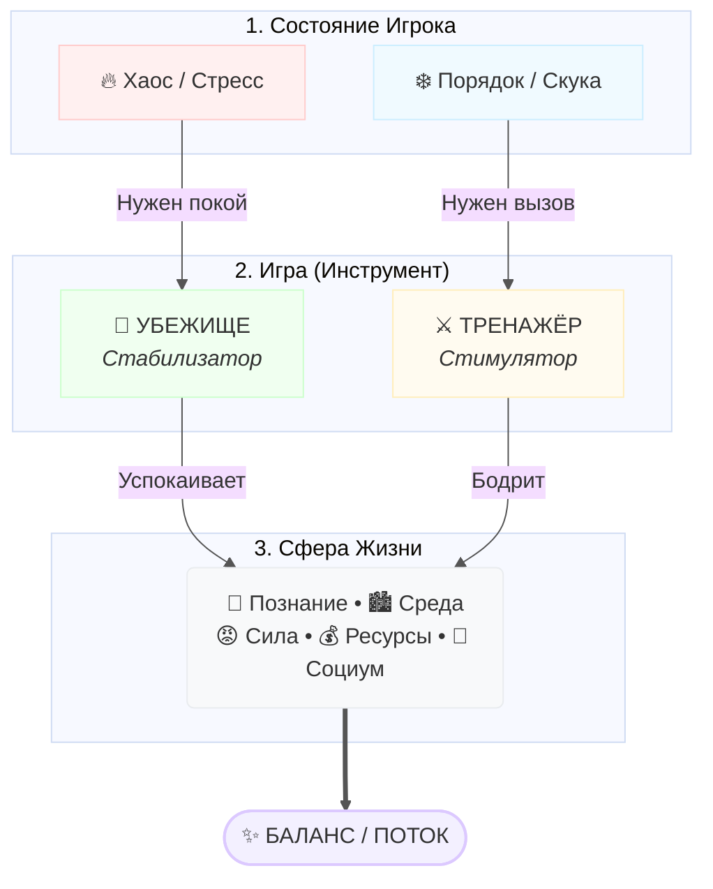

# Organic Game Design (OGD) v0.9-beta
> Метод Органического Геймдизайна

**Хватит гадать, где прячется «фан». Начните проектировать ту игру, которая нужна игроку.**

OGD — это методология, которая объединяет разработку игр, поиск концепции, позиционирование и стратегию продаж в единую систему.

Вместо интуитивных попыток "нащупать хит", OGD предлагает точный алгоритм: мы рассматриваем игру как инструмент регуляции состояния игрока. Это позволяет не только спроектировать увлекательный геймплей, но и найти свободную рыночную нишу, выстроить "честное" позиционирование и предсказать реакцию аудитории еще до написания кода.

> [!WARNING]
> Это **бета-версия**. Формулировки, структура и отдельные части будут уточняться по мере тестов на проектах и обратной связи.

## Для кого эта методология

OGD полезен, если вы:

- Инди-разработчик, который делает игру и не понимает, почему «всё вроде правильно, но что-то не так»
- Геймдизайнер, которому нужен язык для объяснения решений команде — не «мне так нравится», а «вот почему»
- Продюсер, который оценивает концепты и хочет видеть риски до продакшена
- Маркетолог игр, который не может сформулировать обещание игры

## Какие проблемы решает

- «Механики работают идеально, но игроки бросают на 5-й минуте»
- «Копирую всё из успешной игры, а результат другой»
- «Не понимаю, кто моя аудитория — вроде всем нравится, но никто не покупает»
- «Не могу объяснить за 10 секунд, зачем в это играть»
- «Трейлер красивый, обзоры хорошие, но конверсия низкая»

## 📚 С чего начать

Весь метод описан в одном главном документе:

👉 **[`OGD.md`](./OGD.md)**

Внутри вы найдете:
1. **Фундамент:** Как мозг игрока воспринимает игру (Хаос vs Порядок).
2. **Этика и Бизнес:** Чем отличается питательная **Органическая игра** (которая продает сама себя через сарафан) от манипулятивной **Синтетической** (которая живет только на закупке рекламного трафика).
3. **Инструменты:** 6 типов механик для управления состоянием игрока.
4. **Практика:** Пошаговые протоколы для анализа концепта, поиска аудитории и диагностики проблем вашей игры.

*Если времени мало, начните с раздела [TL;DR (В двух словах о методе)](./OGD.md#ogd-tldr) внутри основного документа.*

## Статьи (короткие входы)

Дополнительные материалы, раскрывающие отдельные аспекты (находятся в разделе Guides и в `OGD/articles/`):

- [`Кейс Galaxy Burger: Ловушка памяти и когнитивная нагрузка`](../Guides/GameDesign/case-study-galaxy-burger-memory-trap.md)
- [`Почему OGD смотрит на реальность (и зачем это геймдизайнеру)`](./articles/ogd-kontekst-i-realnost.md)
- [`Концепт и core loop в парадигме OGD`](../Guides/GameDesign/core-loop-and-concept.md) — как проектировать цикл.
- [`OGD и решение парадоксов геймдизайна`](../Guides/GameDesign/ogd-and-game-design-paradoxes.md) — почему работают "скучные" игры.
- [`OGD и PENS (SDT): в чем разница`](../Guides/GameDesign/ogd-and-pens-sdt.md) — сравнение с классической теорией мотивации.
- [`Safe Space: Архитектура Уюта`](../Guides/GameDesign/safe-space-mechanic.md) — почему нам уютно в Dark Souls.
- [`Cozy vs Casual: Механика или Ощущение?`](../Guides/GameDesign/cozy-vs-casual-mechanics.md) — разбор разницы между просто "простой" игрой и "уютной" игрой.
- [`Игра как Лекарство: Философия Игры-Убежища`](../Guides/General/game-as-therapy-and-shelter.md) — почему мы играем в симуляторы работы после работы (анализ через призму OGD).
- [`Когнитивная нагрузка и удержание`](../Guides/GameDesign/cognitive-load-retention.md) — почему игроки бросают игру через 15 минут (теория CLT).
- [`Дофаминовый vs Сератониновый жир`](../Guides/GameDesign/serotonin-vs-dopamine-fat.md) — управление когнитивной нагрузкой и физиология отдыха.

## Как ссылаться (атрибуция)

Если вы используете идеи/фрагменты текста/производные материалы, указывайте авторство и ссылку на источник.

Рекомендуемая формулировка атрибуции:

> Organic Game Design (OGD) — Зайцев Дмитрий Геннадьевич (Dmitrii Zaitsev), лицензия CC BY 4.0. Источник: этот репозиторий.

## Лицензия

Этот материал распространяется по лицензии [Creative Commons Attribution 4.0 International (CC BY 4.0)](https://creativecommons.org/licenses/by/4.0/).

Автор: Зайцев Дмитрий Геннадьевич (Dmitrii Zaitsev).

Контакты автора: `d.zayceff@gmail.com`
